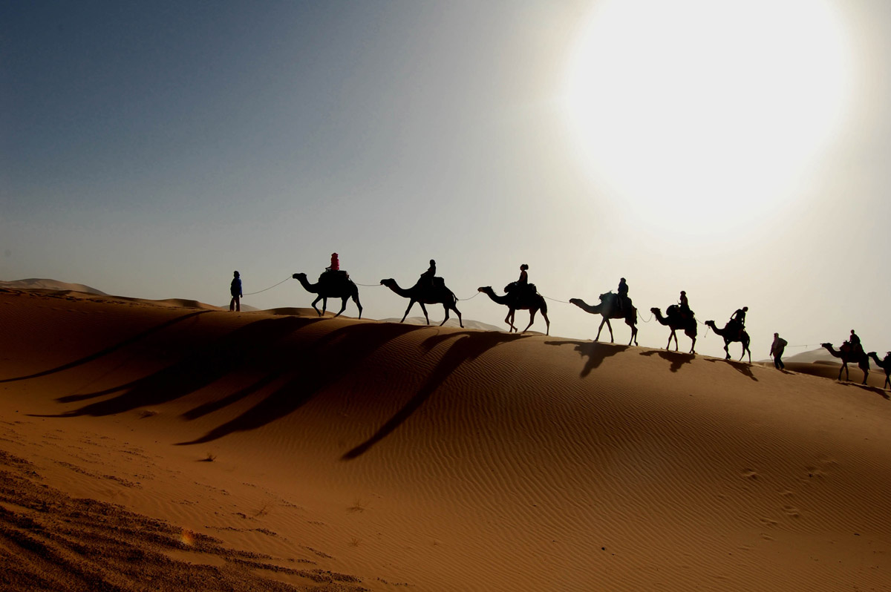

# North African Cuisine

Cooking that runs along the Mediterranean's southern coast - Algeria, Tunisia, Libya - sharing terrain and influences with Morocco and Egypt but with their own dishes. Olive oil, harissa, preserved lemon, ras el hanout, caraway and merguez sausage define the seasoning; couscous is the daily grain; brik, slata mechouia, makroud and a rich tradition of stuffed pastries and sweets fill out the table. The hot Berber-Arab-French history shows in every plate.
