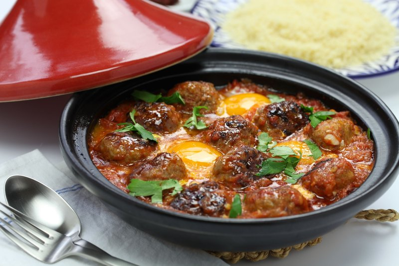

# Kefta Tagine

*Morocco's weeknight tagine: small spiced meatballs simmered in a cumin-and-tomato sauce, finished with eggs cracked into wells in the pan.*

**Serves:** 4

**Prep Time:** 20 minutes

**Cook Time:** 25 minutes

## Overview
Beef or lamb mince is mixed with grated onion, garlic, fresh parsley and coriander, cumin, paprika, cinnamon, salt and pepper; shaped into small (3 cm) balls. A tomato sauce is built in the tagine: onion sweats in olive oil, garlic, cumin and paprika join, tomato passata and a stock cube simmer for 10 minutes. The meatballs are nestled in; cooked for 12 minutes turning once. Eggs are cracked into wells; lid on; 4 minutes more until the whites are just set. Scattered with parsley and served hot.

## Ingredients

### Meatballs
- 500 g beef (or lamb mince, or a 50/50 mix)
- 1 onion (small, grated)
- 3 garlic cloves (crushed)
- 2 tablespoons fresh flat-leaf parsley (chopped)
- 2 tablespoons fresh coriander (chopped)
- 1 ½ teaspoons ground cumin
- 1 teaspoon sweet paprika
- ½ teaspoon ground cinnamon
- 1 teaspoon salt
- ½ teaspoon black pepper

### Sauce
- 3 tablespoons olive oil
- 1 onion (large, sliced)
- 4 garlic cloves (sliced)
- 1 teaspoon ground cumin
- 1 teaspoon sweet paprika
- ½ teaspoon ground cinnamon
- 1 teaspoon harissa paste (or substitute ½ tsp cayenne)
- 700 ml tomato passata (or 2 x 400 g tins chopped tomatoes blitzed smooth)
- 1 stock cube
- 1 teaspoon salt
- 1 teaspoon caster sugar

### Eggs
- 4 eggs (large)

### To finish
- 2 tablespoons fresh flat-leaf parsley (chopped)
- 2 tablespoons fresh coriander (chopped)
- 1 pickled lemon (small, optional - peel sliced into strips)

### To serve
- Khobz, pita (or crusty bread)

## Method

### Stage 1 - Meatballs
1. In a wide bowl, combine all the meatball ingredients.
1. Mix thoroughly with your hands for 2 minutes until well integrated and slightly sticky.
1. Shape into 24-28 small balls (3 cm across).
1. Set aside on a tray.

### Stage 2 - Sauce
1. Heat olive oil in a wide shallow tagine or heavy-bottomed pan over medium heat.
1. Add onion; cook 5 minutes until soft.
1. Add garlic; cook 1 minute.
1. Stir in cumin, paprika, cinnamon and harissa; cook 30 seconds.
1. Pour in the passata.
1. Crumble in the stock cube.
1. Add salt and sugar.
1. Bring to a simmer; cook 10 minutes - the sauce reduces and the colour deepens.

### Stage 3 - Cook the meatballs
1. Tip in the meatballs in a single layer (don't crowd - if needed do 2 batches).
1. Don't stir for the first 4 minutes; let the bottom sides cook.
1. Then gently turn them over with a spoon and a fork; cook 4 more minutes.
1. Continue, turning occasionally, until cooked through - about 12 minutes total.

### Stage 4 - Eggs
1. With the back of a spoon, make 4 small wells between the meatballs.
1. Crack an egg into each well.
1. Season the eggs with a tiny pinch of salt.
1. Cover with a lid (or foil if the tagine is too tall); reduce heat to low.
1. Cook 4-5 minutes - the whites should be just set; the yolks still runny.

### Stage 5 - Serve
1. Scatter parsley, coriander and (if using) preserved lemon strips across the top.
1. Serve directly from the tagine.
1. Dip torn bread to scoop up sauce, meatballs and yolk together.

## Notes
- **Don't crowd the pan when adding meatballs:** Each ball needs to touch hot sauce to brown its edges. Crowding gives boiled-tasting meatballs.
- **Eggs at the end:** Crack the eggs only when you're 5 minutes from eating. Hold too long and they overcook into hard yolks; the dish is meant to have soft runny yolks.
- **Spice balance:** The triad of cumin (warm earthy), paprika (sweet red) and cinnamon (background fragrance) defines kefta tagine. Don't substitute curry powder or chilli mixes.

## Storage
- Best fresh, ideally the moment the eggs are set.
- Without the eggs, the meatballs and sauce refrigerate 3 days; reheat then add fresh eggs.
- Freezes 2 months (without eggs).
