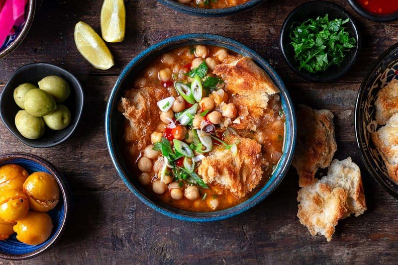

# Lablabi

*Tunisia's market-stall breakfast: hot chickpea broth poured over stale baguette, finished with poached egg, harissa, lemon and capers.*

**Serves:** 4

**Prep Time:** 15 minutes

**Cook Time:** 30 minutes (assuming pre-cooked chickpeas)

## Overview
Chickpeas (pre-soaked overnight and slow-cooked, OR tinned for speed) simmer in their cooking water with crushed garlic, cumin, salt and a spoon of harissa for 20 minutes. The broth thickens slightly as a few chickpeas break down. Deep bowls are loaded with torn stale baguette. The hot broth ladles over to soften the bread. Each bowl is topped with a soft-poached or soft-boiled egg, a drizzle of olive oil, lemon juice, a fresh spoon of harissa, a heap of canned tuna, olives, capers and a sprinkle of cumin.

## Ingredients

### Broth
- 400 g cooked chickpeas (about 200 g dried, soaked overnight and simmered 1 hour until tender - OR 2 x 400 g tins drained and rinsed) plus 700 ml of their cooking liquid (or 700 ml water + 1 stock cube)
- 6 garlic cloves (crushed to a paste with ½ teaspoon salt)
- 2 teaspoons ground cumin
- 1 tablespoon harissa paste (more for the bolder; less for the timid)
- 2 tablespoons olive oil
- 1 teaspoon salt (to taste)
- ½ teaspoon black pepper
- ½ lemon (juice)

### Per bowl (toppings)
- 2 thick slices stale baguette (or country bread), torn into bite pieces
- 1 egg (soft-boiled 6 minutes, or freshly poached)
- 1 teaspoon harissa paste
- 1 tablespoon extra-virgin olive oil
- ½ tablespoon lemon juice
- 2 tablespoons drained canned tuna (in oil - the kind packed in good olive oil)
- 5-6 black olives (pitted)
- 1 teaspoon capers
- A pinch of ground cumin
- A small wedge of fresh lemon
- Optional: 1 teaspoon harissa-and-olive-oil paste; pickled chilli; mint leaves

## Method

### Stage 1 - Build the broth
1. In a heavy pot, combine cooked chickpeas, their cooking water (or water + stock), garlic-salt paste, cumin, harissa, olive oil, salt and pepper.
1. Bring to a simmer.
1. Cook 20 minutes - a few chickpeas will break down and slightly thicken the broth. Mash a small ladleful against the side of the pot with a fork if you want it slightly thicker.
1. Add the lemon juice; taste; adjust salt and harissa.

### Stage 2 - Prepare the eggs
1. For soft-boiled: lower eggs into simmering water; cook 6 minutes 30 seconds; transfer to cold water; peel.
1. For poached: heat 5 cm of water in a wide pan to a bare simmer; add 1 teaspoon vinegar; crack each egg into a cup; slide into the water; cook 3 minutes; lift out with a slotted spoon.

### Stage 3 - Assemble each bowl
1. Place a generous handful of torn stale bread in the bottom of each deep bowl (the bread should fill about half the bowl).
1. Ladle the hot chickpea broth over to come 2 cm above the bread; let stand 30 seconds to soften.
1. Place an egg on top.
1. Add a teaspoon of harissa to one side of the bowl.
1. Drizzle olive oil and lemon juice.
1. Pile tuna on the other side.
1. Scatter olives, capers and a pinch of cumin.
1. Set a lemon wedge on the rim.

### Stage 4 - Serve
1. Eat immediately. Stir the harissa through the broth before scooping. Break the egg yolk into the broth.

## Notes
- **Stale bread is the point:** Fresh bread turns to mush. Day-old or two-day-old crusty bread, slightly stiff, absorbs the broth without disintegrating. This is the entire technique behind the dish.
- **Tuna sounds weird, isn't:** In Tunisia, tinned tuna in olive oil is a fundamental pantry staple. Sprinkled on top of lablabi, it adds protein, savouriness and a faintly oily richness. Don't substitute fresh fish.
- **Harissa is to taste:** Tunisian harissa is fierce. Start with 1 tablespoon in the broth and adjust. A spoon on top at the table lets each diner customise.

## Storage
- Make the broth and chickpeas ahead; refrigerate 4 days; reheat and assemble fresh.
- Don't assemble ahead - the bread softens to mush.
- Broth alone freezes 2 months.
