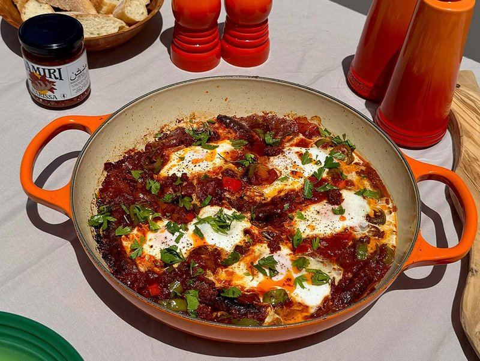

# Ojja with Merguez

*Tunisia's pan supper: harissa-spiced tomato sauce loaded with charred merguez and finished with eggs cracked over the top.*

**Serves:** 4

**Prep Time:** 15 minutes

**Cook Time:** 30 minutes

## Overview
Merguez sausages are browned in a wide deep pan, lifted out and roughly cut into bite pieces. Sliced onion and red pepper sweat in the merguez fat; garlic, caraway, cumin, ground coriander and harissa go in; tinned tomatoes follow and simmer for 12 minutes until thick. The merguez returns; 4 eggs are cracked into wells in the sauce; lid on; gentle 5-minute cook until the whites are set. Sprinkled with parsley and served hot from the pan.

## Ingredients

- 400 g merguez sausages (Tunisian-style lamb merguez, ideally - sold at North African shops and many supermarkets)
- 2 tablespoons olive oil (if needed - depends how fatty the sausages are)
- 1 onion (large, sliced)
- 1 red bell pepper (sliced thin)
- 4 garlic cloves (sliced)
- 1 teaspoon caraway seeds
- 1 teaspoon ground cumin
- 1 teaspoon ground coriander
- 1-2 tablespoons [Harissa](../../base-ingredients/sauces/harissa.md) (to taste - Tunisian harissa is fiery)
- 1 teaspoon sweet paprika
- 800 g tins chopped tomatoes (or 800 g passata)
- 1 teaspoon caster sugar
- 1 teaspoon salt
- ½ teaspoon black pepper
- 4 eggs (large)

### To finish
- 3 tablespoons fresh flat-leaf parsley (chopped)
- 1 tablespoon extra-virgin olive oil (drizzle)
- A squeeze of lemon
- Crusty bread

## Method

### Stage 1 - Brown the merguez
1. Heat a wide deep heavy pan or a wide tagine over medium-high.
1. Add the merguez whole (no oil - they release plenty).
1. Brown 6 minutes, turning, until the casings are crisp at the edges and the sausages are 80% cooked through.
1. Lift onto a plate; cut into 3 cm pieces. Reserve.

### Stage 2 - Build the sauce
1. Pour off all but 2 tablespoons of the merguez fat. (If they were lean, add olive oil.)
1. Reduce heat to medium; add onion and red pepper.
1. Cook 7 minutes until soft.
1. Add garlic; cook 1 minute.
1. Stir in caraway, cumin, coriander, harissa and paprika; cook 30 seconds - the kitchen will smell strongly fragrant.

### Stage 3 - Tomatoes
1. Tip in the tinned tomatoes (and the sugar to balance acidity).
1. Add salt and pepper.
1. Bring to a simmer; cook 12 minutes, stirring occasionally, until the sauce has thickened and the colour deepens to a rich red-orange.
1. Taste; adjust salt and harissa.

### Stage 4 - Return the merguez
1. Tip the merguez pieces and any juices on the plate back into the sauce.
1. Stir gently; simmer 2 minutes to warm through.

### Stage 5 - Eggs
1. With the back of a spoon, make 4 small wells in the sauce between the merguez pieces.
1. Crack an egg into each well.
1. Sprinkle a tiny pinch of salt on each yolk.
1. Cover with a lid (or foil).
1. Reduce heat to low.
1. Cook 4-5 minutes - the whites set; the yolks stay runny.

### Stage 6 - Serve
1. Scatter parsley.
1. Drizzle olive oil; squeeze of lemon.
1. Bring the pan to the table; serve with bread for dipping.

## Notes
- **Real merguez:** Tunisian or Algerian merguez has a fierce harissa-and-paprika-and-cumin colour and flavour. French-supermarket merguez can be milder; if so, double the harissa in the sauce.
- **Caraway is the giveaway:** Caraway seeds are the difference between Tunisian ojja and Moroccan-style shakshouka. Don't substitute fennel or anise - the flavour profile shifts wrong.
- **Don't overcook the eggs:** Soft yolks are the dish. Pull off the heat when the whites are just set; carryover heat will finish them.

## Storage
- Best fresh.
- The sauce without eggs refrigerates 3 days; reheat and add fresh eggs.
- Doesn't freeze well with the eggs in.
