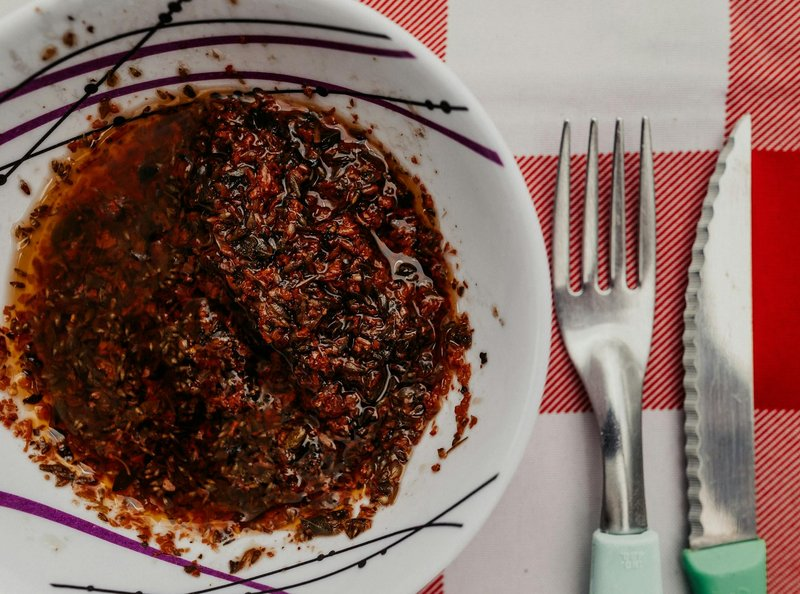

# Chermoula

*Morocco's all-purpose green herb sauce: coriander, parsley, garlic, cumin, paprika, saffron and lemon, bound with good olive oil.*

**Serves:** 6 (makes about 250 ml)

**Prep Time:** 10 minutes

**Cook Time:** 0 minutes

## Overview
Morocco's all-purpose green herb sauce, the bright bowl of garlicky, saffrony emulsion that lives in every Moroccan fridge and turns up smeared on fish, rubbed under chicken skin, drizzled on roasted vegetables, stirred through tagines and scooped up with bread. Coriander, parsley, garlic, cumin, paprika and saffron bound with good olive oil and lemon. Fresh herbs only: dried make a leaden sauce, and the fresh coriander and parsley are 80% of the dish. Pulsed (not over-blended; chermoula benefits from a bit of texture) with garlic, cumin, paprika, saffron-bloomed water, optional cayenne and lemon juice, then olive oil drizzles in with the motor running to a bright green well-emulsified slightly chunky pesto. Finely diced preserved lemon stirs through if you have it. Rests at least thirty minutes (longer is better; chermoula deepens with time). Used as a fish marinade, a chicken rub under and over the skin, a tagine finisher stirred through at the end, or a dressing for warm roasted vegetables.

## Ingredients

- 1 large bunch fresh coriander (about 60 g, stems and leaves)
- 1 large bunch fresh flat-leaf parsley (about 60 g, stems and leaves)
- 5 garlic cloves
- 1 ½ teaspoons ground cumin
- 1 teaspoon sweet paprika
- 1 large pinch saffron threads (soaked in 1 tablespoon hot water)
- ¼ teaspoon cayenne pepper (optional)
- 1 ½ teaspoons salt
- 1 lemon (about 3 tablespoons, juice)
- 120 ml extra-virgin olive oil
- 1 preserved lemon (small, rinsed; pulp discarded; skin diced, optional)

## Method

### Stage 1 - Blitz
1. Trim the very thick stems from the herbs; the fine stems are good and add flavour.
1. Place herbs, garlic, cumin, paprika, saffron (with its soaking water), cayenne, salt and lemon juice in a food processor.
1. Pulse 6-8 times to chop coarsely.

### Stage 2 - Emulsify
1. With the motor running on low, drizzle in the olive oil in a thin steady stream.
1. Stop when the paste is bright green, well-emulsified, and the texture of a slightly chunky pesto. Don't over-blend into a smooth paste - chermoula benefits from a bit of texture.

### Stage 3 - Finish
1. Tip into a bowl; stir in the diced preserved lemon (if using).
1. Taste; adjust with extra lemon juice, salt or cayenne.

### Stage 4 - Rest
1. Let stand 30 minutes for the flavours to integrate. Or refrigerate for hours/days - chermoula deepens with time.

### Uses

- **Fish marinade:** Coat fish fillets generously, rest 30 minutes, then grill, bake or pan-fry. The classic application.
- **Chicken rub:** Rub under and over the skin; rest 1 hour minimum; grill or roast.
- **Tagine finisher:** Stir a tablespoon through a cooked tagine just before serving for a bright finish.
- **Dip / spread:** Eat with bread, drizzle on grilled vegetables, spoon onto roasted potatoes.
- **Vegetable dressing:** Toss with warm roasted vegetables (carrots, courgette, peppers, aubergine).

## Notes
- **Fresh herbs only:** Dried herbs make a leaden sauce. The fresh coriander and parsley are 80% of the dish.
- **Coriander stems are good:** The stems hold more flavour than the leaves; only the very thick lower stems are tough. Use almost everything.
- **Saffron is optional but characteristic:** A pinch of real saffron gives chermoula its faint golden warmth. Skip it if you don't have it; the sauce works without.

## Storage
- Refrigerate in a sealed jar 1 week; the colour darkens but the flavour holds.
- Freezes in ice-cube trays 3 months; pop out a cube to dress a fish fillet.
