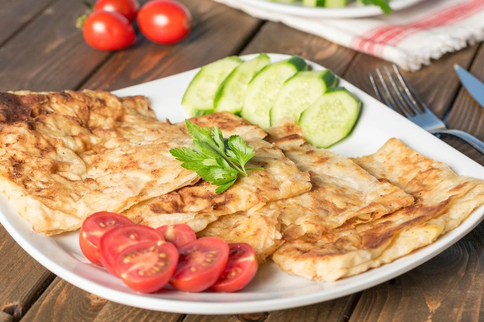

# Msemen

*Morocco's pan-fried laminated flatbread: a soft semolina dough stretched paper-thin, folded with butter into a square, griddled crisp.*

**Serves:** 4 (makes 8 msemen)

**Prep Time:** 40 minutes (plus 30 min dough rest)

**Cook Time:** 25 minutes

## Overview
A soft warm dough of fine semolina, plain flour, salt, sugar, yeast (optional but helps with flexibility) and warm water rests 30 minutes. Divides into 8 balls. Each ball stretches on a heavily oiled surface into a paper-thin (almost translucent) circle. A teaspoon of melted butter-and-oil mix smears across; a sprinkle of semolina dusts on top; the disc folds into thirds, then thirds again, into a square. Each square cooks on a hot dry griddle 2 minutes per side, pressing gently so the layers bond, until golden and crisp at the edges.

## Ingredients

- 200 g fine semolina
- 200 g plain flour
- 1 teaspoon salt
- 1 teaspoon caster sugar
- 1 teaspoon fast-action yeast (optional - helps the flexibility)
- 270 ml warm water

### For lamination
- 80 g unsalted butter (melted) - or 50 g butter + 30 ml sunflower oil for a slightly less rich version
- Extra fine semolina, for dusting (about 4 tablespoons)
- Sunflower oil, for the work surface (about 4 tablespoons)

### To serve
- Clear honey, butter, jam, or alongside savoury tagine

## Method

### Stage 1 - Dough
1. Whisk semolina, flour, salt, sugar and yeast (if using) in a wide bowl.
1. Pour in the warm water; mix to a soft dough.
1. Knead 10 minutes by hand (it'll be sticky at first; resist adding flour - keep going). The dough should become smooth and elastic.
1. Lightly oil the dough; cover; rest 30 minutes (or up to 1 hour).

### Stage 2 - Divide
1. Generously oil a wide work surface (msemen depends on heavily oiling everything).
1. Tip the dough out.
1. Divide into 8 equal balls.
1. Smear each ball with oil; let rest 10 more minutes.

### Stage 3 - Stretch and fold
1. Working with one ball at a time on the oiled surface:
   - Flatten with your palm, then use the heel of your hand and your fingertips to push the dough outward in all directions until it's a thin, almost translucent square 25-30 cm across. (Don't worry if it tears in places - you'll fold over it.)
   - Brush 1 teaspoon of melted butter across the surface.
   - Sprinkle ½ teaspoon of fine semolina.
   - Fold the left third to the centre, then the right third over that (forming a vertical rectangle).
   - Now fold the bottom third up to the centre, then the top third down (forming a smaller square).
   - Set aside on a clean lightly oiled plate.
1. Repeat with all balls. Stack them with a small space between, lightly oiled, while you finish the rest.

### Stage 4 - Rest and re-flatten
1. Let the folded squares rest 5 minutes (the gluten relaxes; they stretch better).
1. Take each square and gently push it outward with the heel of your hand into a thinner square about 15 cm across, keeping the layers intact.

### Stage 5 - Cook
1. Heat a wide flat dry griddle or non-stick pan over medium-high heat 3 minutes.
1. Place a square on the griddle; cook 2 minutes - bubbles should form, the underside spotted gold.
1. Flip; press gently with a spatula to bond the layers; cook 2 more minutes.
1. Lift onto a plate; stack as you go (the steam from each helps keep them soft).

### Stage 6 - Serve
1. Eat warm, immediately. Drizzle with honey, smear with butter, or use to scoop up tagine sauce.

## Notes
- **Heavily oil everything:** Msemen lamination depends on the dough sliding around on a thin film of oil. A floured surface is wrong - it dries the dough. Oil your hands, the surface, and the dough itself.
- **Thin stretch matters:** The first stretch should be almost transparent. If you can't see your hand through the dough, push it further. Tearing is fine - it'll be folded over.
- **Dry griddle, not buttered:** Cook on a dry pan; the butter is already inside the layers. A buttered pan makes msemen soggy.

## Storage
- Best the day they're made.
- Refrigerate 2 days; reheat in a dry pan 30 seconds per side.
- Freeze cooked msemen 2 months; reheat from frozen in a hot dry pan 1 minute per side.
