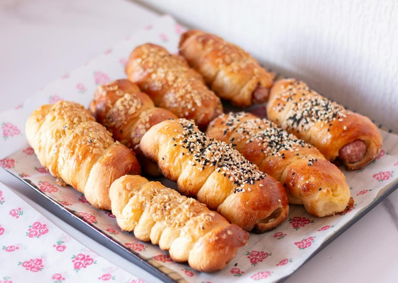

# Merguez Rolls

*North African pigs-in-blankets: puff pastry wrapped around spicy merguez lamb sausage. Served with a drizzle of harissa-honey or yogurt.*

**Serves:** Makes 16 rolls

**Prep Time:** 20 minutes

**Cook Time:** 25 minutes

## Overview
All-butter puff pastry rolls thin; cuts into 4 long strips. Merguez sausages cut into 6 cm lengths. Each pastry strip wraps once around a merguez piece (overlapping seam underneath). Eggwashes; dusts with sesame and nigella seeds. Bakes for 25 minutes at 200°C till the pastry is deep gold and the sausage cooked through.

## Ingredients
- 500 g all-butter puff pastry (2 ready-rolled sheets)
- 600 g merguez sausages (about 6-8 sausages)
- 1 egg yolk (beaten with 1 tablespoon milk, for glazing)
- 2 tablespoons sesame seeds
- 1 tablespoon nigella (kalonji) seeds
- 1 teaspoon ground cumin (optional sprinkle)

### To serve
- 2 tablespoons harissa
- 2 tablespoons clear honey (warmed briefly to thin)
- 200 g yogurt (whisked with 1 tablespoon lemon juice and a pinch of salt)

## Method

### Stage 1 - Prep sausages
1. Cut each merguez sausage crossways into 4-6 cm lengths.
1. You should have 16 short pieces.

### Stage 2 - Cut pastry strips
1. Heat the oven to 200°C (180°C fan).
1. Unroll the puff pastry on a lightly floured surface.
1. Cut each sheet lengthways into 4 strips of equal width (about 6 cm wide).
1. Then cut each strip in half crossways - you should have 16 strips total, each about 6 cm × 12 cm.

### Stage 3 - Wrap
1. Place a merguez piece at one short end of a pastry strip.
1. Roll up so the pastry wraps once around the sausage with a small overlap seam underneath.
1. Place seam-down on a parchment-lined tray.
1. Repeat for all 16.

### Stage 4 - Glaze
1. Brush each roll with the egg-yolk wash.
1. Sprinkle generously with sesame and nigella seeds.
1. Optionally dust with a tiny amount of ground cumin.

### Stage 5 - Bake
1. Bake 22-25 minutes until the pastry is deep gold and puffed and the sausage juices are bubbling underneath.

### Stage 6 - Harissa-honey
1. Whisk the harissa with the warm honey to a glossy spicy-sweet drizzle.

### Stage 7 - Serve
1. Pile rolls on a platter.
1. Drizzle with harissa-honey at the table (or serve in a small jug on the side).
1. Provide the cool yogurt sauce alongside.

## Notes
- **Real merguez, not generic sausage:** merguez has lamb / beef, harissa, cumin, paprika, garlic - its identity is the spice mix. A pork sausage or generic chipolata won't taste right. Buy from a halal butcher or North-African deli.
- **One layer of pastry, not two:** these are roll-ups, not parcels. A single wrap with seam underneath is the structure.
- **Harissa-honey is iconic:** the combination of hot North-African chilli paste and sweet honey is the signature dipping sauce. Don't skip.

## Storage
- Best within an hour of baking.
- Keep 1 day refrigerated; reheat in a 200°C oven 8 minutes.
- Freeze unbaked, on a tray then bagged, 2 months; bake from frozen 28 minutes.
