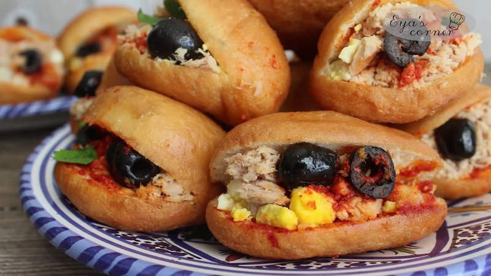

# Tunisian Fricassé

*Tunisia's deep-fried sandwich bun: yeasted dough puffed in hot oil, split open and stuffed with tuna, harissa, capers, olives and egg.*

**Serves:** Makes 8 fricassés

**Prep Time:** 30 minutes (plus 1 hour rising)

**Cook Time:** 15 minutes

## Overview
The Tunisian fricassé is the deep-fried sandwich bun that turns up at every street-corner stand around lunchtime in Tunis and Sousse. A light yeasted dough fries into puffed hollow buns, each one a perfect pocket waiting to be split and stuffed. The filling is generous: tuna mashed with harissa, slices of hard-boiled egg, capers, olive halves and a sliver of preserved lemon for the salty-floral lift that makes a fricassé feel distinctly Tunisian. Get the oil properly hot before the dough goes in or the buns won't puff. Eat warm and right away, while the shell is still crisp and the inside still soft. Once they sit, the bread starts to soften and the contrast is gone.

## Ingredients

### Dough
- 400 g plain flour
- 7 g instant yeast
- 1 teaspoon salt
- 1 teaspoon caster sugar
- 240 ml warm water
- 2 tablespoons olive oil

### Frying
- 800 ml neutral oil

### Filling (per fricassé)
- 1 small tin (100 g) tuna in olive oil (drained, but reserve a little oil)
- 1 ½ teaspoons [Harissa](../../../base-ingredients/sauces/harissa.md) (or to taste)
- ½ hard-boiled egg (sliced)
- 4-5 capers (drained, rinsed)
- 4 green olives (small, or black olives, pitted, halved)
- 1 thin slice preserved lemon peel (or substitute: zest of fresh lemon + pinch of salt)
- 1 teaspoon chopped parsley

### Per batch of 8 - total filling
- 4 small tins tuna
- 4 tablespoons [Harissa](../../../base-ingredients/sauces/harissa.md)
- 4 hard-boiled eggs
- 4 tablespoons capers
- 100 g olives
- 1 preserved lemon
- A handful of parsley

## Method

### Stage 1 - Dough
1. In a wide bowl, whisk flour, yeast, salt and sugar.
1. Pour in the warm water and olive oil.
1. Mix to a shaggy dough; knead 6 minutes till smooth and elastic.
1. Rest in a covered bowl 1 hour till doubled.

### Stage 2 - Shape
1. Knock back; divide into 8 portions (~80 g each).
1. Shape each into an oval shape about 10 cm long and 5 cm wide, slightly pointed at the ends.
1. Rest 15 minutes on parchment.

### Stage 3 - Fry
1. Heat the oil to 175°C.
1. Lower 2 ovals at a time into the oil.
1. Fry 1-2 minutes per side; the dough will puff dramatically into a hollow shape.
1. Lift onto a wire rack to drain and cool slightly.

### Stage 4 - Fillings
1. Mash each tin of drained tuna with 1 tablespoon harissa in a small bowl.
1. Have the egg slices, capers, olives, preserved lemon and parsley ready.

### Stage 5 - Stuff
1. With a small knife, cut a slit lengthways along the side of each fricassé (don't cut through - make a pocket).
1. Open the pocket carefully - it should be hollow inside.
1. Spread harissa-tuna mash inside.
1. Add: 2-3 slices of hard-boiled egg, 2-3 capers, 2-3 olive halves, a small piece of preserved lemon, a sprinkle of parsley.

### Stage 6 - Serve
1. Eat IMMEDIATELY while still hot.
1. The bread softens within 30 minutes - fricassé is best straight after building.

## Notes
- **Hot oil + light dough = hollow interior:** the secret is the fry. The dough puffs into a balloon, leaving a perfect pocket for stuffing. Cold dough won't puff.
- **Harissa is non-negotiable:** the spicy paste defines the fricassé. Mild palates can use less, but skipping it altogether removes the Tunisian character.
- **Preserved lemon is iconic:** the salty-floral note is what makes a fricassé distinctly Tunisian. Substitute fresh lemon zest + a pinch of salt if you can't find preserved.
- **Eat right after building:** the bread softens fast. Build at the last second.

## Storage
- Eat fricassés within 30 minutes of building.
- Plain fried buns (unstuffed) keep 1 day at room temperature; reheat briefly in a 180°C oven before stuffing.
- Don't pre-stuff and store - the filling weeps into the bread.
