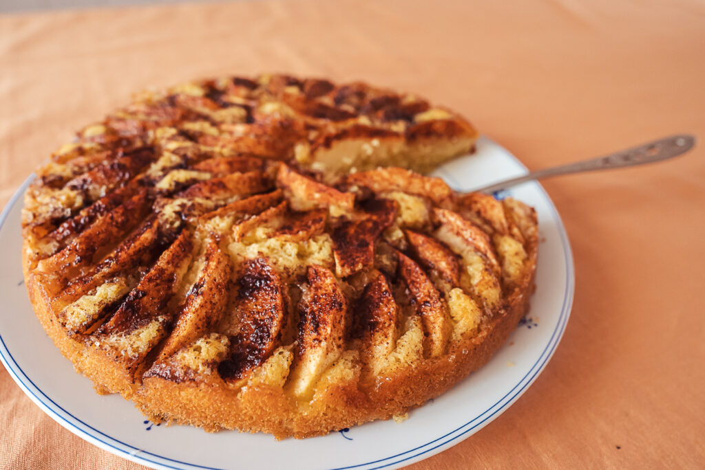

# Eplekake (Norwegian Apple Cake)

*Norway's home-baking apple cake: a soft cardamom-scented sponge with apple slices fanned across the top, baked until the apple caramelises and the cake puffs around it. Served warm with vanilla cream or a scoop of cold vanilla ice cream.*

**Serves:** 8

**Prep Time:** 20 minutes

**Cook Time:** 45 minutes

## Overview
Eplekake is the everyday Norwegian apple cake - the cake every Norwegian grandmother makes for visiting children, every summer cabin baker turns out from the few ingredients in the cupboard, every autumn home cook produces when the trees in the garden drop their fruit. The base is a soft, lightly sweet butter cake scented with cardamom (the Scandinavian spice signature); the topping is rings of thinly sliced apple pressed into the batter, which caramelise into golden discs as the cake bakes around them. A dusting of cinnamon sugar before baking gives the surface a crunchy sweet glaze. Best served warm from the oven with vanilla sauce (vaniljekrem - a thin custard), softly whipped cream, or simply a scoop of cold vanilla ice cream.

## Ingredients

### Cake
- 150 g unsalted butter, softened
- 150 g caster sugar
- 3 large eggs
- 200 g plain flour
- 1.5 tsp baking powder
- 1.5 tsp ground cardamom
- A pinch of fine salt
- 100 ml whole milk
- 1 tsp vanilla extract

### Topping
- 3 medium dessert apples (Cox, Braeburn, Pink Lady), peeled, cored, sliced into thin half-moons
- 2 tbsp caster sugar
- 1 tsp ground cinnamon

### To serve
- Vanilla sauce (warm pouring custard), whipped cream, or vanilla ice cream
- Optional: a sprinkle of toasted flaked almonds

## Method

### Stage 1 - Prep
1. Preheat the oven to 180°C.
2. Grease a 23 cm round springform tin; line the base with greaseproof paper.

### Stage 2 - Cream the butter and sugar
1. In a large bowl, cream the softened butter and caster sugar with an electric mixer until pale and fluffy, about 3 minutes.
2. Add the eggs one at a time, beating well after each.

### Stage 3 - Combine the dry
1. In a separate bowl, sift together the flour, baking powder, cardamom and salt.

### Stage 4 - Combine wet and dry
1. With the mixer on low, add half the flour mixture; mix briefly.
2. Add the milk and vanilla; mix.
3. Add the rest of the flour; mix only until just combined.
4. Don't overmix - the cake toughens.

### Stage 5 - Fill the tin
1. Tip the batter into the prepared tin; smooth the top.

### Stage 6 - Arrange the apple
1. Arrange the apple slices on top of the batter in concentric circles, slightly overlapping, pressing each lightly into the batter (they shouldn't sink in, but should be set in).
2. Combine the topping sugar and cinnamon; sprinkle evenly over the apple.

### Stage 7 - Bake
1. Bake 40-45 minutes until the cake is deeply golden, risen, and a skewer inserted in the middle (between apple slices) comes out clean.
2. The apples should have softened and caramelised at the edges.

### Stage 8 - Cool and serve
1. Cool in the tin 15 minutes.
2. Release the springform; slide onto a serving plate.
3. Best warm.
4. Cut into wedges; serve with vanilla sauce, whipped cream, or vanilla ice cream.

## Notes
- **Cardamom is the Scandinavian signature:** Don't skip it. Freshly ground (from pods) gives the brightest flavour; pre-ground works if reasonably fresh.
- **Slice the apples thin:** 3-4 mm thick is right. Thicker slices don't fully soften in the cake's baking time; thinner ones disappear.
- **Eat warm:** Eplekake is at its best 20-30 minutes out of the oven, when the apples are still warm and the cake is just-set. Cold leftovers are fine but lose some of the magic.

## Serving
The afternoon coffee cake of Norwegian summer cabins. Serve with a pot of strong black coffee, a glass of cold milk for the children, and good company.

## Storage
- Room temperature in a tin 3 days; the apples weep slightly and the cake softens.
- Refrigerates 5 days; reheat 30 seconds in the microwave or 5 minutes in a 160°C oven.
- Freezes whole or in slices 2 months; thaw at room temperature.
