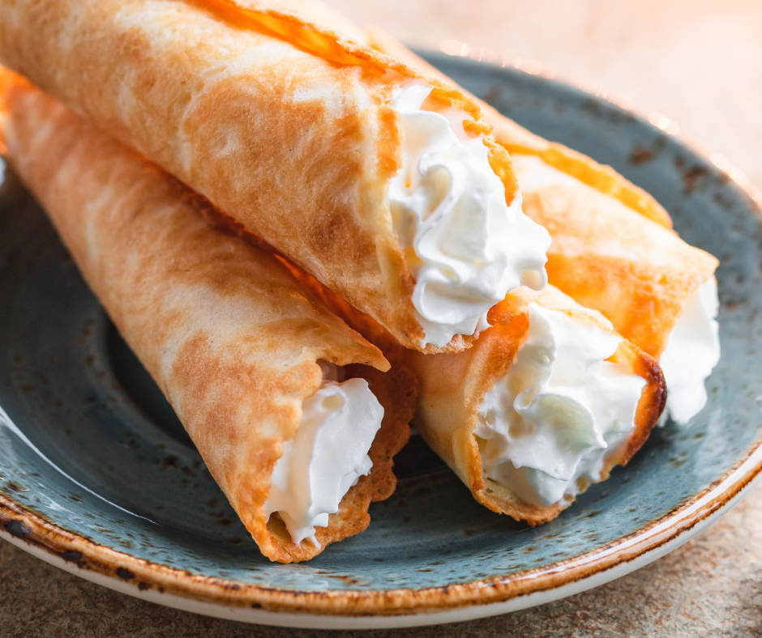

# Krumkake (Norwegian Waffle Cookies)

*Norway's cardamom-scented thin waffle cookie: a delicate batter cooked in a patterned iron then rolled around a wooden cone while warm and flexible. Sets crisp and shatters at the bite. Christmas baking staple, often filled with whipped cream and berries.*

**Serves:** Makes about 30 krumkake

**Prep Time:** 30 minutes

**Cook Time:** 45 minutes

## Overview
Krumkake (literally "curved cake") is a Norwegian waffle cookie shaped in a small two-sided iron pressed onto a stovetop or on an electric krumkake iron. A thin cardamom-scented batter spread on the hot iron cooks in 30 seconds into a delicate patterned disc, which is immediately rolled around a tapered wooden cone (krumkakeform) while warm and pliable. Within seconds the disc sets brittle and crisp, holding the cone shape permanently. They're a Christmas baking tradition (one of the syv slag - "seven kinds" - of Christmas biscuits in Norwegian homes), served plain, dusted with icing sugar, or filled at serving time with whipped cream, fresh berries and a drizzle of multekrem (cloudberry cream). A krumkake iron is a specialised piece of kit, but the cookies are worth the investment if you have any Scandinavian connection.

## Ingredients

### Batter
- 3 large eggs
- 100 g caster sugar
- 100 g unsalted butter, melted and cooled
- 100 ml double cream (or whole milk)
- 100 g plain flour
- 1 tsp ground cardamom (freshly ground from green pods is best)
- 1 tsp vanilla extract
- A pinch of fine salt

### Equipment
- A krumkake iron (stovetop two-sided iron, or electric krumkake maker)
- A wooden conical krumkakeform (the small tapered roller, about 15 cm long)

### To finish (optional)
- Icing sugar for dusting
- Whipped cream with vanilla
- Fresh berries (raspberries, blueberries)
- Cloudberry preserves or apricot jam

## Method

### Stage 1 - Whisk the batter
1. In a large bowl, whisk the eggs and sugar together until pale and slightly thickened, about 2 minutes.
2. Whisk in the melted butter and the cream.
3. Sift in the flour, cardamom and salt.
4. Whisk to a smooth batter, no lumps.
5. Stir in the vanilla.
6. Rest 15 minutes (the flour hydrates and the cardamom infuses).

### Stage 2 - Heat the iron
1. Stovetop iron: heat on medium heat for 3-4 minutes a side until very hot. Test with a drop of water; it should sizzle and evaporate immediately.
2. Electric iron: heat to the manufacturer's specified temperature (usually 5-7 minutes preheat).
3. Lightly grease the iron with melted butter or a brush of oil on the first cook only - the batter has enough butter to release after that.

### Stage 3 - Cook a krumkake
1. Open the iron; spoon a tablespoon of batter onto the centre of the bottom plate.
2. Close the iron firmly; the batter spreads into a thin disc.
3. Cook 30-45 seconds per side (stovetop iron must be flipped after 30 seconds); electric irons usually cook both sides at once for 60-90 seconds.
4. The krumkake is done when deeply golden and the edges are crisp.

### Stage 4 - Shape immediately
1. Open the iron; lift the krumkake disc with a thin spatula (it's flexible only for 5-6 seconds).
2. Working fast, lay it on a clean surface; place the wooden cone at one edge.
3. Roll the disc tightly around the cone.
4. Hold for 5 seconds; the cookie sets crisp.
5. Slide off the cone.
6. Repeat with the next disc.

### Stage 5 - Continue
1. Cook and roll all the batter.
2. Cool the rolled cones completely on a wire rack.
3. They crisp further as they cool.

### Stage 6 - Serve plain or filled
1. Plain: dust with icing sugar. Eat with coffee at Christmas.
2. Filled: just before serving, pipe whipped cream into each cone; top with berries; drizzle with cloudberry preserves or apricot jam.

## Notes
- **Work fast at the shaping stage:** Krumkake is flexible for just a few seconds out of the iron. If they set flat before you can roll, the iron is cooking too long or you're moving too slow. Keep the cone close at hand.
- **Cardamom is essential:** The flavour signature of krumkake. Use freshly ground pods for the brightest aroma; pre-ground cardamom from a jar loses its vibrancy fast.
- **Fill at serving:** Whipped cream-filled krumkake go soggy within 30 minutes. Cook the shells ahead, fill at the table.

## Serving
- Serve at Christmas with coffee. The Norwegian protocol is to have a selection of seven biscuits on a tray (syv slag); krumkake is always one of them. Multekrem (cloudberry whipped cream) is the festive filling; in summer, fresh berries and whipped cream.

## Storage
- Empty shells store in an airtight tin 2 weeks (in a dry place - humidity wilts them).
- Don't refrigerate - the moisture softens the crisp shells.
- Freezes 1 month, but the texture is best in the first week.
