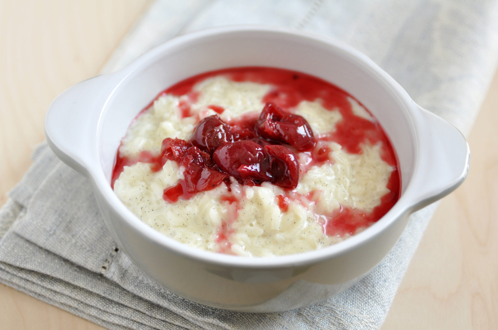

# Riskrem (Norwegian Rice Cream)

*The Norwegian Christmas Eve dessert: cold rice porridge folded with whipped cream and vanilla, topped with hot red berry sauce. A whole almond hidden in one bowl; whoever finds it gets a marzipan pig.*

**Serves:** 6

**Prep Time:** 20 minutes (plus chilling time)

**Cook Time:** 1 hour (for the porridge, day before)

## Overview
Riskrem is the Norwegian Christmas Eve dessert: cold rice porridge (risgrøt - made on Christmas Eve morning or the day before) is folded with vanilla-whipped cream into a light, sweet, surprisingly elegant pudding. The contrast - cold creamy white riskrem with a generous ladle of hot deep-red berry sauce poured over - is what makes it a Christmas classic across all of Scandinavia. The Norwegian Christmas tradition adds a single peeled almond hidden in the serving bowl; whoever scoops the almond into their portion wins a small prize (traditionally a marzipan pig, sold at every Norwegian supermarket in December). The riskrem itself is mellow and milky; the berry sauce is what brings the colour, the acidity, and the celebration.

## Ingredients

### Rice porridge (risgrøt) - make day before
- 200 g short-grain rice (pudding rice, arborio, or Norwegian grøtris)
- 250 ml water
- 1.2 L whole milk
- 1 cinnamon stick
- 60 g caster sugar
- 1 tsp fine salt
- 1 tsp vanilla extract

### To convert to riskrem
- 300 ml double cream
- 2 tbsp icing sugar
- 1 tsp vanilla extract
- 1 whole peeled almond (for hiding)

### Berry sauce (rød saus)
- 400 g frozen mixed berries (raspberries, blackcurrants, blueberries) or fresh
- 80 g caster sugar (adjust to taste; berries are tart)
- 200 ml water
- 1 tbsp lemon juice
- 1 tbsp cornflour mixed with 2 tbsp cold water (slurry)

## Method

### Stage 1 - Cook the porridge (day before)
1. In a heavy pot, combine the rice and water.
2. Bring to a boil; cook 5 minutes until the water absorbs.
3. Pour in the milk; add the cinnamon stick.
4. Reduce to very low heat; cover; cook 50-60 minutes, stirring every 10 minutes to stop sticking.
5. The rice should be very soft and the porridge thick and creamy.
6. Off the heat, stir in the sugar, salt and vanilla.
7. Pour into a wide dish to speed cooling.
8. Once cool, cover; refrigerate overnight.

### Stage 2 - The next day - whip the cream
1. In a large bowl, whip the cold double cream with the icing sugar and vanilla to soft peaks.
2. Don't whip stiff - soft peaks fold into the porridge more easily.

### Stage 3 - Combine
1. Take the cold porridge out of the fridge.
2. Add one third of the whipped cream and fold in to loosen the porridge.
3. Add the rest of the cream; fold gently until uniform and light.
4. The texture should be a thick, fluffy, mousse-like cream.

### Stage 4 - Hide the almond
1. Drop the peeled whole almond into the riskrem; stir once to bury it.
2. Note: warn guests about the hidden almond - dental crowns and choking are real risks.

### Stage 5 - Make the berry sauce
1. In a small saucepan, combine the berries, sugar and water.
2. Bring to a boil; simmer 5-7 minutes until the berries break down and release their juice.
3. Stir in the lemon juice.
4. Pour in the cornflour slurry, stirring continuously.
5. The sauce thickens within 30 seconds to a pourable but coating consistency.
6. Taste; adjust sugar.

### Stage 6 - Serve
1. Spoon the cold riskrem into bowls.
2. Pour the hot berry sauce over generously at the table - the sight of hot red sauce hitting cold white cream is the dessert's signature moment.
3. Whoever finds the almond announces it and claims the prize.

## Notes
- **Cold porridge, hot sauce:** The temperature contrast is what makes riskrem distinct. Don't reheat the riskrem or chill the sauce.
- **Don't over-whip the cream:** Soft peaks fold into the porridge smoothly. Over-whipped cream goes lumpy when folded.
- **The almond is a real choking hazard:** Particularly for young children. Either warn loudly, or leave the almond out for kid-heavy dinners.

## Serving
Christmas Eve dessert in Norwegian homes. The almond hunt is part of the entertainment. Serve at the end of a long Christmas feast as a light, sweet finish.

## Storage
- Refrigerates 3 days.
- Berry sauce refrigerates 1 week; freezes 3 months.
- Don't freeze the riskrem - the cream separates on thawing.
