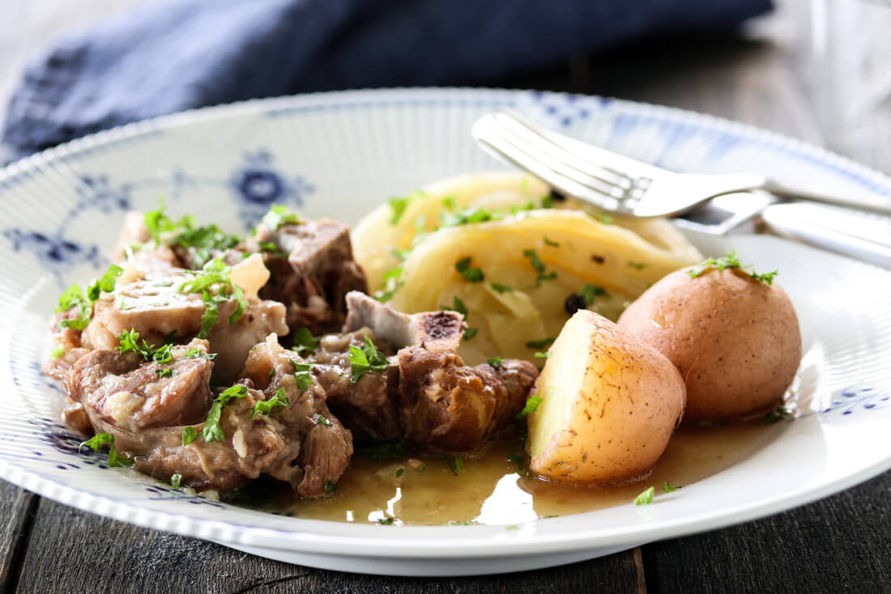

# Fårikål (Norwegian Lamb and Cabbage)

*Norway's national dish: chunks of lamb on the bone layered with white cabbage and whole black peppercorns, simmered for two hours into a fragrant, tender autumn stew. Served with boiled potatoes.*

**Serves:** 6

**Prep Time:** 15 minutes

**Cook Time:** 2 hours 30 minutes

## Overview
Fårikål - "sheep in cabbage" - is the dish Norway officially declared its national dish in 2014 and again in 2017 after a brief flirtation with the idea that it might be retired. The recipe is as simple as cooking gets: chunks of bone-in lamb (shoulder or breast) layered with white cabbage and a generous pour of whole black peppercorns, just covered with water, simmered slowly until the lamb falls off the bone and the cabbage softens into a sweet-savoury silk. The bone marrow enriches the broth; the peppercorns give a striking warmth that defines the dish. Eat on the last Thursday of September (Fårikålens Festdag - "fårikål's celebration day") and through autumn, with boiled potatoes catching the broth.

## Ingredients
- 1.5 kg lamb shoulder or lamb breast on the bone, cut into 5 cm chunks
- 1 large white cabbage (about 1.5 kg), cut into thick wedges
- 2 tbsp whole black peppercorns
- 2 tsp fine sea salt
- 2 tbsp plain flour (optional, for thickening)
- 500 ml water (just enough to barely cover)

### To serve
- 1.5 kg floury potatoes, peeled, boiled
- Butter for the potatoes
- Lingonberry preserves or sweet pickled red cabbage on the side

## Method

### Stage 1 - Layer the pot
1. Choose a heavy pot large enough to hold everything snugly (a Dutch oven or large casserole).
2. Place a layer of lamb chunks at the bottom, fat side down.
3. Sprinkle a teaspoon of peppercorns over.
4. Cover with a layer of cabbage wedges.
5. Sprinkle with salt and another teaspoon of peppercorns.
6. Continue layering: lamb, peppercorns, cabbage, salt, peppercorns.
7. Finish with cabbage on top.

### Stage 2 - Optional flour
1. If using flour to thicken the broth, sprinkle between layers (a teaspoon at a time) - traditional in some regions, omitted in others.

### Stage 3 - Add water
1. Pour the water down the side of the pot - just enough that you can see liquid through the cabbage at the bottom.
2. The cabbage releases its own water as it cooks, so don't drown it.

### Stage 4 - Simmer slow
1. Bring to a gentle simmer over medium heat.
2. Cover with a tight lid.
3. Reduce heat to very low; cook 2 hours.
4. Don't stir - layered cooking is the point; stirring breaks up the cabbage.
5. After 2 hours, check: the lamb should be fork-tender; the cabbage soft and translucent.
6. If the lamb is still firm, give it another 30 minutes.

### Stage 5 - Boil the potatoes
1. While the fårikål rests, peel and boil the potatoes in salted water until tender (about 20 minutes).
2. Drain; toss with butter; cover to keep warm.

### Stage 6 - Serve
1. Ladle the fårikål into deep warm bowls, scooping from the side so each portion gets lamb, cabbage and broth.
2. Spoon the peppercorns over - they're soft and edible at this point, fragrant and pleasingly warm.
3. Serve the potatoes alongside on a separate plate so each diner can mash and dip their own into the broth.

## Notes
- **Whole peppercorns, not ground:** The whole peppercorns slowly release flavour into the broth without making it harsh. Ground pepper would give a one-note bite.
- **Bone-in lamb:** The marrow gives the broth its character; boneless lamb makes a thinner, less interesting stew.
- **Layer, don't stir:** The layering is what gives fårikål its character; stirring it during cooking turns it to mush.

## Serving
- Serve as the autumn Sunday dinner, traditional from late September through November. Drink a glass of dark beer or aquavit alongside (aquavit is the Norwegian caraway spirit; a small chilled shot is the formal accompaniment).

## Storage
- Refrigerates 4 days; the flavour deepens overnight.
- Reheats well in the original pot over low heat.
- Freezes 2 months; thaw in the fridge before reheating.
