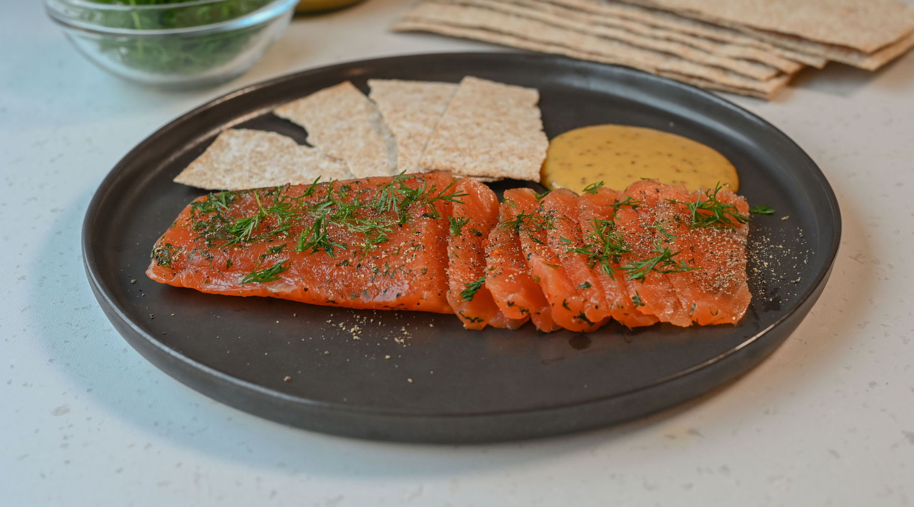

# Gravlaks (Cured Norwegian Salmon)

*Norway's defining preparation of salmon: a side of salmon cured in salt, sugar and dill for two days until the flesh is firm, silky and translucent. Sliced thin and served with mustard-dill sauce on dark bread.*

**Serves:** 8 as a starter

**Prep Time:** 15 minutes (plus 48 hours cure)

**Cook Time:** None

## Overview
Gravlaks - "grave salmon" - is the Norwegian and Scandinavian preparation that turned salmon into world food. The technique is ancient: salmon was buried (graved) in sand near the beach with salt and dill, where the action of salt drew out water and the cold cured the flesh without cooking it. The modern home method skips the sand and uses a refrigerator: a salmon fillet is rubbed with salt, sugar and chopped dill, weighted down, and left to cure for two days. The result is a firm, glossy, brilliantly orange flesh with a flavour deeper than smoked salmon and a texture more silky than cooked. Sliced thin and served on dark rye bread with mustard-dill sauce (hovmästarsås) and a glass of cold aquavit, gravlaks is the Norwegian buffet centrepiece - present at every celebration from Christmas to Constitution Day.

## Ingredients

### Salmon and cure
- 1 kg salmon fillet, skin-on, scaled, pin bones removed (the centre cut or tail end of a large salmon)
- 100 g coarse sea salt (not fine table salt)
- 100 g caster sugar
- 1 tbsp coarsely crushed white peppercorns
- 1 large bunch fresh dill, roughly chopped (about 50 g)
- Optional: 2 tbsp aquavit, brandy or vodka (for a deeper cure)

### Mustard-dill sauce (hovmästarsås)
- 3 tbsp Dijon mustard
- 1 tbsp wholegrain mustard
- 2 tbsp caster sugar
- 1 tbsp white wine vinegar
- 100 ml neutral vegetable oil
- 3 tbsp finely chopped fresh dill
- Salt and white pepper

### To serve
- Dark rye bread or pumpernickel, thinly sliced
- Unsalted butter
- Lemon wedges
- Extra fresh dill sprigs

## Method

### Stage 1 - Inspect the fish
1. Run your fingers over the salmon to find any remaining pin bones; remove with tweezers.
2. Pat dry with kitchen paper.

### Stage 2 - Make the cure
1. In a bowl, combine the salt, sugar and crushed white peppercorns.
2. Add half the chopped dill; mix.

### Stage 3 - Cure
1. Spread a quarter of the cure mixture on a piece of cling film large enough to wrap the salmon (or a glass/ceramic dish).
2. Place the salmon skin-side down on the cure.
3. Sprinkle the spirits over the flesh (if using).
4. Pack the remaining cure thickly over the top of the salmon - covering it entirely with a 5 mm crust.
5. Top with the rest of the chopped dill.
6. Wrap tightly in cling film (or cover the dish).

### Stage 4 - Weight and chill
1. Place the wrapped salmon on a plate or shallow dish (juices will be released as it cures - don't skip the dish).
2. Set another plate on top.
3. Place 2-3 cans of food on the plate as weights.
4. Refrigerate.

### Stage 5 - Cure time
1. Cure for 48 hours, turning the salmon every 12 hours so the cure works both sides evenly.
2. The flesh firms, the colour deepens to a rich orange, and the juices in the dish increase.

### Stage 6 - Mustard-dill sauce
1. In a small bowl, whisk together both mustards, sugar and vinegar.
2. Slowly drizzle in the oil, whisking continuously, until the sauce emulsifies into a thick mayonnaise consistency.
3. Stir in the chopped dill.
4. Season with salt and white pepper.
5. Chill 30 minutes (flavours marry).

### Stage 7 - Unwrap and slice
1. Lift the salmon out; brush off the cure with a clean tea towel (don't rinse).
2. Pat dry.
3. Place skin-side down on a board.
4. Using a long, sharp, thin-bladed knife, slice the flesh on a steep angle (40 degrees) into very thin slices, leaving the skin behind.
5. The slices should be paper-thin and translucent.

### Stage 8 - Plate
1. Arrange the slices in a fan or rosette on a flat platter.
2. Scatter fresh dill sprigs.
3. Lemon wedges around the edge.
4. The mustard-dill sauce in a small bowl alongside.
5. Sliced rye bread and butter on a separate plate.

## Notes
- **Use the freshest salmon you can find:** This is essentially raw fish. Buy from a fishmonger you trust, ask if it's sashimi grade. Wild Norwegian or Scottish salmon is ideal; farmed is fine if of good quality.
- **Coarse sea salt, not fine:** Fine salt over-cures and gives a salty, leathery result. Coarse salt cures more gradually.
- **Slice thin against the grain:** A long, thin, very sharp knife is the right tool. Thick slabs of gravlaks are inelegant and chewy.

## Serving
Serve as a starter at any Norwegian celebration meal, or as a buffet centrepiece. The Norwegian protocol: take a slice on a buttered piece of rye bread, add a small dollop of mustard-dill sauce, a sprig of dill. A cold shot of aquavit alongside. A glass of dry Riesling or champagne for the wine-drinker.

## Storage
- Refrigerates in cling film 1 week.
- Slices oxidise and lose their gloss after slicing - slice only what you need; the rest stays whole.
- Don't freeze post-cure - the texture suffers; freeze pre-cure if storing the raw salmon.
