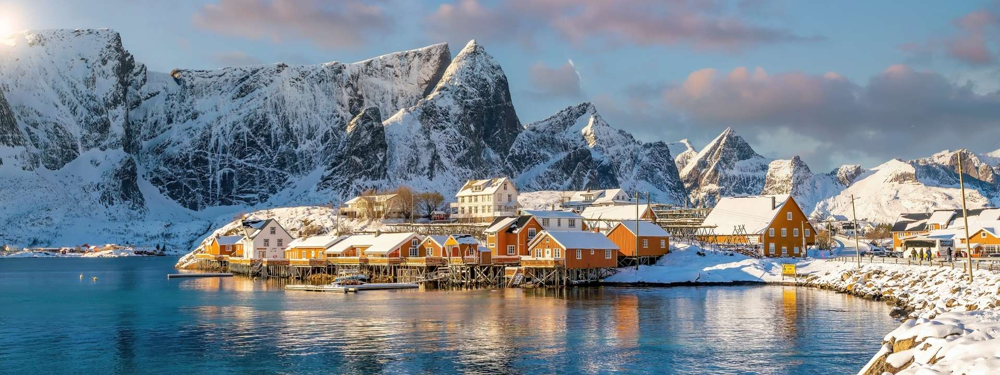

# Norwegian Cuisine

Norway's seafood-and-dairy table: salmon and cod from the fjords (gravlaks, klippfisk, rakfisk), brown cheese (brunost), waffles eaten as breakfast or snack, lefse (potato flatbread), and the cold-weather hearty stews of fårikål (lamb-and-cabbage) and lapskaus. The pølse i lompe national hot dog is eaten on Syttende Mai (Constitution Day, May 17th).
