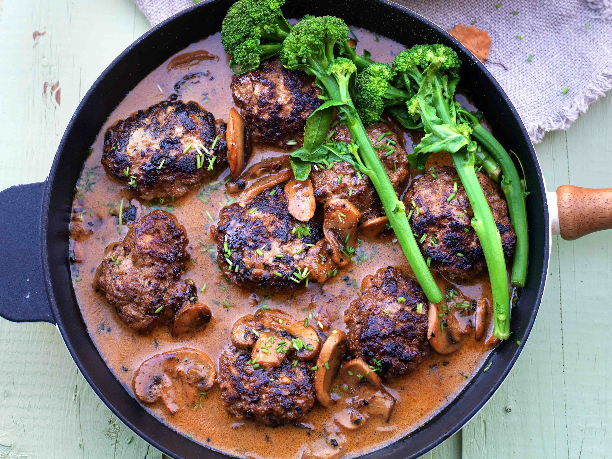

# Kjøttkaker (Norwegian Meatballs)

*Norwegian meatballs done properly: large patties of seasoned beef and pork, browned in butter then simmered in brown gravy. Served with mashed potato, peas and lingonberry preserves. The Sunday dinner Norwegians grow up on.*

**Serves:** 4

**Prep Time:** 20 minutes

**Cook Time:** 30 minutes

## Overview
Kjøttkaker (literally "meat cakes") are Norway's home meatballs - larger and flatter than Swedish köttbullar, made of mixed beef and pork, gently spiced with nutmeg and ginger, browned to a deep crust and then simmered in dark brown gravy made from the pan drippings. The accompaniments are non-negotiable: creamy mashed potato, sweet boiled peas, and a small spoon of lingonberry preserves on the side, the tart-sweet jam cutting the rich gravy. This is the comfort-food Sunday dinner Norwegian children grew up with and Norwegian adults make for their own families. The technique - sear, then simmer in gravy - keeps the meat tender and lets the gravy build flavour from the fond.

## Ingredients

### Meatballs
- 400 g beef mince (15-20% fat)
- 400 g pork mince
- 1 small onion, very finely grated (use a microplane)
- 2 tbsp plain flour
- 1 large egg
- 200 ml whole milk
- 1.5 tsp fine sea salt
- 1 tsp freshly ground black pepper
- 0.5 tsp ground nutmeg
- 0.5 tsp ground ginger
- 30 g unsalted butter
- 1 tbsp vegetable oil

### Brown gravy
- 30 g unsalted butter (in addition to the meatball butter)
- 3 tbsp plain flour
- 600 ml beef stock
- 100 ml double cream (optional, for a richer gravy)
- 1 tsp soy sauce (for colour and savour)
- A pinch of brown sugar
- Salt and pepper

### To serve
- Mashed potato (creamy, plenty of butter)
- 400 g frozen peas, boiled 3 minutes
- 100 g lingonberry preserves (or substitute cranberry sauce or redcurrant jelly)

## Method

### Stage 1 - The meat mixture
1. In a large bowl, combine the beef and pork mince.
2. Add the finely grated onion (with its juice), flour, egg, milk, salt, pepper, nutmeg and ginger.
3. Mix with your hands until evenly combined, but don't overwork - just enough to bring it together.
4. Rest 10 minutes (the flour hydrates).

### Stage 2 - Shape
1. With slightly wet hands, shape into 12 large flat patties (each about 4 cm across, 2 cm thick).
2. Set on a tray; refrigerate 10 minutes if you have time (helps them hold shape).

### Stage 3 - Brown
1. Heat the butter and oil in a large heavy frying pan over medium-high heat.
2. When the butter foam subsides, add the meatballs in 2 batches (don't crowd).
3. Brown 3-4 minutes a side until deeply golden.
4. Lift to a plate.

### Stage 4 - Build the gravy
1. Reduce heat to medium; add the extra 30g butter to the pan.
2. When it melts, sprinkle the flour over and whisk into a paste with the pan juices.
3. Cook 1-2 minutes, whisking, until the flour smells nutty (this is the roux).
4. Gradually pour in the beef stock, whisking continuously to keep smooth.
5. Bring to a simmer; cook 3-4 minutes until thickened to gravy consistency.
6. Stir in the cream (if using), soy sauce, brown sugar.
7. Taste; salt and pepper as needed.

### Stage 5 - Simmer the meatballs in gravy
1. Return the meatballs and any resting juices to the pan.
2. Cover; simmer over low heat 15-20 minutes.
3. The meatballs cook through to juicy in the middle; the gravy thickens slightly more.

### Stage 6 - Plate
1. Mashed potato in the middle of the plate.
2. Three or four meatballs on top.
3. Ladle the gravy generously over.
4. Peas to the side.
5. A small spoonful of lingonberry preserves at the edge of the plate (not mixed in - eaten in small forkfuls alongside).

## Notes
- **Beef and pork together:** The classic Norwegian mix. Pure beef gives a dry meatball; pure pork is too soft. The 50-50 ratio is what gives kjøttkaker their characteristic texture.
- **Grate the onion fine:** Chopped onion makes the meatballs fall apart; grated onion melts into the mix and adds moisture and flavour.
- **The lingonberry isn't optional:** That small spoon of tart-sweet jam cuts the richness of the gravy and is the Norwegian element. Cranberry sauce or redcurrant jelly are reasonable substitutes outside Scandinavia.

## Serving
The Sunday dinner. A glass of Norwegian dark lager or sparkling apple cider. A simple green salad on the side, or just the plate as it comes.

## Storage
- Refrigerates 4 days; reheats beautifully in the gravy (add a splash of stock if it's tightened too much).
- Freezes 2 months in the gravy; thaw in the fridge before reheating.
- The meatballs alone (no gravy) freeze 3 months.
