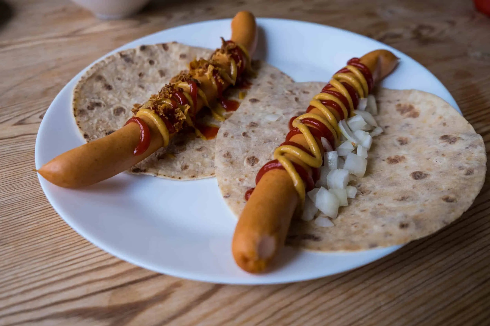

# Pølse i Lompe (Norwegian Potato-Flatbread Hot Dog)

*Norway's national hot dog: a long mild Norwegian sausage wrapped not in a bun but in a soft lompe - a thin flexible Norwegian potato-flour flatbread that wraps like a soft tortilla. Topped simply with ketchup, mustard, fried onions, and sometimes mashed potato or shrimp salad. The Constitution Day (May 17th) tradition; the Norwegian kiosk staple.*

**Serves:** 4

**Prep Time:** 20 minutes (plus rest time for the lompe dough)

**Cook Time:** 15 minutes

## Overview
The Norwegian pølse i lompe ("sausage in lompe") is Norway's national hot dog and the canonical street-food snack for Constitution Day (Syttende Mai, May 17th) when Oslo and every Norwegian town centre fills with families eating pølse i lompe in their bunad national costumes. The dish is structurally distinct from every other European hot dog: instead of a bread bun, the sausage is wrapped in a lompe - a soft thin potato-flour flatbread (a Norwegian relative of the Swedish tunnbröd, but using potato flour as the base and made smaller and more handheld). The lompe is laid flat, a long mild Norwegian sausage placed down the middle, then condiments added (ketchup, mustard, crispy fried onions are the canonical trio; sweet pickled cucumber, mashed potato, or shrimp salad as additions), and the lompe rolled tightly around the sausage into a soft burrito-style wrap. Sold from kiosks (especially Narvesen and 7-Eleven Norge), gas stations, and street stands across Norway. Three details: lompe wrap (potato-flour, soft, smaller than tortilla), mild long sausage, crispy fried onions essential.

## Ingredients

### Lompe (Norwegian potato flatbread) - makes 8
- 400 g cold mashed potato (from boiled and riced potatoes, no butter or milk added)
- 200 g potato flour (or wheat flour if potato unavailable)
- 1 teaspoon fine sea salt
- More potato flour for dusting

### Sausages
- 4 long mild Norwegian-style wienerwurst sausages (or any long pork-and-beef hot dog; the Norwegian sausage is mild, not spiced heavily)
- 1 tablespoon vegetable oil

### Toppings
- Yellow mustard
- Tomato ketchup
- 6 tablespoons crispy fried onions
- Sweet pickled cucumber slices (optional)
- 200 ml warm Norwegian-style mashed potato (optional; called "lomperul med potetstappe" when added)
- 100 g Norwegian shrimp salad (optional)

### To serve
- A glass of cold beer or Solo (Norwegian orange soda)
- For Constitution Day: ice cream cones on the side

## Method

### Stage 1 - Make lompe dough
1. In a wide bowl, mix the cold mashed potato with the potato flour and salt.
2. Knead briefly into a soft dough (it should be slightly sticky but workable).
3. Rest 15 minutes (helps the flour hydrate).

### Stage 2 - Roll the lompe
1. Divide the dough into 8 equal pieces (about 75g each).
2. On a surface dusted with potato flour, roll each piece into a very thin round about 20cm wide and 2-3mm thick.
3. The lompe should be flexible, not crispy.

### Stage 3 - Cook the lompe
1. Heat a wide dry pan or griddle over medium-high heat.
2. Cook each lompe 90 seconds per side till small light brown spots appear and the lompe is dry to the touch but still flexible.
3. Stack cooked lompe on a plate, covered with a clean kitchen towel to keep them soft.

### Stage 4 - Cook the sausages
1. Heat oil in a wide pan over medium-high heat.
2. Cook the sausages 6-8 minutes, turning, till lightly browned with slightly split casing.

### Stage 5 - Build the pølse i lompe
1. Lay a warm soft lompe flat on a board.
2. Place a warm sausage down the centre of the lompe.
3. Zigzag mustard down the length.
4. Zigzag ketchup alongside.
5. A generous scatter of crispy fried onions.
6. Optional: sweet pickle slices laid in a row.
7. Optional: a spoon of warm mashed potato or shrimp salad alongside the sausage.

### Stage 6 - Roll
1. Fold one end of the lompe up.
2. Roll the lompe around the sausage from one long side.
3. The lompe should fully enclose the sausage as a soft wrap.

### Stage 7 - Serve immediately
1. Hand over warm; eat with hands.
2. Cold beer or Solo (Norwegian orange soda).

## Notes
- **Lompe, not a bun:** potato-flatbread wrap is the structural and cultural signature.
- **Mild sausage:** Norwegian sausages are gently spiced; spicy sausages overpower the lompe.
- **Crispy fried onions:** the canonical Norwegian topping.
- **Roll like a burrito:** tightly so it holds while eating.

## Variations
**Lompe med potetstappe (lompe with mashed potato):** add a stripe of warm mash inside the wrap.
**Lompe med rekesalat (with shrimp salad):** add a spoon of shrimp salad - the Scandinavian sweet-creamy lift.
**Pølse med bacon:** wrap the sausage in bacon and grill before adding to the lompe.
**Spicier:** add a zigzag of sriracha (less traditional, increasingly common).
**Lompe two sausages (for big eaters):** double up.

## Serving
On Syttende Mai (Constitution Day, May 17th) with the family in the centre of Oslo, Bergen or Trondheim. At a kiosk in any Norwegian train station. At a hytte (cabin) weekend.

## Storage
- Lompe keep wrapped in a kitchen towel 1 day; freeze 2 months (thaw and warm in dry pan).
- Cooked sausages refrigerate 4 days.
- Don't assemble in advance.
