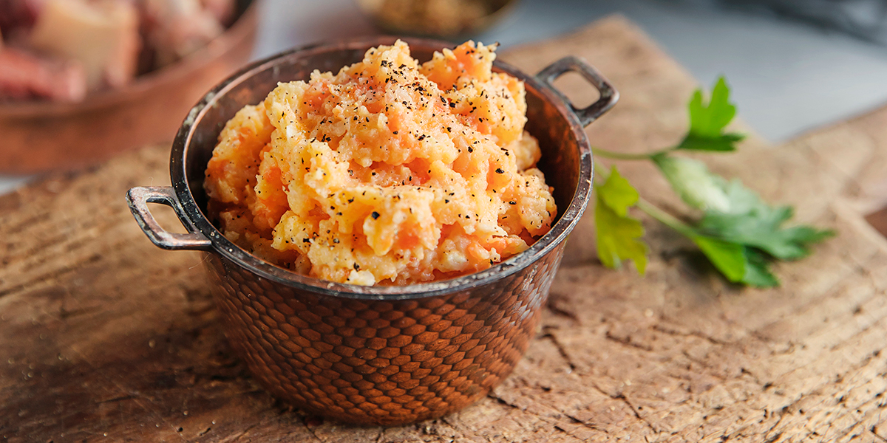

# Kålrabistappe (Norwegian Rutabaga Mash)

*The Norwegian Christmas rutabaga mash: swede and carrot boiled in lamb broth and mashed with butter, cream and a generous twist of black pepper. Orange-yellow, silky, slightly sweet. Sits next to the meat at every Norwegian Christmas table.*

**Serves:** 6

**Prep Time:** 10 minutes

**Cook Time:** 35 minutes

## Overview
Kålrabistappe (also spelt kålrotstappe) is the Norwegian root-vegetable mash that sits alongside the meat on every Christmas dinner plate: rutabaga (swede - the round, purple-and-yellow root that's a cross between turnip and cabbage) and a smaller proportion of carrot, boiled in lamb broth, then mashed with butter, cream and pepper. The lamb broth gives a depth that water alone can't; the carrot adds sweetness and the orange tint that turns the mash from yellow to a warmer amber. The flavour is gently sweet, slightly cabbagey from the rutabaga, with a hint of meatiness from the broth. The texture is smooth but not whipped - left with a little body to hold its shape against the gravy on the plate.

## Ingredients
- 1 kg rutabaga (swede), peeled, cut into 3 cm chunks
- 200 g carrots, peeled, cut into 2 cm chunks
- 600 ml lamb broth (from a roast or stew - or substitute beef/chicken stock)
- 1 tsp fine sea salt
- 60 g unsalted butter
- 100 ml double cream (or whole milk for a lighter mash)
- 0.5 tsp ground white pepper
- A pinch of grated nutmeg

### Optional finishing
- 2 tbsp finely chopped fresh chives or parsley
- A drizzle of brown butter on top

## Method

### Stage 1 - Boil
1. Place the rutabaga and carrot chunks in a large pot.
2. Pour over the lamb broth (or stock); add the salt.
3. If the liquid doesn't fully cover, top up with a little water.
4. Bring to a boil; reduce to a simmer.
5. Cook 25-30 minutes until very tender (a knife slides through easily).

### Stage 2 - Drain and dry
1. Drain in a colander, reserving the broth (delicious leftover stock for soup).
2. Return the vegetables to the empty pot over very low heat for 30 seconds to dry off any residual moisture.

### Stage 3 - Mash
1. Add the butter to the pot; let it melt over the warm vegetables.
2. Mash with a potato masher (or pass through a ricer for a smoother mash).
3. Don't use a food processor - rutabaga becomes gummy.

### Stage 4 - Loosen and season
1. Stir in the cream gradually until the mash reaches a thick spoonable consistency.
2. Season with white pepper, nutmeg, and more salt to taste (rutabaga can take quite a bit).

### Stage 5 - Plate
1. Spoon into a warm serving bowl.
2. Optional: drizzle with brown butter or scatter with chopped chives.
3. Serve immediately while hot.

## Notes
- **Rutabaga, not turnip:** They're different vegetables despite the name confusion. Rutabaga (swede) is larger, with denser yellow flesh; turnip is smaller and whiter. Use rutabaga for this dish - turnip is too sharp.
- **Lamb broth is the difference:** Cooking the roots in lamb broth instead of water adds the depth that makes kålrabistappe distinct from generic mashed swede. Leftover broth from a Sunday lamb roast is ideal.
- **Don't whip:** Mash to smooth-with-body. Over-whipping makes it gluey and pale.

## Serving
The Christmas-dinner classic alongside pinnekjøtt (dried lamb ribs), ribbe (roast pork belly) or any Sunday roast. A spoonful per plate; the dish is rich.

## Storage
- Refrigerates 4 days; reheats well in a pan with a splash of cream or milk.
- Freezes 2 months; thaw in the fridge before reheating.
- Leftovers can be fried in butter as a vegetable cake; or shaped into balls, breaded and deep-fried for a Norwegian-style root croquette.
