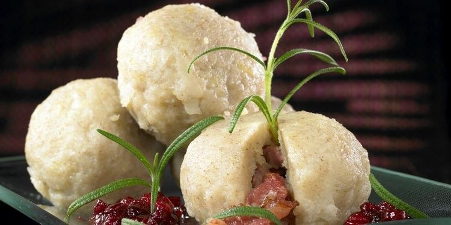

# Raspeballer (Norwegian Potato Dumplings)

*Western Norway's potato dumplings: grated raw and boiled potato bound with flour into large dense dumplings, boiled in lamb broth, served with bacon, butter and rutabaga mash. The Thursday lunch of the fjord coast.*

**Serves:** 4

**Prep Time:** 30 minutes

**Cook Time:** 1 hour 10 minutes

## Overview
Raspeballer (also called komle, klubb, kumle or potetball depending on the valley) are the potato dumplings of western Norway, traditionally served on Thursdays in the fjord-coast counties of Hordaland and Sogn og Fjordane. The dumpling is made from a mix of grated raw potato (which gives the characteristic gummy chew) and cooked mashed potato (which gives body), bound with flour and salt into large heavy balls the size of an orange. Boiled in lamb-bone broth for an hour, they emerge dense, slightly translucent, and faintly grey. They're never the main attraction on the plate - they're the carb that sits alongside crispy bacon, melted butter, rutabaga mash, sausages and lamb, with a generous puddle of golden syrup or lingonberry jam on top.

## Ingredients

### Broth
- 1 kg lamb bones or lamb shoulder on the bone (or 1.5 L good chicken stock as substitute)
- 1 onion, halved
- 2 carrots, halved
- 2 bay leaves
- 1 tsp whole black peppercorns
- 2 tsp salt
- Water to cover

### Dumplings
- 1 kg waxy potatoes (Désirée, Charlotte)
- 500 g floury potatoes (Maris Piper, Agria)
- 100 g plain flour
- 100 g barley flour (or more plain flour if no barley)
- 2 tsp fine sea salt
- 0.5 tsp ground white pepper

### To serve
- 250 g smoked streaky bacon (or thick-cut bacon), diced
- 100 g unsalted butter
- 400 g rutabaga (swede), peeled, cubed
- 1 tbsp golden syrup or honey
- Lingonberry preserves on the side

## Method

### Stage 1 - Start the broth
1. Place the lamb bones in a large pot.
2. Cover with cold water; bring to a boil.
3. Skim the foam.
4. Add the onion, carrots, bay leaves, peppercorns and salt.
5. Reduce to a simmer; cook 1 hour 30 minutes.
6. Strain into a clean pot, discarding the solids.

### Stage 2 - The cooked-potato component
1. Peel and chop the floury potatoes (500g) into chunks.
2. Boil in salted water until tender (about 15 minutes); drain; mash smooth.
3. Cool to lukewarm.

### Stage 3 - The grated-raw-potato component
1. Peel the waxy potatoes (1 kg).
2. Grate finely on the fine side of a box grater into a clean tea towel.
3. Gather the tea towel into a bundle; wring tightly over the sink to squeeze out as much water as possible (do this thoroughly - wet grated potato makes loose dumplings).
4. The starch left in the water can settle in a glass; pour off the water and scrape the starch back into the dough for extra body if you wish.

### Stage 4 - Combine the dough
1. In a very large bowl, combine the grated raw potato, the mashed cooked potato, both flours, salt and pepper.
2. Mix with your hands until uniform - it's heavy work; a few minutes of kneading.
3. The dough should be sticky but cohesive; if too sticky, add a little more flour; if dry, a tablespoon of water.

### Stage 5 - Shape
1. With wet hands, take handfuls of dough and shape into round balls the size of an orange (about 250g each).
2. You'll get 8-10 dumplings.
3. Set on a tray dusted with flour.

### Stage 6 - Cook in broth
1. Bring the strained broth to a gentle simmer (not a rolling boil - the dumplings break up).
2. Lower the dumplings in one at a time with a slotted spoon.
3. Cook 1 hour at a low simmer, partially covered.
4. The dumplings firm up and turn slightly translucent.

### Stage 7 - Rutabaga mash
1. Boil the rutabaga cubes in salted water 20 minutes until tender.
2. Drain; mash with 20g of the butter and a pinch of salt.
3. Keep warm.

### Stage 8 - Crisp the bacon
1. Fry the diced bacon in a dry pan over medium heat until crisp; reserve the fat.

### Stage 9 - Brown butter
1. Melt the remaining 80g butter in a small pan over medium heat.
2. Continue until it foams and turns nut-brown - smelling toasty and slightly sweet.
3. Pour into a small jug.

### Stage 10 - Serve
1. Lift the dumplings out of the broth with a slotted spoon onto warm plates.
2. Spoon over the bacon and bacon fat.
3. Drizzle with the brown butter.
4. Spoon rutabaga mash alongside.
5. A small puddle of golden syrup on top of each dumpling (yes, sweet on savoury - it's the way).
6. A spoonful of lingonberry preserves at the edge of the plate.

## Notes
- **Wring the grated potato dry:** The single most important step. Wet potato dough cooks into mush. Wring hard until the cloth is barely damp.
- **Don't boil hard:** The dumplings cook in a gentle simmer; a rolling boil breaks them up.
- **Sweet on savoury:** The golden syrup or jam over the dumpling is non-negotiable Norwegian tradition. It balances the salty bacon and the dense starch.

## Serving
The Thursday lunch dish of western Norway. Serve as a hearty winter midday meal with dark beer or aquavit alongside.

## Storage
- Refrigerates 4 days; reheats well in simmering broth (don't microwave - they go rubbery).
- Freezes 2 months; thaw in the broth, then reheat.
- Leftovers are often sliced and pan-fried in butter the next day - the Norwegian fried-dumpling breakfast.
