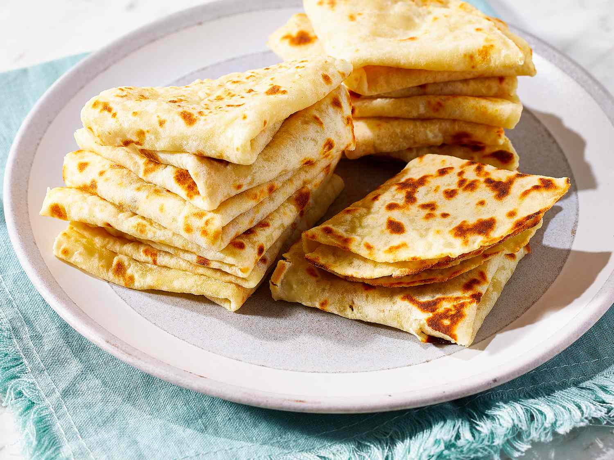

# Lefse (Norwegian Potato Flatbread)

*Norway's thin soft potato flatbread: cold mashed potato mixed with flour, rolled paper-thin and cooked dry on a hot griddle. Brushed with butter and dusted with cinnamon sugar; rolled into tubes and served with coffee. Norwegian afternoon comfort.*

**Serves:** Makes about 12 lefse

**Prep Time:** 40 minutes (plus overnight chill of potato)

**Cook Time:** 30 minutes

## Overview
Lefse is the Norwegian thin soft flatbread made from a dough of cold mashed potato, butter, cream and flour. There are many regional versions - the soft tjukklefse of the east is thicker and dumpling-like; the thin paper-fine potetlefse of the Trøndelag and Hardanger districts is delicate and lacy. This recipe makes the thin version: rolled paper-thin, cooked dry on a hot griddle until lightly speckled, stacked under a cloth to stay soft. Served the classic way: brushed with melted butter, dusted with cinnamon sugar, rolled into a tube and cut into pieces (smør og sukker lefse) for afternoon coffee. Lefse also wraps savoury fillings - cured fish, cheese, cold cuts - and is the wrapper for pølse i lompe (the Norwegian hot dog).

## Ingredients

### Dough
- 1 kg waxy potatoes, peeled and quartered
- 1 tsp salt (for boiling)
- 60 g unsalted butter
- 100 ml double cream
- 1.5 tsp fine sea salt
- 200-250 g plain flour (start with less, add as needed)
- Extra plain flour for dusting

### To serve (sweet)
- 80 g unsalted butter, melted
- 50 g caster sugar
- 1.5 tsp ground cinnamon

## Method

### Stage 1 - Boil and mash (day before)
1. Boil the potatoes in salted water until tender, about 20 minutes.
2. Drain very well; return to the empty pot over low heat for 30 seconds to dry off.
3. Pass through a ricer for the smoothest mash (or mash thoroughly by hand).
4. Add the butter, cream and salt; mix until uniform.
5. Cool to room temperature.
6. Cover and refrigerate overnight - cold potato makes a manageable dough.

### Stage 2 - Mix the dough
1. The next day, tip the cold potato into a large bowl.
2. Sprinkle 200 g of the flour over.
3. Mix gently with your hands; bring together into a soft, slightly sticky dough.
4. Add more flour a tablespoon at a time only if the dough won't hold its shape - the lefse goes tough with too much flour.

### Stage 3 - Heat the griddle
1. Heat a wide dry griddle, large frying pan or comal over medium-high heat.
2. Test with a sprinkle of flour - it should brown gently in 30 seconds.

### Stage 4 - Divide and roll
1. Divide the dough into 12 equal pieces (about 115 g each); roll into balls.
2. On a flour-dusted surface (use plenty of flour - lefse sticks easily), flatten one ball into a disc.
3. Roll out with a rolling pin into a very thin round, 25-28 cm wide and 1-2 mm thick. The thinner the better; some you can almost see through.
4. Dust both sides lightly with flour to prevent sticking.

### Stage 5 - Cook
1. Transfer the rolled lefse to the hot dry griddle (the back of a rolling pin or a long thin spatula helps).
2. Cook 60-90 seconds until light brown spots appear and the surface bubbles.
3. Flip; cook the second side 30-60 seconds.
4. Lift onto a plate; cover with a clean tea towel to keep soft.
5. Continue with the rest, stacking each cooked lefse on top of the previous one under the same towel.

### Stage 6 - Serve sweet (smør og sukker lefse)
1. Combine the sugar and cinnamon in a small bowl.
2. Take a warm lefse; brush one side generously with melted butter.
3. Sprinkle with cinnamon sugar.
4. Fold into thirds, then roll up into a tight tube.
5. Cut into 5 cm pieces with a sharp knife.
6. Eat warm or at room temperature with coffee.

## Notes
- **Cold mashed potato is the key:** Warm mash absorbs more flour and gives a tough lefse. Cold mash + minimum flour = tender lefse.
- **Roll thin:** Aim for 1-2 mm thick. A grooved lefse rolling pin (with crosshatch ridges) helps for an authentic texture, but a plain rolling pin works too.
- **Dry griddle, no fat:** Lefse cooks dry. Any fat in the pan and they fry crisp instead of staying soft.

## Serving
- The afternoon coffee snack. A plate of warm sweet lefse with a pot of strong black coffee at 4pm; the Norwegian "kaffe og kake" ritual. Also rolled around pølse (sausages) as pølse i lompe.

## Storage
- Wrapped in a tea towel at room temperature: 2 days.
- Refrigerated in a sealed bag: 4 days (warm briefly in a dry pan to soften).
- Freezes 3 months wrapped tightly; thaw and warm on a dry pan.
