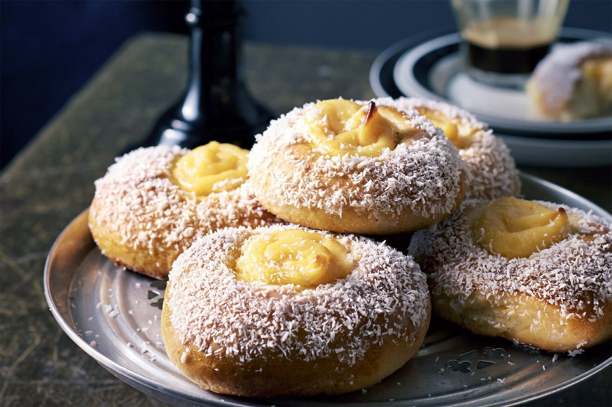

# Skolebrød (Norwegian School Bread)

*Norway's beloved sweet custard bun: a soft cardamom-spiced dough piped with a hollow, filled with thick vanilla custard, baked, then topped with icing and a generous shower of desiccated coconut. The packed-lunch staple every Norwegian child remembers.*

**Serves:** Makes 12 buns

**Prep Time:** 30 minutes (plus 2 hours proving)

**Cook Time:** 15 minutes

## Overview
Skolebrød (or skolebolle in Bergen) - "school bread" - is the iconic Norwegian sweet bun named for its place in every Norwegian schoolchild's matpakke (packed lunch). The bun is a soft yeasted cardamom-scented dough shaped into a flat round with a deep well in the centre; the well is filled with thick vanilla custard before baking, and after baking the top edge is iced and dipped in desiccated coconut, leaving the custard centre exposed. The result is a small handheld dessert with three textures - soft sweet bread, set custard, sweet coconut topping - all in one bite. They're sold in every Norwegian bakery, posted to Norwegians abroad as care packages, and made at home for birthdays and lunchboxes.

## Ingredients

### Dough
- 500 g plain flour
- 100 g caster sugar
- 2 tsp ground cardamom
- 1 tsp fine salt
- 7 g (1 sachet) instant dried yeast
- 250 ml whole milk, warmed to body temperature
- 1 large egg
- 100 g unsalted butter, softened

### Vanilla custard (vaniljekrem)
- 500 ml whole milk
- 1 vanilla pod, split (or 2 tsp vanilla extract)
- 4 large egg yolks
- 100 g caster sugar
- 40 g cornflour
- 30 g unsalted butter

### Topping
- 1 egg, beaten (for glazing)
- 150 g icing sugar
- 2-3 tbsp water (or lemon juice)
- 100 g desiccated coconut

## Method

### Stage 1 - Make the custard first
1. In a heavy saucepan, heat the milk with the split vanilla pod until just below a simmer.
2. In a bowl, whisk the egg yolks, sugar and cornflour into a smooth thick paste.
3. Slowly pour the hot milk into the egg mixture, whisking continuously.
4. Return the mixture to the pan; cook over low heat, stirring constantly with a wooden spoon, 4-5 minutes until very thick (custard bubbling and pulling away from the sides).
5. Off the heat, stir in the butter.
6. Remove the vanilla pod (scrape seeds back into the custard).
7. Cover with cling film pressed onto the surface; refrigerate to cool completely (at least 1 hour).

### Stage 2 - Mix the dough
1. In the bowl of a stand mixer with a dough hook, combine the flour, sugar, cardamom, salt and yeast.
2. Add the warm milk and the egg.
3. Mix on low speed until a shaggy dough forms.
4. Add the softened butter, a tablespoon at a time, mixing between additions.
5. Knead on medium speed 8-10 minutes until smooth and elastic.

### Stage 3 - First prove
1. Cover with a tea towel.
2. Rise in a warm place 1.5-2 hours until doubled.

### Stage 4 - Shape
1. Tip onto a lightly floured surface.
2. Knock back; divide into 12 equal pieces (about 75g each).
3. Shape each into a smooth ball; flatten slightly into a disc.
4. Place on a lined baking tray, spaced apart (they grow).
5. Using a small jar or the base of a tumbler, press a deep round indentation into the centre of each bun (about 2 cm deep, 4 cm wide).

### Stage 5 - Second prove
1. Cover; prove 30 minutes until puffy but not doubled.

### Stage 6 - Fill and bake
1. Preheat the oven to 200°C.
2. Spoon a generous tablespoon of cold custard into each indentation.
3. Brush the dough (not the custard) with beaten egg.
4. Bake 12-15 minutes until the buns are deeply golden.
5. Cool on a wire rack 15 minutes.

### Stage 7 - Ice and coconut
1. In a small bowl, whisk the icing sugar with water until smooth and thick (consistency of double cream).
2. Tip the desiccated coconut into a wide shallow bowl.
3. Brush icing only around the dough rim of each bun (avoid the custard centre).
4. Invert each bun, dip the iced rim into the coconut; lift out and turn back over.
5. The coconut sticks in a thick wreath around the centre, leaving the yellow custard exposed.

### Stage 8 - Serve
1. Best on the day they're made.
2. Eat at room temperature with a glass of cold milk or coffee.

## Notes
- **Cold custard, not warm:** Warm custard runs and sinks into the dough. Make the custard ahead and chill thoroughly before filling.
- **Don't ice the centre:** The exposed yellow custard centre is the visual signature; ice and coconut only on the dough rim.
- **Eat the day they're made:** Skolebrød soften fast. Make in the morning, eat by afternoon. Day-old skolebrød is still good but loses some of the contrast.

## Serving
- The lunchbox standard. Pack one in a child's school bag, or take to work for the kaffepause (coffee break). Also the standard birthday treat for Norwegian kids.

## Storage
- Room temperature in an airtight container 2 days; the coconut wilts and the dough softens.
- Don't refrigerate (dries out the dough).
- Freezes well unfilled (without custard or coconut) 2 months; thaw, fill and ice fresh.
