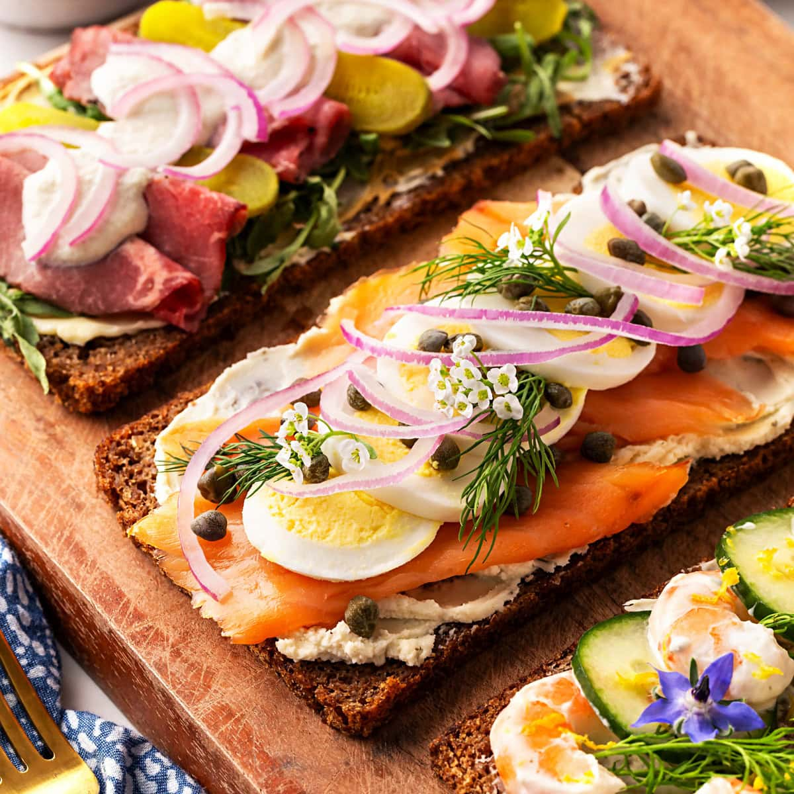

# Smørbrød (Norwegian Open Sandwich)

*Norway's open-faced sandwich: a slice of dense dark rye bread spread with butter, topped with one careful arrangement of fish, cheese, eggs or meat, taken with a knife and fork. The Norwegian lunchtime ritual.*

**Serves:** 4 (makes 4 sandwiches)

**Prep Time:** 15 minutes

**Cook Time:** None

## Overview
Smørbrød ("butter bread") is the Norwegian (and broader Scandinavian) open-faced sandwich tradition: a single slice of dark dense rye or wholemeal bread, generously buttered, topped with a careful and complete composition of one ingredient theme - cured salmon with dill and mustard sauce; egg and anchovy; herring and red onion; cheese with cucumber and tomato; cold cuts with mayonnaise and cornichons. Each smørbrød is a deliberate small plate, approached with knife and fork rather than picked up. The Norwegian lunch protocol allows 2-3 different smørbrød per person, served in order from mildest (cheese, vegetables) to strongest (herring, anchovy), with rakfisk or smoked salmon as the climax. This recipe gives four classic combinations; mix and match for a smørbrød lunch.

## Ingredients

### Common base
- 4 large slices dark rye bread or wholemeal sourdough, about 1.5 cm thick (one slice per sandwich)
- 80 g unsalted butter, softened (Norwegian butter is the choice, or any quality cultured butter)

### Smørbrød 1 - Cured salmon with mustard-dill (gravlaks)
- 150 g cured salmon (gravlaks or smoked salmon), thinly sliced
- 1 small handful fresh dill sprigs
- 1 tbsp mustard-dill sauce (mayo + Dijon + dill + sugar + vinegar)
- 1 lemon wedge
- Cracked black pepper

### Smørbrød 2 - Egg and anchovy
- 2 large hard-boiled eggs, peeled and sliced
- 4 anchovy fillets in oil
- 1 tbsp mayonnaise
- A pinch of chopped chives
- A few sprigs of fresh dill

### Smørbrød 3 - Brown cheese (brunost) with strawberry
- 4 thick slices brunost (Norwegian brown cheese - the caramelised whey cheese)
- 2 strawberries, sliced
- A drizzle of honey (optional)

### Smørbrød 4 - Cold roast beef with pickle
- 60 g thinly sliced cold roast beef (or roast pork)
- 1 tbsp horseradish cream
- 4 cornichons, sliced lengthways
- A small handful of crispy fried onions
- A few sprigs of flat-leaf parsley

## Method

### Stage 1 - Butter the bread
1. Lay all four slices of bread flat on a board.
2. Spread each generously with softened butter, edge to edge. Don't skimp - butter is the binding layer that keeps toppings in place.

### Stage 2 - Cured salmon smørbrød
1. Drape the cured salmon slices over the buttered bread, just overlapping at the edges.
2. Spoon a teaspoon of mustard-dill sauce in the centre.
3. Scatter fresh dill sprigs.
4. A grind of black pepper.
5. Place a lemon wedge at the corner.

### Stage 3 - Egg and anchovy smørbrød
1. Arrange the egg slices over the bread in a tile pattern.
2. Lay the anchovy fillets in a cross or X pattern on top.
3. Pipe or dollop the mayonnaise in small dots.
4. Scatter chopped chives and dill sprigs.

### Stage 4 - Brunost and strawberry smørbrød
1. Lay slices of brunost flat over the bread, covering completely.
2. Arrange the sliced strawberries on top.
3. Drizzle with honey if using.

### Stage 5 - Cold beef smørbrød
1. Spread a teaspoon of horseradish cream on the bread.
2. Drape the cold beef slices on top in soft folds.
3. Lay the sliced cornichons in a row.
4. Scatter the crispy onions and parsley.

### Stage 6 - Serve
1. Plate two or three smørbrød per person.
2. Knife and fork for each diner.
3. The Norwegian protocol is to eat from mildest to strongest in flavour.

## Notes
- **Butter generously:** Smørbrød is named for butter - it's structural. Thin butter lets the bread go dry; generous butter holds the toppings.
- **One theme per smørbrød:** Don't pile multiple flavours on a single slice. Each smørbrød is a single careful composition.
- **Eat with a knife and fork:** Smørbrød is not picked up by hand. It's plated and eaten at the table with cutlery.

## Serving
The Norwegian lunch ritual. Make a selection on a board for a family or guests; let people choose. A glass of cold beer or sparkling water. A side of pickled vegetables or coleslaw.

## Storage
- Best assembled immediately and eaten within an hour.
- Bread, butter and toppings refrigerate separately; assemble when serving.
- Made-up smørbrød wilt within an hour; don't pre-make for a buffet by more than 30 minutes.
