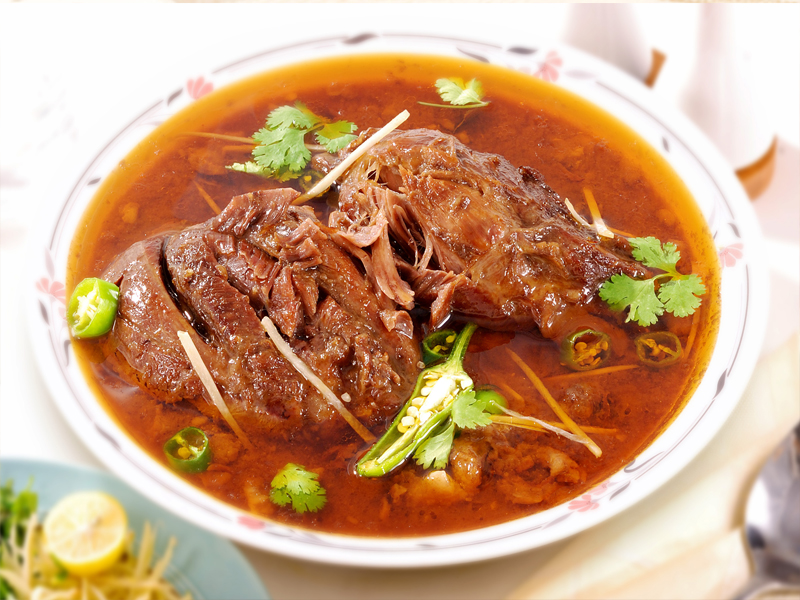

# Beef Nihari

*Karachi's breakfast of kings: bone-in beef shank simmered overnight in spiced stock till the meat falls apart and the broth is glossy with marrow.*

**Serves:** 6

**Prep Time:** 30 minutes

**Cook Time:** 4-5 hours

## Overview
Beef shank with bones browns in ghee; onions cook to deep golden; whole spices bloom. Stock simmers everything for 3-4 hours until the meat is fork-tender. A wheat-flour slurry whisks in to thicken to a glossy, slightly silky gravy. Tarka of fried garlic and Kashmiri chilli pours over hot. Served with naan and a heavy plate of garnishes.

## Ingredients

### Nihari
- 1 ½ kg bone-in beef shank (or beef shin), cut into 4-5 cm pieces
- 4 tablespoons ghee
- 3 onions (large, sliced thin)
- 8 garlic cloves (crushed)
- 4 cm fresh ginger (grated)
- 2 tablespoons nihari masala (see below) or store-bought
- 1 tablespoon Kashmiri chilli powder
- 1 teaspoon ground turmeric
- 2 teaspoons salt
- 2 litres beef stock (or water)

### Nihari masala (or use store-bought)
- 1 tablespoon fennel seeds
- 1 tablespoon coriander seeds
- 1 teaspoon cumin seeds
- 4 cardamom pods
- 4 cloves
- 1 small piece star anise
- 1 cinnamon stick (4 cm)
- 1 teaspoon black peppercorns
- 1 teaspoon nigella seeds
- 1 mace blade
- ½ teaspoon ground ginger

### Thickener
- 4 tablespoons wheat flour (atta) or plain flour
- 100 ml water

### Tarka (finishing oil)
- 4 tablespoons ghee
- 4 garlic cloves (sliced)
- 1 teaspoon Kashmiri chilli powder

### To serve
- Fresh naan (or sheermal)
- Julienned fresh ginger
- 2 long green chillies (sliced)
- A small bunch fresh coriander (chopped)
- 2 limes (cut into wedges)

## Method

### Stage 1 - Masala
1. Toast all the masala spices in a dry pan over medium heat 2-3 minutes until fragrant.
1. Cool and grind to a fine powder.

### Stage 2 - Brown the meat
1. Heat the ghee in a heavy pot over medium-high heat.
1. Pat the beef dry; salt lightly. Brown in batches 4-5 minutes until well-coloured. Lift out.

### Stage 3 - Onions
1. Reduce the heat; add the onions to the pot.
1. Cook 12-15 minutes, stirring, until deep golden.
1. Add the garlic and ginger; cook 1 minute.

### Stage 4 - Bloom
1. Stir in the nihari masala, Kashmiri chilli powder, turmeric and salt.
1. Cook 1 minute - the kitchen should fill with the smell.

### Stage 5 - Simmer
1. Return the beef and any juices.
1. Pour in the stock; bring to the boil.
1. Reduce to lowest heat; cover loosely; cook 3-4 hours until the beef is fork-tender and the broth has reduced and darkened. Stir occasionally; top up with hot water if it threatens to dry out.

### Stage 6 - Thicken
1. Whisk the wheat flour into the cold water to a smooth slurry.
1. Pour the slurry slowly into the pot, stirring constantly.
1. Cook 8-10 minutes more, stirring often, until the broth has visibly thickened and turned glossy.

### Stage 7 - Tarka
1. Heat the 4 tablespoons of ghee in a small pan over medium heat.
1. Add the sliced garlic; cook 1-2 minutes until pale gold.
1. Off the heat, stir in the Kashmiri chilli powder.
1. Pour the tarka over the nihari.

### Stage 8 - Serve
1. Ladle into wide bowls.
1. Bring julienned ginger, sliced chillies, coriander and lime wedges to the table; each diner garnishes their own.
1. Serve with hot naan for dipping.

## Notes
- **Bone-in shank is essential:** The marrow and connective tissue dissolving into the broth is what makes nihari nihari. Boneless beef gives a thinner, less rich result.
- **Time, not shortcuts:** Pressure-cooker nihari (1 hour) is faster but the depth comes from the long simmer. If you have the time, take it.
- **The wheat-flour slurry is what makes this nihari, not stew:** Don't skip - it gives the gravy its body and slight stickiness.

## Storage
- Keeps 4 days refrigerated; arguably better the next day. Reheat gently.
- Freezes 3 months.
