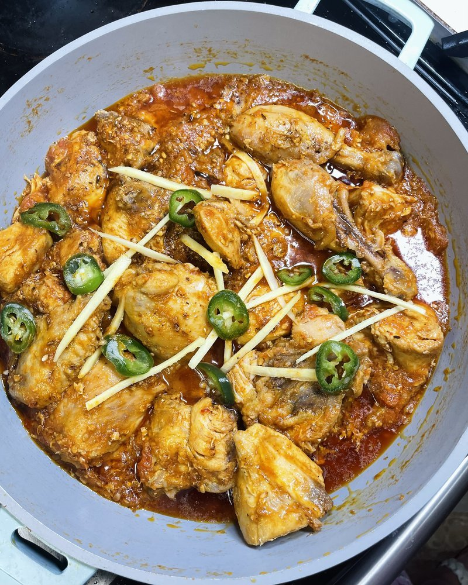

# Chicken Karahi

*Lahore's roadside dhaba dish: bone-in chicken seared hard in a karahi, then simmered with ginger, garlic, tomato and green chillies.*

**Serves:** 4

**Prep Time:** 15 minutes

**Cook Time:** 45 minutes

## Overview
A whole chicken is jointed into 8 bone-in pieces (or 8 thighs). Oil heats in a wide karahi or wok; chicken sears on all sides for colour. Crushed ginger and garlic go in for 1 minute. Halved tomatoes (yes, half-tomatoes, not chopped) tumble in; the lid clamps on; the chicken steam-cooks for 20 minutes in the tomato juices. The lid lifts; the tomato skins come off; the sauce reduces to a thick deep-orange masala. Whole green chillies, freshly crushed black pepper, ground cumin and a dollop of yogurt stir in. Coriander and slivered ginger finish.

## Ingredients

- 1.4 kg chicken (a whole bird jointed into 8 bone-in skin-on pieces, OR 8 chicken thighs bone-in skin-on)
- 80 ml sunflower oil (or ghee)
- 8 garlic cloves (crushed)
- 4 cm fresh ginger (half grated, half cut into matchsticks for the garnish)
- 8 tomatoes (medium, halved through the core - about 800 g)
- 4-6 fresh green chillies (3 split lengthwise, 2-3 sliced for garnish)
- 1 tablespoon coarsely cracked black peppercorns (use a mortar; not pre-ground pepper)
- 1 ½ teaspoons ground cumin
- 1 ½ teaspoons salt (to taste)
- 1 teaspoon ground coriander
- 100 g full-fat plain yogurt (whisked smooth)
- 3 tablespoons fresh coriander (chopped - both leaves and fine stems)
- ½ teaspoon garam masala (optional, to finish)
- 1 lemon (cut into wedges)

## Method

### Stage 1 - Sear the chicken
1. Heat oil in a wide karahi or wok over high heat until shimmering.
1. Add the chicken pieces; sear 4 minutes per side until well browned (don't crowd - do in two batches if necessary).

### Stage 2 - Aromatics
1. Reduce heat to medium-high.
1. Add the crushed garlic and grated ginger; stir 30 seconds (don't let it burn).

### Stage 3 - Tomatoes and steam-cook
1. Tip in the halved tomatoes, cut side down, on top of the chicken.
1. Add the split green chillies.
1. Cover with a tight lid.
1. Reduce heat to medium-low.
1. Cook 20 minutes - the tomatoes will collapse in their own juices and the chicken will steam-poach through.

### Stage 4 - Skin the tomatoes
1. Lift the lid.
1. Pick out the tomato skins (they will have separated from the flesh and lifted off easily).
1. Discard the skins.

### Stage 5 - Reduce
1. Increase heat to medium-high.
1. Cook uncovered 12-15 minutes, stirring occasionally, until the sauce thickens, the oil rises, and the masala is glossy and deep orange-red. Try to keep the chicken pieces whole; turn rather than stir aggressively.

### Stage 6 - Final season
1. Add the cracked black pepper, cumin, salt and ground coriander; stir 1 minute.
1. Whisk a splash of warm masala into the yogurt to temper it.
1. Add the yogurt to the pan; stir to integrate; cook 2 minutes.

### Stage 7 - Garnish
1. Off heat.
1. Scatter the slivered ginger, sliced chillies and fresh coriander.
1. Sprinkle garam masala if using.
1. Serve straight from the karahi with naan or roti and lemon wedges.

## Notes
- **Whole tomatoes are the secret:** The halved tomatoes (skin-side up) steam over the chicken and break down into the sauce. You then pick out the skins. This gives the dish its silky tomato pulp without bits of tough skin.
- **Crushed black pepper, freshly:** Pre-ground pepper is acrid. Bash whole peppercorns in a mortar and add at the end - the pepper is one of the dish's defining flavours.
- **No onions:** Pakistani karahi doesn't use onion paste; that's an Indian (Punjabi-style) addition. Karahi is built on tomato, ginger, garlic, chilli and pepper.

## Storage
- Refrigerate 3 days; reheats well.
- Doesn't freeze brilliantly - the yogurt can split on thaw. Make without yogurt to freeze; add fresh on reheat.
