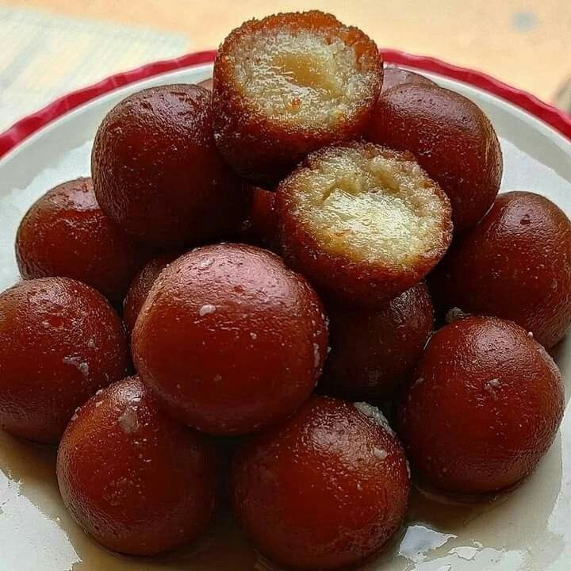

# Gulab Jamun

*Pakistan and India's most-loved sweet: fried dough balls of khoya drowned warm in cardamom-rose syrup. Chewy outside, melt-on-the-tongue inside.*

**Makes:** 18-20 gulab jamun (serves 6)

**Prep Time:** 25 minutes

**Cook Time:** 25 minutes (plus 30 minutes soaking)

## Overview
Khoya (or a milk-powder shortcut) blends with a small amount of plain flour, semolina, baking powder and ghee to a smooth, soft dough. Small balls fry slowly in low-temperature oil until uniformly deep gold. They drop straight into warm rose-cardamom syrup and soak 30+ minutes, the whole point is the soaked, syrup-heavy bite.

## Ingredients

### Dough
- 200 g khoya (or 200 g full-fat milk powder + 60 ml warm milk)
- 60 g plain flour
- 1 tablespoon fine semolina
- ½ teaspoon baking powder
- A pinch of salt
- ½ teaspoon ground cardamom
- 1 tablespoon ghee (softened)
- 60-90 ml whole milk (as needed to bring the dough together)

### Syrup
- 400 g caster sugar
- 400 ml water
- 1 teaspoon rosewater
- 1 teaspoon ground cardamom
- A pinch of saffron threads (optional)
- 1 tablespoon lemon juice

### Frying
- Vegetable oil (or ghee, about 800 ml; for deep-frying)

### To garnish
- A few pistachios (chopped) and rose petals

## Method

### Stage 1 - Syrup
1. Combine the sugar, water and lemon juice in a wide pan.
1. Bring to the boil; simmer 6-8 minutes until very slightly thickened (one-string consistency - a drop between fingers should form a thin string).
1. Off the heat, stir in the rosewater, cardamom and saffron.
1. Keep warm but not bubbling.

### Stage 2 - Dough
1. If using khoya: grate or crumble it into a wide bowl.
1. If using milk powder: combine with the warm milk and knead briefly to a soft mass.
1. Add the flour, semolina, baking powder, salt, cardamom and ghee.
1. Knead gently - too much kneading makes them dense; you want just enough to bring it together. Add splashes of milk as needed to make a soft, slightly sticky dough.
1. Cover and rest 10 minutes.

### Stage 3 - Shape
1. Divide the dough into 18-20 small balls (about the size of a small walnut).
1. Roll each between your palms until completely smooth - any cracks open in the oil and the gulab jamun won't be uniform.

### Stage 4 - Fry low and slow
1. Heat the oil in a heavy deep pan to a low 140-150°C - much cooler than typical deep-frying. The temperature is the secret.
1. Add 5-6 balls at a time. Don't move them for 30 seconds.
1. After they rise to the surface, gently swirl the pan or push them with the back of a slotted spoon so they roll and colour evenly.
1. Fry 8-10 minutes total, gradually increasing the heat slightly, until they're deep mahogany brown and feel slightly springy.

### Stage 5 - Soak
1. Lift out and drop straight into the warm syrup.
1. Soak at least 30 minutes, ideally 1-2 hours. The gulab jamun double in size as they absorb syrup.

### Stage 6 - Serve
1. Serve warm with 2-3 per person, generous syrup spooned over.
1. Top with chopped pistachios and rose petals.

## Notes
- **Low and slow frying is essential:** Hot oil burns the outside before the inside cooks; the result is a hard skin and raw centre. Low heat for a long time is the trick.
- **No cracks on the surface:** Crack-free balls puff evenly and absorb syrup uniformly. Take time on the rolling.
- **Khoya vs milk powder:** Khoya (Indian/Pakistani grocers, refrigerated section) is traditional. Milk powder is the home-cook shortcut and works very well.

## Storage
- Keep refrigerated in their syrup, in a covered container, up to 5 days. Bring back to room temperature or warm gently before serving.
