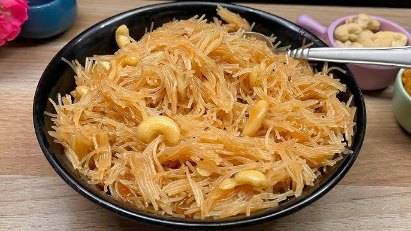

# Sevaiyan

*The drier cousin of sheer khurma. Fine vermicelli toasted golden in ghee, simmered with sugar, milk, cardamom and a handful of nuts and raisins until the strands swell and the liquid disappears into a fragrant tangle. The morning-of-Eid breakfast, eaten warm with sweet tea.*

**Serves:** 6

**Prep Time:** 5 minutes

**Cook Time:** 25 minutes

## Overview
Sevaiyan is the drier cousin of sheer khurma and the morning-of-Eid breakfast in every Pakistani and North Indian household, eaten warm in small bowls with sweet milky tea before the day's feasting begins. Fine vermicelli toasts golden in ghee, then simmers with milk, sugar, cardamom and a thread of saffron until the strands swell and the liquid disappears into a glossy tangle dotted with raisins, almonds and pistachios. The difference from sheer khurma is the texture: where sheer khurma is loose and pudding-like, sevaiyan stays drier with the strands distinct rather than collapsing into a porridge. If you can find pre-roasted vermicelli in the packet you can skip the toasting step. Eaten warm in small bowls, with extra slivered pistachios scattered on top.

## Ingredients

- 200 g fine roasted vermicelli (look for "sevaiyan" in the South Asian aisle; or unroasted, see notes)
- 60 g ghee
- 500 ml whole milk
- 120 g caster sugar (adjust to taste)
- 1 teaspoon ground cardamom
- A small pinch of saffron threads
- 30 g raisins
- 30 g cashews (chopped)
- 30 g pistachios (chopped, plus a few slivered for the top)
- 30 g almonds (slivered)
- 2 tablespoons rose water (optional)
- A small pinch of fine sea salt

## Method

### Stage 1 - Toast the vermicelli
1. If your sevaiyan is pre-roasted (it will be a deep golden colour out of the packet), skip to Stage 2. If unroasted (pale, almost white), warm 1 tablespoon of the ghee in a wide pan over a medium-low heat, add the vermicelli, and stir gently for 5-7 minutes until the strands turn deep golden and smell like toasted shortbread. Tip onto a plate and set aside.

### Stage 2 - Bloom the saffron, fry the nuts
1. Crush the saffron between your fingertips into a small cup and pour over 2 tablespoons of warm milk. Set aside to bloom.
2. In a wide heavy pan, melt the rest of the ghee over a medium heat. Add the cashews, almonds and pistachios and fry for 2 minutes, stirring, until they turn fragrant and pale gold. Lift out with a slotted spoon onto a plate.
3. Drop the raisins into the same ghee and fry for 30 seconds until they puff. Lift out with the slotted spoon.

### Stage 3 - Simmer
1. To the same pan, add the milk, sugar, cardamom, salt and the bloomed saffron with its milk. Bring to a low simmer, stirring until the sugar dissolves.
2. Crumble the roasted vermicelli into the pan (break the strands into 5 cm lengths as you go). Stir to coat in the milk.
3. Drop the heat to low and cook gently for 8-10 minutes, stirring every couple of minutes, until the vermicelli is soft but still slightly chewy and the liquid has reduced to a glossy syrup that clings to the strands rather than pooling at the bottom.

### Stage 4 - Finish
1. Stir in three-quarters of the fried nuts and all the raisins. Stir in the rose water if using.
2. Taste and adjust sugar: Eid sevaiyan is meant to be properly sweet but not cloying. Add another tablespoon of sugar if needed.

## Notes
- Roasted sevaiyan is a different product from the long thin vermicelli used in sheer khurma; it is shorter, redder and sold in clumps. Both work - adjust the cook time slightly for the unroasted kind (a minute or two longer).
- For a richer version, add 100 ml double cream alongside the milk and reduce the sugar by 20 g.
- A small spoon of khoya (reduced milk solids) stirred in at the end deepens the flavour considerably.

## Serving
In small bowls on the Eid morning table, with sweet milky tea or strong black coffee. Top each bowl with the reserved nuts and a few extra slivered pistachios.

## Storage
In a covered container in the fridge for up to 3 days. Reheat gently with a splash of milk to loosen.
