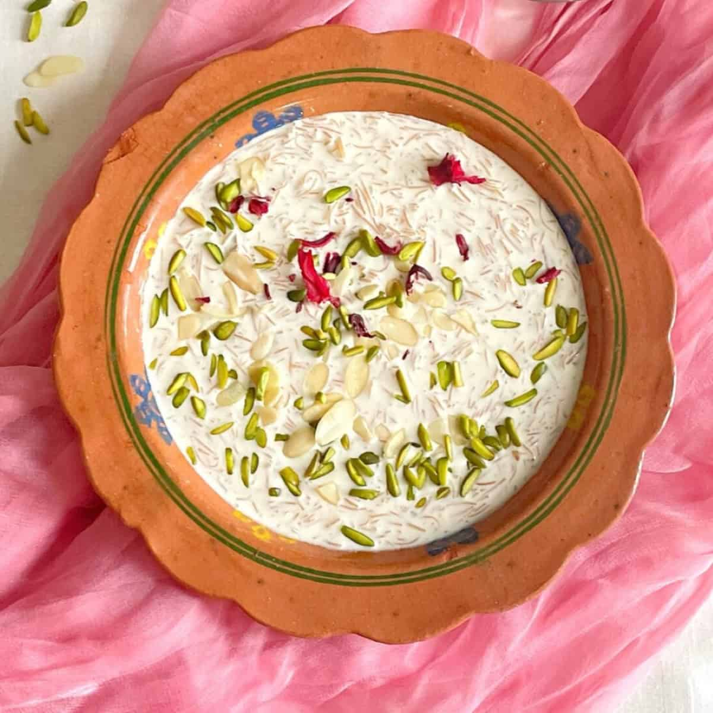

# Sheer Khurma

*Pakistan's Eid morning dessert: vermicelli toasted in ghee, simmered in milk with dates, almonds, pistachios and cashews, scented with cardamom and saffron.*

**Serves:** 8

**Prep Time:** 10 minutes

**Cook Time:** 40 minutes

## Overview
Sheer khurma is the Eid al-Fitr morning dessert, eaten first thing after dawn prayers in Pakistani and North Indian households before the rest of the day's feasting begins. The name means "milk with dates" in Persian, and that's the heart of it: thin vermicelli toasted in ghee, simmered slowly in milk with sliced medjool dates, almonds, pistachios and cashews, scented with cardamom, saffron and an optional drop of rose water. The thin Indian sevaiyan from a Pakistani grocer is the right noodle here; Italian pasta vermicelli is much thicker and won't give the right texture. Bowls go round the family with a generous scatter of nuts, a few rose petals and a pinch of saffron threads on top. A second helping is expected.

## Ingredients

### The base
- 1.2 litres whole milk
- 100 g vermicelli (thin Indian sevaiyan, broken into 4 cm lengths)
- 3 tablespoons ghee
- 100 g caster sugar (adjust to taste; some homes go to 150 g)
- A pinch of saffron threads
- 2 tablespoons warm milk (to bloom the saffron)
- 1/2 teaspoon ground cardamom

### The fruit and nuts
- 8 medjool dates (pitted, sliced into 4 lengthways)
- 2 tablespoons almonds (slivered)
- 2 tablespoons pistachios (slivered)
- 2 tablespoons cashews (roughly chopped)
- 1 tablespoon golden raisins (optional)

### To finish
- 1 tablespoon dried rose petals (optional)
- 1 teaspoon rose water (optional)
- A few extra saffron threads

## Method

### Stage 1 - Bloom the saffron
1. Crush the saffron threads between your fingers into a small cup. Pour over the warm milk and leave to steep for 15 minutes while you toast everything else. The colour should deepen to a strong amber.

### Stage 2 - Toast the nuts and vermicelli
1. Melt 1 tablespoon of the ghee in a heavy, wide pan over medium-low heat.
1. Add the almonds, pistachios and cashews. Stir for 2-3 minutes until the cashews are pale gold and the almonds smell toasted. Tip onto a small plate.
1. Add the remaining 2 tablespoons of ghee to the same pan. Tip in the broken vermicelli and stir continuously over medium-low heat for 3-4 minutes until evenly deep golden brown. Watch closely, vermicelli goes from pale to burnt in seconds.

### Stage 3 - Build the kheer
1. Pour the milk into the same pan with the toasted vermicelli. Add the cardamom and stir.
1. Bring to a gentle simmer over medium-low heat, stirring every minute or so to stop the milk sticking. Cook for 12-15 minutes until the vermicelli is soft but still distinct strands, not falling apart.
1. Add the sugar a tablespoon at a time, tasting as you go. The traditional taste is sweet but not cloying; some homes go richer.
1. Stir in the saffron milk; the kheer turns pale gold.
1. Add the dates, two-thirds of the toasted nuts, and the raisins (if using). Simmer for 3 more minutes, the dates soften and start to release their syrup.
1. Off the heat, stir in the rose water (if using). Taste once more for sweetness.

### Stage 4 - Serve
1. Ladle into small bowls. Scatter the remaining nuts, a few rose petals and a pinch of saffron threads over each.

## Notes
- The vermicelli should be the thin "sevaiyan" sold in Indian and Pakistani groceries, not Italian pasta vermicelli. The Italian sort is much thicker and won't yield the right texture.
- Some families use khoya (reduced milk solids) for extra richness, about 50 g grated in at the end. Optional but festive.
- Dates can be soaked briefly in hot milk to soften further if they're firm, most medjools are soft enough straight from the box.

## Serving
- First thing on Eid al-Fitr morning, in small bowls passed around the family. Cooled to lukewarm if it's a hot Eid; warm if the morning is cool. A second helping is expected.

## Storage
Refrigerated, up to 3 days. The kheer will thicken further as it cools and the vermicelli continues to absorb milk. Loosen with a splash of warm milk before serving, or eat cold straight from the bowl.
