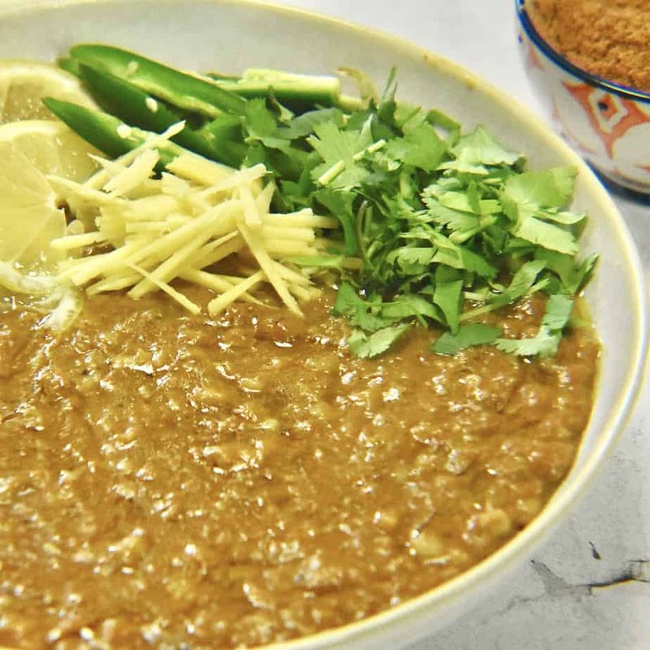

# Haleem

*Pakistan's iftar pot: cracked wheat, lentils and mutton simmered for hours until they collapse into a rich, savoury porridge.*

**Serves:** 6

**Prep Time:** 30 minutes (plus overnight soaking)

**Cook Time:** 4 hours (pressure cooker) or 6 hours (stovetop)

## Overview
Cracked wheat (daleya), pearl barley, chana dal, masoor dal, moong dal and urad dal soak overnight together. Mutton on the bone (or beef shin) simmers separately with ginger-garlic paste, ground spices, onion and salt for 2 hours until tender. The drained grains and lentils join; everything simmers 2 more hours, beating periodically with a wooden masher (or blitzing in batches with a stick blender) until the meat strands break apart and integrate with the grain. The base goes intensely smooth, almost the texture of porridge. Off heat, fried onions, ghee-and-cumin tarka, julienned ginger, lemon, chilli and herbs finish each bowl.

## Ingredients

### Grain and dal mix
- 100 g cracked wheat (daleya / dalia)
- 80 g pearl barley
- 60 g chana dal (split skinless chickpeas)
- 60 g moong dal (split skinless mung beans)
- 50 g masoor dal (red lentils)
- 30 g urad dal (split skinless black gram)

### Meat
- 1 kg bone-in mutton (or beef shin, or lamb shoulder) cut into 3 cm chunks

### Spice and aromatics
- 3 tablespoons ginger-garlic paste
- 2 teaspoons Kashmiri red chilli powder
- 1 teaspoon ground turmeric
- 1 ½ teaspoons ground coriander
- 1 teaspoon ground cumin
- 1 ½ teaspoons [Garam Masala](../indian/Spice-Mixes/garam-masala.md)
- 1 teaspoon black peppercorns (whole)
- 2 black cardamom pods
- 4 cloves
- 1 cinnamon stick
- 2 bay leaves
- 2 teaspoons salt (more to taste)

### Cooking
- 4 tablespoons ghee
- 1 onion (large, chopped)
- 3 litres water

### Tarka (sizzle topping)
- 100 ml ghee (or sunflower oil)
- 2 onions (large, sliced very thin, fried to deep brown)
- 1 teaspoon cumin seeds
- 6 dried red chillies (whole, for the oil sizzle)

### Garnishes (set each at the table)
- 4 cm fresh ginger (cut into matchsticks)
- 3 green chillies (sliced)
- 4 lemons (cut into wedges)
- Small bunch fresh coriander (chopped)
- Small bunch fresh mint (chopped)
- 1 teaspoon [Garam Masala](../indian/Spice-Mixes/garam-masala.md)

## Method

### Stage 1 - Soak the grains
1. Combine cracked wheat, barley, all four dals in a wide bowl.
1. Cover with 2 litres of cold water.
1. Soak overnight (12 hours minimum).
1. Drain.

### Stage 2 - Cook the meat
1. Heat the ghee in a large heavy pot over medium-high.
1. Add chopped onion; cook 8 minutes until soft and golden.
1. Add ginger-garlic paste; cook 1 minute.
1. Add the meat; brown 5 minutes.
1. Add chilli powder, turmeric, coriander, cumin, garam masala, peppercorns, black cardamom, cloves, cinnamon, bay leaves and salt.
1. Cook 1 minute, stirring.
1. Pour in 1 ½ litres of water; bring to a boil; reduce to a low simmer; cover.
1. Cook 1 hour 30 minutes (stovetop) OR pressure cook on high pressure 45 minutes. The meat should be very tender - almost falling off the bone.

### Stage 3 - Combine
1. Pull out the larger bones (the meat will fall off them); discard.
1. Tip in the drained grain-and-dal mix.
1. Add another 1 ½ litres of hot water.
1. Bring back to a simmer.

### Stage 4 - The long cook and mash
1. Simmer 2 hours (stovetop), partially covered, stirring every 15 minutes. Pressure cook another 30 minutes if using a pressure cooker.
1. After 1 hour, take a potato masher or wooden spoon and start beating the haleem against the side of the pot - this is the traditional ghutna step that breaks the meat into strands and integrates everything.
1. Continue cooking and beating in 15-minute cycles. After 2 hours the haleem should be thick, glossy, and the meat should be in fine threads throughout - no large chunks remaining.
1. Alternatively, blitz in 3-4 second pulses with a stick blender (don't over-puree - you want texture).
1. Add hot water as needed to keep it loose enough to stir; haleem thickens dramatically as it cools.

### Stage 5 - Final season
1. Taste; adjust salt heavily - haleem soaks salt.
1. Cook 10 more minutes uncovered to thicken.

### Stage 6 - Tarka
1. Heat the 100 ml ghee in a small pan over medium-high.
1. When shimmering, add cumin seeds and whole dried red chillies; sizzle 20 seconds until the cumin turns dark and fragrant.
1. Off heat.

### Stage 7 - Serve
1. Ladle haleem into deep bowls.
1. Drizzle hot tarka over each bowl - the sizzle is part of the experience.
1. Scatter fried onions, ginger matchsticks, green chilli, coriander, mint and garam masala generously across the top.
1. Squeeze of lemon at the table.
1. Eat with naan or roti for scooping.

## Notes
- **The mash is the dish:** Haleem is not a soup with chunks of meat - the meat and grain become one continuous, glossy, gritty-smooth porridge. Without the beating step, you have a stew. With it, you have haleem.
- **Overnight soak is non-negotiable:** Hard grains (cracked wheat, barley, chana dal, urad dal) need overnight rest in water or they'll never break down in the cook.
- **Top each bowl generously:** Haleem is plain-tasting at base - the garnishes are essential. A bowl of haleem without lemon, ginger, fried onions, chilli and herbs is incomplete.

## Storage
- Refrigerate 4 days; thickens further. Loosen with hot water on reheat.
- Freezes 3 months; thaw overnight; reheat gently.
