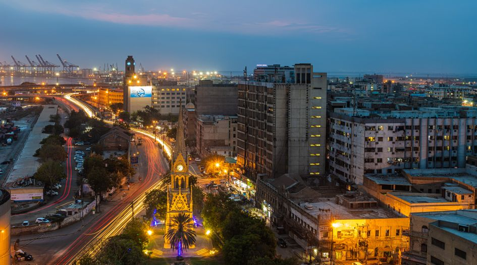

# Pakistani Cuisine

Mughal-Persian-Punjabi crossroads cuisine, distinguished from Indian by stronger Mughal influence and slow-cooked meat traditions. Nihari (overnight-braised beef shank), haleem (lentils, wheat and meat pounded together), karahi (wok-cooked spiced meat), elaborate Sindhi and Karachi biryanis, chapli kebabs and seekh kebabs anchor the savoury table; gulab jamun, kheer and barfi close the meal. Garam masala, ginger, garlic, kasuri methi (dried fenugreek), Kashmiri chilli and saffron drive the seasoning.
