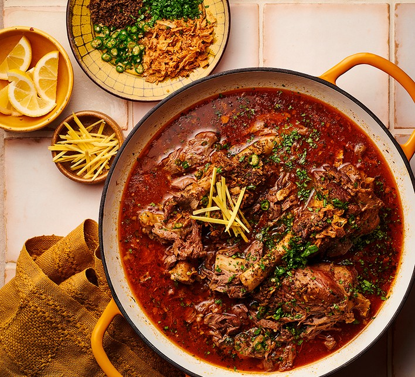

# Lamb Nihari

*Lahore's slow lamb stew: shoulder simmered for hours in mustard oil, ginger and a fragrant masala. Eaten with naan at dawn.*

**Serves:** 4-6

**Prep Time:** 25 minutes

**Cook Time:** 5 hours (stovetop) or 1 hour 30 minutes (pressure cooker)

## Overview
Lamb shanks (or bone-in shoulder pieces) brown in mustard oil and ghee with sliced onion. Ginger-garlic paste, ground spices (red chilli, turmeric, coriander, cumin, fennel) and a whole-spice nihari masala go in. The meat braises in a covered pot 4 hours stovetop (or 1 hour pressure cooker) until very tender. The cooking liquid strains; a wheat-flour slurry whisks in to thicken; the meat returns; the stew finishes 30 minutes. A sizzling tarka of fried onion and ghee finishes. Garnished hot.

## Ingredients

### Spice mix (nihari masala - make ahead or buy ready)
- 2 teaspoons fennel seeds
- 1 teaspoon black peppercorns
- 1 teaspoon coriander seeds
- 1 teaspoon cumin seeds
- 6 green cardamom pods
- 2 black cardamom pods
- 6 cloves
- 1 cinnamon stick (5 cm)
- 4 bay leaves
- 2 dried red chillies
- 1 teaspoon nutmeg (grated)
- 1 teaspoon mace (or ½ teaspoon ground)
- 1 teaspoon ground ginger
- ½ teaspoon ground long pepper (or extra black pepper)

### Meat and base
- 1.2 kg lamb shanks (4 small shanks, OR bone-in lamb shoulder, cut into 5 cm chunks)
- 4 tablespoons mustard oil (Pakistani-style; if unavailable use sunflower)
- 4 tablespoons ghee
- 2 onions (large, sliced)
- 3 tablespoons ginger-garlic paste
- 2 teaspoons Kashmiri red chilli powder
- 1 teaspoon ordinary chilli powder
- 1 ½ teaspoons ground turmeric
- 2 teaspoons salt (more to taste)
- 2 litres water

### Thickening slurry
- 4 tablespoons wheat flour (atta or plain)
- 250 ml cold water (to mix)

### Tarka
- 4 tablespoons ghee
- 1 onion (large, sliced very thin; fried deep brown)
- 1 teaspoon cumin seeds

### Garnish
- 4 cm fresh ginger (matchsticks)
- 3 green chillies (sliced)
- Small bunch coriander (chopped)
- 1 lemon (cut into wedges)
- Naan (or paratha to serve)

## Method

### Stage 1 - Toast and grind the nihari masala
1. In a dry pan, toast fennel, peppercorns, coriander, cumin, cardamoms, cloves, cinnamon, bay leaves and dried chillies over medium heat 3 minutes until fragrant.
1. Cool; transfer to a spice grinder.
1. Add nutmeg, mace, ground ginger and long pepper.
1. Grind to a fine powder.
1. (Store extra in a sealed jar; keeps 3 months.)

### Stage 2 - Brown the lamb
1. Heat mustard oil and ghee together in a large heavy pot over medium-high.
1. Add the lamb shanks; brown 5 minutes per side until deep colour. Lift to a plate.

### Stage 3 - Onion and masala
1. Reduce heat to medium.
1. Add sliced onions; cook 10 minutes until deep gold.
1. Add ginger-garlic paste; cook 1 minute.
1. Add 2 tablespoons of the nihari masala, Kashmiri chilli, ordinary chilli, turmeric and salt.
1. Cook 30 seconds with a splash of water (so the spices don't burn).

### Stage 4 - Braise
1. Return the lamb and any juices to the pot.
1. Add 2 litres of water.
1. Bring to a boil; skim.
1. Reduce to the lowest simmer; cover tightly.
1. **Stovetop:** Cook 4 hours, turning the meat once at the 2-hour mark.
1. **Pressure cooker:** Cook on high 1 hour 15 minutes; natural release.
1. The lamb should be falling-apart tender; the broth deep mahogany; the spices fully integrated.

### Stage 5 - Thicken with the slurry
1. Lift the lamb pieces onto a plate (cover to keep warm).
1. Strain the broth into a clean pot (discard the whole-spice debris; the broth should be smooth).
1. Whisk the wheat flour into 250 ml cold water until smooth (no lumps).
1. Whisk a ladleful of warm broth into the slurry to temper.
1. Pour the slurry into the broth, whisking continuously.
1. Bring to a low simmer; cook 8-10 minutes, whisking, until the broth thickens to a glossy, slightly velvety consistency - like single cream.

### Stage 6 - Return the meat
1. Return the lamb pieces to the thickened broth.
1. Simmer gently 15-20 minutes.
1. Taste; adjust salt.

### Stage 7 - Tarka
1. Heat the ghee in a small pan.
1. Add cumin seeds; sizzle 15 seconds.
1. Off heat; stir in the deep-fried golden onions.
1. Pour the tarka over the nihari pot - listen for the sizzle.

### Stage 8 - Rest and serve
1. Cover; rest 10 minutes.
1. Ladle into bowls; ensure each bowl has a piece of meat and plenty of broth.
1. At the table: scatter ginger matchsticks, green chilli, coriander.
1. Squeeze of lemon.
1. Eat with hot naan or paratha - tear, dip, scoop the meat off the bone.

## Notes
- **Mustard oil is traditional:** The dish has a faintly pungent, slightly nasal note from mustard oil. Heat it to smoking before reducing temperature to mellow the harshness, then proceed normally.
- **The flour slurry must be smooth:** Any lumps in the slurry give lumps in the broth. Whisk hard before tempering. The slurry is what makes nihari thick and clinging.
- **Slow cook over pressure cook:** Both work; the stovetop method gives a slightly silkier broth and more complex flavour, but pressure cookers are practical for weeknight nihari.

## Storage
- Refrigerate 5 days; arguably better on day 2-3.
- Freezes 3 months.
