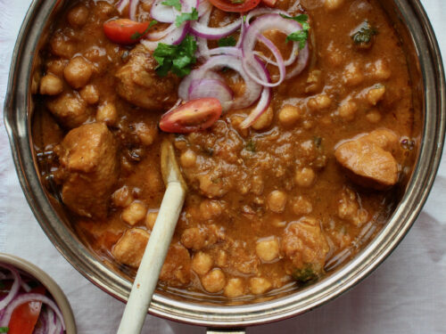

# Murgh Cholay

*Pakistan's weeknight chicken-and-chickpea curry: bone-in chicken simmered with chickpeas in a deep tomato-and-onion masala.*

**Serves:** 4

**Prep Time:** 15 minutes

**Cook Time:** 45 minutes

## Overview
Murgh cholay is Pakistan's weeknight chicken-and-chickpea curry, the kind of family dinner that turns up on a Wednesday with rice on the side and a bowl of raita to cool things down. Bone-in chicken simmers with chickpeas in a deep tomato-and-onion masala until the sauce clings glossy to the meat. The bhuna technique is the heart of it, with the onion taken properly deep brown rather than just translucent and the tomatoes cooked down until they break completely and the oil separates at the edges (that's the sign the base is ready). Skip either step and you get a thin one-dimensional curry. Bone-in thighs and drumsticks are the right cut here; boneless chicken cooks too fast for the masala to penetrate. Finished with ginger matchsticks, slit green chillies, fresh coriander and a pinch of garam masala. Eat with naan, roti or basmati rice, with a bowl of raita on the side.

## Ingredients

### Curry base
- 4 tablespoons sunflower oil (or ghee)
- 2 onions (medium, finely diced)
- 2 tablespoons ginger-garlic paste
- 1 ½ teaspoons ground cumin
- 1 ½ teaspoons ground coriander
- 1 teaspoon ground turmeric
- 1 teaspoon Kashmiri red chilli powder (mild)
- ½ teaspoon ordinary chilli powder (to taste)
- 1 teaspoon [Garam Masala](../../base-ingredients/curry-powder/garam-masala.md)
- ½ teaspoon black pepper
- 4 tomatoes (medium, chopped fine, or 1 x 400 g tin chopped tomatoes)
- 1 ½ teaspoons salt (to taste)

### Mains
- 800 g bone-in chicken pieces (thighs and drumsticks, skin removed)
- 1 (400 g) tin chickpeas (drained and rinsed, OR 200 g dried, soaked overnight and cooked 1 hour until tender)
- 400 ml water

### To finish
- 2 cm fresh ginger (cut into matchsticks)
- 2 green chillies (slit lengthwise)
- 3 tablespoons fresh coriander (chopped)
- ½ teaspoon [Garam Masala](../../base-ingredients/curry-powder/garam-masala.md) (extra, to finish)
- 1 lemon (cut into wedges)

## Method

### Stage 1 - Fry the onion
1. Heat oil or ghee in a wide heavy pot over medium-high heat.
1. Add onion; reduce to medium; fry 10-12 minutes, stirring often, until deep gold (not just translucent, push the colour).

### Stage 2 - Aromatics and spice
1. Add ginger-garlic paste; cook 1 minute, stirring.
1. Add cumin, coriander, turmeric, both chilli powders, garam masala and black pepper.
1. Cook 30 seconds, stirring, the oil will turn red-orange.

### Stage 3 - Tomatoes
1. Add the chopped tomatoes.
1. Cook 8-10 minutes, stirring, until the tomatoes break down completely and the oil starts to separate at the edges (a sign of a properly cooked bhuna base).
1. Add salt.

### Stage 4 - Chicken
1. Add the chicken pieces; toss to coat in the masala.
1. Cook 5 minutes, turning, to seal the chicken in the spice.

### Stage 5 - Chickpeas and simmer
1. Add the drained chickpeas.
1. Pour in the water.
1. Bring to a simmer; cover; reduce heat; cook 25 minutes until the chicken is cooked through and the chickpeas have absorbed the sauce.

### Stage 6 - Reduce
1. Lift the lid; cook 5 more minutes uncovered if the sauce is too loose, it should be thick enough to coat the chicken in clinging masala, not runny.

### Stage 7 - Finish
1. Off heat.
1. Scatter ginger matchsticks, slit green chillies, coriander and extra garam masala.

### Stage 8 - Serve
1. Ladle into bowls or onto a wide platter.
1. Eat with naan, roti or basmati rice and a lemon wedge.
1. Raita on the side balances the heat.

## Notes
- **Bhuna the base:** Pakistani curries depend on the masala being properly cooked, the onion deep brown, the tomatoes broken down, the oil separating. Skipping this step (especially the tomato bhuna) gives a thin one-dimensional curry. Don't move on until the oil glistens at the edge.
- **Chickpeas should be tender:** Tinned chickpeas vary in tenderness. If they're too firm, simmer alone in water 10 minutes before adding to the curry. If they fall apart on you, add them in the last 10 minutes.
- **Bone-in chicken matters:** Boneless chicken cooks too fast and the masala doesn't penetrate. Bone-in pieces give a richer sauce.

## Storage
- Refrigerate 4 days; reheats brilliantly and the flavour deepens.
- Freezes 3 months.
