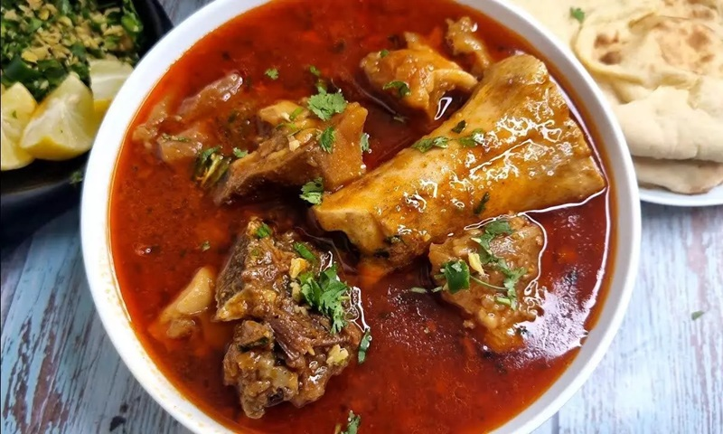

# Paya

*Lahore's Sunday breakfast: lamb trotters simmered all night in a deep masala until the broth turns silky with gelatin.*

**Serves:** 6

**Prep Time:** 30 minutes

**Cook Time:** 6 hours (or 2 hours pressure cooker)

## Overview
Paya is Lahore's Sunday breakfast, the slow-cooked trotter stew eaten at dawn from Old City paya shops where the pots have been simmering since the night before. Lamb or goat trotters cook in a deep masala for six hours until the broth turns silky with gelatin and the meat on the bones goes dark and luscious. The slow simmer is the dish here: paya cannot be rushed, and the lowest possible heat is what extracts the gelatin properly (a pressure cooker shortcuts to two hours but the texture is slightly less silky). Black cardamom is essential too, its smoky pods carrying a flavour that extra green cardamom can't replicate. A tarka of ghee, cumin and fried golden onions goes in near the end. Bowls come with ginger matchsticks, green chilli, fresh coriander and lemon scattered at the table, eaten with hot naan: tear, dip, suck the marrow from the bones.

## Ingredients

### Paya (trotters)
- 8 lamb trotters (or 6 goat trotters, about 1 ½ kg total - your butcher will clean and chop them; ask for "paya cut")
- 1 tablespoon salt (for blanching)

### Masala
- 5 tablespoons ghee (or sunflower oil)
- 3 onions (medium, sliced)
- 3 tablespoons ginger-garlic paste
- 1 ½ teaspoons Kashmiri red chilli powder
- ½ teaspoon ordinary chilli powder
- 1 ½ teaspoons ground turmeric
- 1 ½ teaspoons ground coriander
- 1 teaspoon ground cumin
- 1 ½ teaspoons [Garam Masala](../indian/Spice-Mixes/garam-masala.md)
- 2 bay leaves
- 4 green cardamom pods
- 2 black cardamom pods (the smoky kind - important for paya)
- 4 cloves
- 1 cinnamon stick
- 1 teaspoon black peppercorns
- 2 teaspoons salt (more to taste)
- 2 ½ litres water

### Tarka
- 4 tablespoons ghee
- 1 onion (large, sliced thin, fried golden)
- 1 teaspoon cumin seeds

### To finish (set at the table)
- 4 cm fresh ginger (cut into matchsticks)
- 3 green chillies (sliced)
- Small bunch coriander (chopped)
- 4 lemons (cut into wedges)
- 1 teaspoon [Garam Masala](../indian/Spice-Mixes/garam-masala.md)
- Fresh naan (or roti)

## Method

### Stage 1 - Blanch the trotters
1. Place trotters in a large pot; cover with cold water; add the 1 tablespoon salt.
1. Bring to a hard boil.
1. Boil 10 minutes.
1. Drain; rinse thoroughly under cold water; scrape off any remaining hair or grime with a small knife.
1. Reserve.

### Stage 2 - Masala base
1. Heat ghee in a large heavy pot over medium-high heat.
1. Add sliced onions; cook 12 minutes, stirring, until deep golden brown.
1. Add ginger-garlic paste; cook 1 minute.
1. Add chilli powder, turmeric, coriander, cumin, garam masala; cook 30 seconds.

### Stage 3 - Combine and simmer
1. Add the cleaned trotters, whole spices (cardamoms, cloves, cinnamon, bay leaves, peppercorns) and salt.
1. Toss to coat the trotters in the masala.
1. Pour in 2 ½ litres of water.
1. Bring to a boil; skim any foam thoroughly.

### Stage 4 - The long cook
1. **Stovetop:** Reduce to the lowest possible simmer (barely bubbling).
1. Cover loosely (leaving a small gap for steam to escape).
1. Cook 6 hours, checking every hour, topping up with hot water if the level drops below the trotters. The broth should reduce by a third and the meat on the trotters should be tender, the bones starting to release the gelatin.
1. **Pressure cooker (alternative):** Pressure cook on high 2 hours (cumulative). Natural release.

### Stage 5 - Check tenderness
1. The meat on the trotters should pull off easily; the broth should be visibly thickened and silky.
1. If not yet tender, simmer 30 minutes more.

### Stage 6 - Tarka
1. In a small pan, heat the 4 tablespoons ghee.
1. Add the cumin seeds; sizzle 10 seconds until dark.
1. Off heat; stir in the deep-fried golden onion.

### Stage 7 - Combine
1. Stir the tarka into the paya pot.
1. Taste; adjust salt - paya needs generous salt.

### Stage 8 - Serve
1. Ladle paya into deep bowls - make sure each gets some meat, broth and bone.
1. At the table, garnish with ginger matchsticks, green chilli, coriander, garam masala and a lemon wedge to squeeze.
1. Eat with fresh naan - tear, dip, suck the marrow from any leftover bones.

## Notes
- **Slow simmer is the dish:** Paya cannot be rushed. 6 hours on the lowest heat is what extracts the gelatin and makes the meat tender. A pressure cooker shortcuts to 2 hours but the texture is slightly less silky.
- **Black cardamom matters:** The smoky black cardamom pods are key to paya's traditional flavour. Don't substitute extra green cardamom - the smokiness is missed.
- **Garnish generously:** A bowl of paya without lemon, fresh ginger, chilli and coriander on top is ½ bowl. The fresh notes cut the richness.

## Storage
- Refrigerate 5 days - paya sets to a savoury jelly in the fridge as the gelatin firms; reheats gently back to liquid.
- Freezes 3 months.
