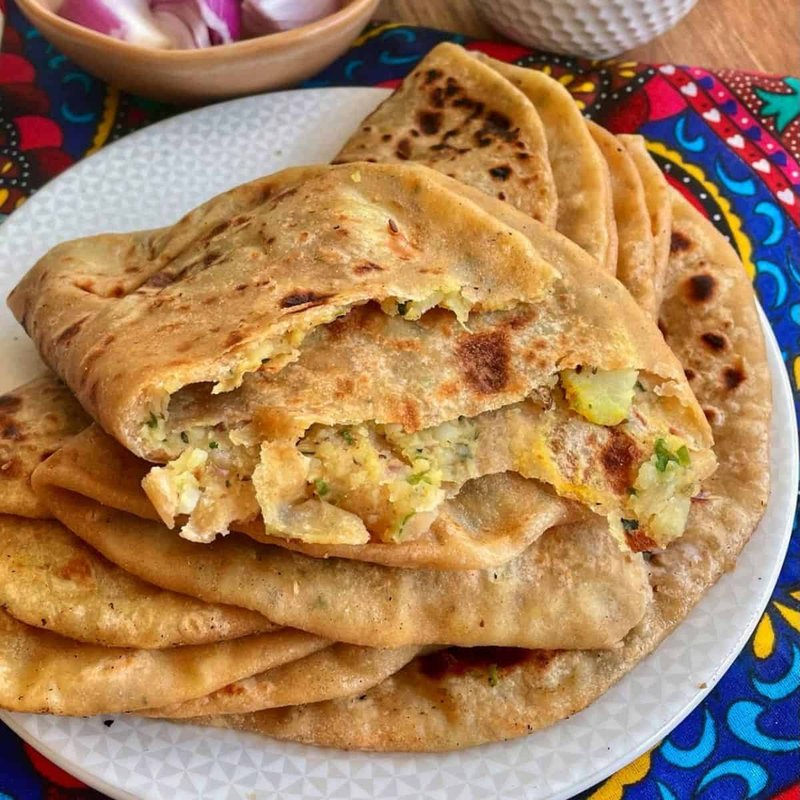

# Aloo Paratha

*Punjab's stuffed flatbread: whole-wheat dough rolled around spiced mashed potato, cooked on a hot tawa with ghee till blistered and crisp.*

**Serves:** 4 (makes 8 parathas)

**Prep Time:** 40 minutes (plus 20 min dough rest)

**Cook Time:** 25 minutes

## Overview
Whole-wheat (atta) flour is mixed with salt and just enough warm water to make a soft dough; rests for 20 minutes. Potatoes boil whole, peel hot, mash with cumin, garam masala, ginger, green chilli, amchoor and coriander. The dough divides into balls. Each ball flattens into a small disc; a heaped spoon of potato sits in the middle; the dough pleats up around the filling and pinches closed; flattens again carefully; rolls out gently to a 20 cm disc. Each cooks on a hot tawa or non-stick pan with ghee, 2 minutes per side, until crispy and gold.

## Ingredients

### Dough
- 400 g whole-wheat flour (atta - sold at South Asian shops; ordinary wholemeal flour works as a substitute)
- 1 teaspoon salt
- 1 tablespoon sunflower oil
- 250-280 ml warm water

### Filling
- 600 g potatoes (Maris Piper or other floury)
- 2 teaspoons salt
- 1 ½ teaspoons ground cumin
- 1 teaspoon [Garam Masala](../../indian/Spice-Mixes/garam-masala.md)
- 1 teaspoon amchoor (dried mango powder)
- 1 teaspoon Kashmiri red chilli powder
- 2 green chillies (very finely chopped)
- 2 cm fresh ginger (grated)
- 3 tablespoons fresh coriander (chopped fine)

### For cooking
- 100 g ghee (or unsalted butter, melted)

### To serve
- Thick plain yogurt
- Lime pickle
- Fresh chilli sauce
- Butter to slather

## Method

### Stage 1 - Dough
1. Whisk flour and salt in a wide bowl.
1. Drizzle in the oil; rub with fingertips.
1. Pour in 250 ml of warm water; mix to a soft dough. Add more water 1 tablespoon at a time if needed.
1. Knead 5 minutes on a lightly floured surface until smooth.
1. Smear with a thin film of oil; cover; rest 20 minutes.

### Stage 2 - Boil and mash the potato
1. Place potatoes (skins on) in a pot of water; bring to a boil; cook 25 minutes until a knife slides through.
1. Drain; peel while still hot.
1. Mash thoroughly with a potato masher in a wide bowl - no lumps.

### Stage 3 - Spice the filling
1. To the warm mashed potato, add salt, cumin, garam masala, amchoor, chilli powder, green chilli, ginger and fresh coriander.
1. Mix well.
1. Taste; adjust salt - the filling should be assertively seasoned, since the dough is plain.
1. Divide into 8 equal portions; roll each into a ball.

### Stage 4 - Stuff and roll
1. Divide the dough into 8 equal pieces; roll into balls.
1. Working one at a time on a lightly floured surface:
   - Flatten the dough ball with the heel of your hand into a disc about 10 cm across (slightly thicker at the edges).
   - Place a ball of potato filling in the centre.
   - Bring the edges of the dough up and over the filling, pleating it into a closed parcel; pinch firmly to seal.
   - Dust with flour.
   - Place pinched-side down; gently press flat with your palm.
   - Roll out carefully into a 20 cm disc - go slowly, don't force, let the filling spread evenly. If a small tear opens, pinch it closed and continue.
   - Set aside on a lightly floured tray; don't stack.

### Stage 5 - Cook
1. Heat a wide tawa or non-stick pan over medium-high.
1. Place a paratha on the dry pan; cook 60-90 seconds until bubbles appear on top and the underside has light brown spots.
1. Flip; brush 1 teaspoon ghee over the cooked side; cook 90 seconds.
1. Flip again; brush ghee on the other side; press gently with a spatula. Cook 30 seconds.
1. Lift onto a plate; stack with a cloth over to keep warm.
1. Repeat.

### Stage 6 - Serve
1. Eat hot, the moment they come off the pan.
1. Tear, dip in yogurt, top with a smear of butter and a spoon of lime pickle.

## Notes
- **Soft dough is critical:** A stiff dough cracks during stuffing. The dough should be soft enough to dent with a fingertip but not stick to clean hands.
- **Don't over-stuff:** The first attempt is always over-stuffed and bursts. Use less filling than you think - about 60-70 g per paratha.
- **Cook over high heat, briefly:** Low heat dries them out. Medium-high heat with a quick cook gives the right blistered-crisp texture.

## Storage
- Best within 30 minutes of cooking.
- Refrigerate 2 days; reheat on a dry pan 30 seconds per side.
- Freeze cooked parathas separated by baking paper 2 months; reheat from frozen on a pan 1 minute per side.
