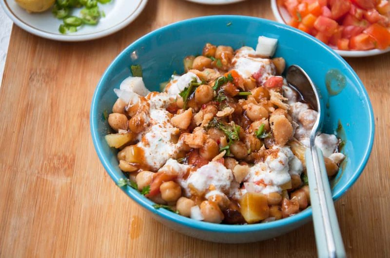

# Chana Chaat

*Pakistan's tangy chickpea snack: boiled chickpeas tossed with onion, tomato and potato, dressed with lemon, chaat masala and tamarind.*

**Serves:** 4

**Prep Time:** 15 minutes

**Cook Time:** 5 minutes (assuming pre-cooked chickpeas)

## Overview
Pakistan's tangy chickpea snack and the iftar-table standby, the kind of plate that turns up at every Ramadan break-fast and roadside chaat stall: boiled chickpeas tossed with diced red onion, tomato and potato, dressed with lemon, chaat masala and tamarind, crowned with crushed papri and sev for crunch. Chaat masala is the soul of the dish; without it (that Pakistani blend of dried mango, black salt, cumin, dried ginger and chillies) you have a chickpea salad rather than chana chaat, so buy a small jar at any South Asian shop. You combine drained chickpeas (tinned for speed, or overnight-soaked and home-cooked for best texture) with finely diced red onion, deseeded chopped tomato, small-diced boiled potato, finely chopped green chilli, fresh coriander and optional mint in a wide bowl. Whisk lemon juice with chaat masala, ground roasted cumin, Kashmiri chilli, optional black salt (kala namak, with the faint sulphurous tang that defines Pakistani chaat) and ordinary salt. Pour over, add tamarind chutney and a teaspoon of hot green chilli sauce, toss thoroughly. The dressing should be aggressively sharp, salty and slightly spicy; half a teaspoon of lemon and a pinch of salt is wrong here, Pakistani chaat is meant to be vigorously dressed and noisy on the palate. Tip onto a wide serving plate, crush papri (or Bombay mix, sev, salty potato crisps) lightly between your hands and scatter across the top, sprinkle sev, scatter extra coriander, set lemon wedges around. Eat with a spoon immediately; the papri softens fast in the lemon juice, so this isn't a make-ahead dish.

## Ingredients

### Salad base
- 2 (400 g) tins chickpeas (drained and rinsed, OR 200 g dried chickpeas, soaked overnight and simmered 1 hour until tender)
- 1 red onion (medium, finely diced)
- 2 tomatoes (medium, deseeded, finely diced)
- 1 potato (large, boiled in its skin until tender, then peeled and diced 1 cm)
- 1 green chilli (small, deseeded and finely chopped)
- 4 tablespoons fresh coriander (chopped)
- 2 tablespoons fresh mint (chopped, optional)

### Dressing
- 2 lemons (about 4 tablespoons, juice)
- 1 ½ teaspoons [Chaat Masala](../../indian/Spice-Mixes/chaat-masala.md) (sold at South Asian shops - distinctive sour-and-salty)
- 1 teaspoon ground roasted cumin (see notes)
- ½ teaspoon Kashmiri red chilli powder
- ½ teaspoon black salt (kala namak, optional but traditional, gives a faint sulphurous tang)
- ½ teaspoon salt (to taste)
- 1 tablespoon [Tamarind Chutney](../../indian/sauces-pickles/tamarind-chutney.md) (sold ready-made, optional but classic)
- 1 teaspoon hot green chilli sauce (or Pakistani hot sauce)

### To finish
- 30 g papri (small fried wheat crackers, substitute crushed Bombay mix, sev or salty potato crisps)
- 2 tablespoons sev (chickpea-flour vermicelli - optional)
- Extra fresh coriander
- 1 lemon (cut into wedges)

## Method

### Stage 1 - Combine the base
1. In a wide bowl, combine drained chickpeas, red onion, tomato, diced boiled potato, green chilli, coriander and mint (if using).
1. Toss gently.

### Stage 2 - Dress
1. In a small bowl, whisk lemon juice, chaat masala, roasted cumin, Kashmiri chilli, black salt and ordinary salt to a smooth dressing.
1. Pour over the chickpea mix.
1. Add tamarind chutney and hot sauce.
1. Toss thoroughly with a fork - be generous.
1. Taste; adjust - chana chaat should be aggressively sharp, salty and slightly spicy.

### Stage 3 - Top and serve
1. Tip onto a wide serving plate or shallow bowl.
1. Crush the papri lightly between your hands and scatter across the top.
1. Scatter sev (if using).
1. Sprinkle extra coriander.
1. Lemon wedges around.

### Stage 4 - Eat
1. Eat with a spoon, immediately. The papri softens fast in the lemon juice, so this is not a make-ahead dish.

## Notes
- **Chaat masala is the soul:** Without chaat masala - that very specific Indian / Pakistani blend of dried mango (amchoor), black salt, cumin, dried ginger and chillies - you have a chickpea salad, not chana chaat. Buy a small jar at any South Asian shop; it lasts months.
- **Toss generously:** Pakistani chaat is meant to be vigorously dressed and assertive. ½ teaspoon of lemon juice and a pinch of salt is wrong; it should be tangy, salty and noisy on the palate.
- **Black salt (kala namak) is optional but characteristic:** Pink-grey rock salt with a sulphurous edge. Adds an unmistakable savoury depth. Not the same as ordinary table salt.

## Storage
- Eat within an hour of assembly; the papri softens and the salad goes watery.
- The dressed chickpea base (without papri) refrigerates 1 day; revive with a fresh squeeze of lemon and fresh papri.
