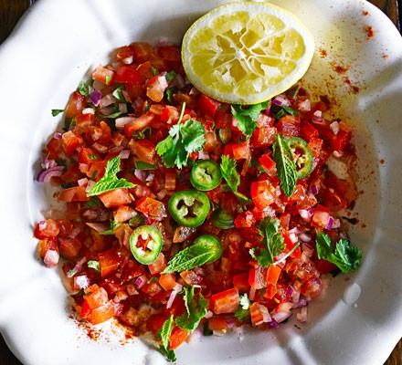

# Kachumber

*Pakistan's chopped salad: cucumber, tomato, onion and green chilli diced fine, sharpened with lime and chaat masala. The fresh foil to anything rich and meaty on the table.*

**Serves:** 4 as a side

**Prep Time:** 10 minutes

**Cook Time:** 0 minutes

## Overview
Kachumber is Pakistan's chopped salad, the fresh foil to nihari, biryani, karahi or anything heavy and meaty on the table. Cucumber, tomato, onion and green chilli dice fine and uniform, sharpened with lime and chaat masala and scattered with coriander and mint. Two things to get right: deseed the cucumber and tomato (watery seeds pool the dressing and turn the salad to soup), and don't skimp on the chaat masala. That tangy blend of black salt, mango powder, cumin and coriander is what makes kachumber kachumber rather than just diced veg. The dressing should taste assertively sharp. Eat at room temperature alongside any rich Pakistani main, and made right before serving since it won't keep beyond an hour or two.

## Ingredients

- 1 cucumber (large, deseeded, diced 5 mm)
- 3 tomatoes (medium, deseeded, diced 5 mm)
- 1 red onion (small, diced 5 mm)
- 1 long green chilli (finely chopped; or to taste)
- A small bunch fresh coriander (chopped)
- A small handful fresh mint (chopped)
- 1 lime (juice)
- 1 teaspoon [Chaat Masala](../../../base-ingredients/spices/chaat-masala.md) (or 1 tsp lemon juice + ½ tsp ground cumin + pinch of black salt)
- ½ teaspoon ground cumin (toasted, ideally)
- ¾ teaspoon salt
- ¼ teaspoon black pepper
- 1 tablespoon olive oil (optional)

## Method

### Stage 1 - Combine
1. Toss the cucumber, tomato, onion and green chilli in a wide bowl.

### Stage 2 - Dress
1. Squeeze the lime juice over.
1. Sprinkle in the chaat masala, ground cumin, salt and pepper.
1. Drizzle the olive oil if using.
1. Toss gently with two forks (don't bruise the tomato).

### Stage 3 - Finish
1. Stir in the coriander and mint.
1. Taste; adjust salt and lime, should be sharp and fresh.

### Stage 4 - Serve
1. Serve at room temperature alongside any rich Pakistani main.

## Notes
- **Chaat masala makes it:** The blend of black salt, mango powder, cumin, coriander and asafoetida gives kachumber its tangy-savoury edge. Skip and the salad is just diced veg.
- **Deseed the tomato and cucumber:** Watery seeds pool the dressing and turn the salad to soup. Cut them out.
- **Eat fresh:** Won't keep beyond an hour or two. Make right before serving.

## Storage
- Best within an hour of mixing.
