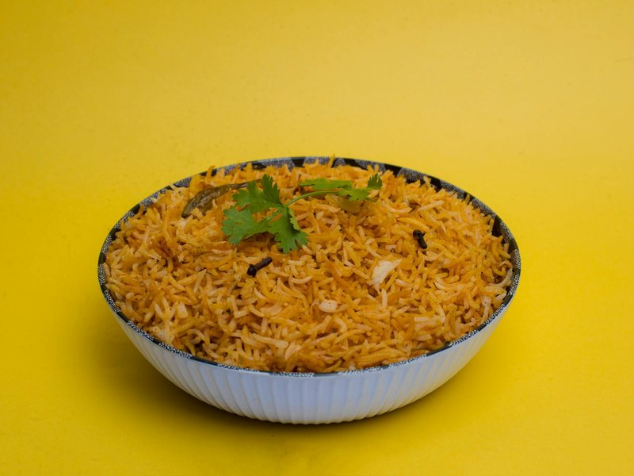

# Sindhi Biryani

*Sindh's chilli-tangy biryani: yogurt-marinated mutton layered with basmati, fried onions, soft prunes and chillies, slow-cooked on dum.*

**Serves:** 6

**Prep Time:** 35 minutes (plus 2 hours marinating)

**Cook Time:** 1 hour 30 minutes

## Overview
Mutton on the bone marinates for 2 hours in yogurt, ginger-garlic paste, ground spices (red chilli, turmeric, coriander, cumin, garam masala), mint, coriander and salt. Sliced onions fry slowly in oil to deep gold, then crispy, and drain on paper (some go in the marinade, some on top of the biryani). The marinated mutton browns; tomatoes go in; the meat braises for 45 minutes until tender. Basmati rice parboils with whole spices and salt to 70% done; drains. The layering: mutton at bottom, half the rice, fried onions and prunes and green chillies, the remaining rice, more onions, saffron-milk and ghee on top. Dum cook for 25 minutes sealed.

## Ingredients

### Mutton marinade
- 800 g bone-in mutton (or 1 kg chicken thighs) cut into 4 cm chunks
- 250 g full-fat plain yogurt
- 3 tablespoons ginger-garlic paste (or 3 cm ginger + 6 garlic cloves blitzed)
- 2 teaspoons Kashmiri red chilli powder (mild and red)
- 1 teaspoon ordinary chilli powder (or to taste)
- 1 teaspoon ground turmeric
- 1 teaspoon ground coriander
- 1 teaspoon ground cumin
- 1 ½ teaspoons [Garam Masala](../indian/Spice-Mixes/garam-masala.md)
- 1 tablespoon fresh mint (chopped)
- 2 tablespoons fresh coriander (chopped)
- 2 teaspoons salt
- ½ lemon (juice)

### Fried onions
- 4 onions (large, sliced very thin)
- 200 ml sunflower oil

### Tomato and braise
- 2 tomatoes (medium, chopped)
- 200 ml water

### Rice
- 500 g basmati rice (rinsed; soaked 30 minutes; drained)
- 2 litres water (for parboiling)
- 2 tablespoons salt
- 4 green cardamom pods
- 4 cloves
- 2 bay leaves
- 1 cinnamon stick
- 1 teaspoon black peppercorns

### Layering
- 200 g dried plums (alu bukhara, soft pitted prunes)
- 4 green chillies (slit)
- 2 tablespoons fresh mint (chopped)
- 2 tablespoons fresh coriander (chopped)
- 1 large pinch saffron threads (soaked in 4 tablespoons hot milk)
- 2 tablespoons ghee
- ½ lemon (juice)

## Method

### Stage 1 - Marinate
1. In a wide bowl, combine all marinade ingredients with the mutton.
1. Massage well; cover; rest 2 hours minimum (4-12 hours ideal in the fridge).

### Stage 2 - Fried onions
1. Heat oil in a wide pan over medium-high.
1. Add sliced onions; fry 18-20 minutes, stirring often, until deep dark brown and crisp (NOT just gold - keep going).
1. Lift onto kitchen paper.
1. Reserve 100 ml of the onion-flavoured oil for the biryani.

### Stage 3 - Braise the mutton
1. In a wide heavy pot, heat 4 tablespoons of the onion oil.
1. Add the marinated mutton (along with all the marinade).
1. Cook 5 minutes on medium-high, stirring, until the yogurt absorbs.
1. Add tomatoes and water.
1. Bring to a simmer; cover; reduce heat; cook 45-60 minutes until the mutton is fall-from-bone tender. The sauce should be thick and clinging to the meat - not soupy. (Uncover for the last 10 minutes if too wet.)

### Stage 4 - Parboil rice
1. While the mutton braises: bring 2 litres of well-salted water to a boil with the whole spices.
1. Add the drained soaked rice.
1. Cook 5-6 minutes until 70% done (still firm to the bite at the centre - the rice will finish in dum).
1. Drain quickly; spread on a wide tray briefly to stop cooking.

### Stage 5 - Layer
1. Use the same wide heavy pot as the mutton (don't remove the mutton - layer over it).
1. Spread half the rice over the mutton evenly.
1. Scatter: a third of the fried onions, all the prunes, the slit chillies, half the mint, half the coriander, a squeeze of lemon.
1. Spread the remaining rice.
1. Top with the rest of the fried onions, the remaining mint and coriander.
1. Drizzle the saffron-milk in streaks across the top.
1. Dot the ghee around.
1. Drizzle 2 tablespoons of the reserved onion oil.

### Stage 6 - Dum cook
1. Cover the pot with a tight-fitting lid (line the rim with foil or a damp cloth if it doesn't seal).
1. Place over the lowest heat 20-25 minutes (or stand the pot on a heat-diffuser to prevent the bottom catching).
1. Off heat; let stand sealed 10 more minutes.

### Stage 7 - Serve
1. Uncover at the table.
1. Use a wide flat spoon to gently lift portions from the pot, scooping down from rice through to mutton - try not to mash the rice.
1. Eat with raita and a wedge of lemon.

## Notes
- **Prunes are the Sindhi tell:** Alu bukhara (dried plum/prune) is what distinguishes Sindhi biryani from every other regional biryani. The slight tang and sweetness running through the dish is its character.
- **Deep dark fried onions:** "Gold and crisp" is the goal. Pale onions give bland biryani. Don't be afraid to push the colour - they should be on the edge of burnt at the edges.
- **70% cooked rice for dum:** Fully cooked rice goes to mush in the dum stage. The rice should still have a firm centre when drained; the steam from the meat finishes it.

## Storage
- Refrigerate 4 days; reheats well covered in a low oven.
- Freezes 2 months.
