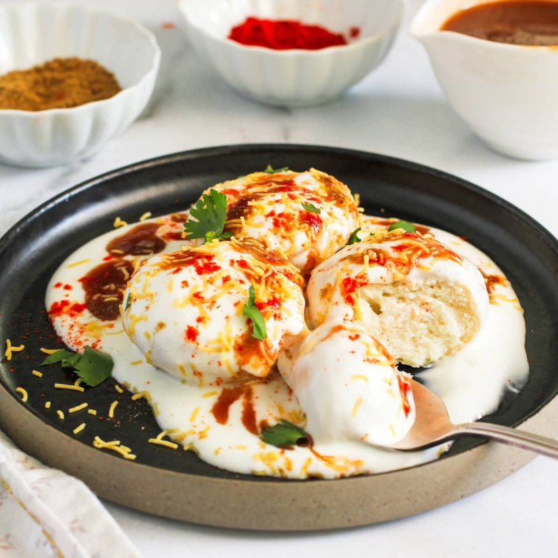

# Dahi Bhalla

*Pakistan's yogurt-and-fritter snack: urad dal fritters soaked soft, drowned in spiced cold yogurt and crowned with tamarind and chutneys.*

**Serves:** 4 (makes 12 fritters / 4 bowls)

**Prep Time:** 30 minutes (plus overnight bean soak)

**Cook Time:** 15 minutes

## Overview
Dried urad dal (white, sometimes labelled "white lentils" or "split urad") soaks overnight, then blends with ginger, green chilli and a small amount of water into a smooth thick batter. Whipped vigorously for 5 minutes to incorporate air (this is what makes the fritters light). Asafoetida and salt season; baking soda activates right before frying. Fritters drop into 175°C oil; fry for 3-4 minutes until amber. Lifted into a wide bowl of lukewarm water; soaked for 10 minutes; squeezed gently between palms to remove most water. Plated in shallow bowls; flooded with sweet salted spiced yogurt; topped with chutneys, chaat masala, pomegranate, fresh coriander, a sprinkle of crushed papri or sev for crunch.

## Ingredients

### Fritters (bhalla)
- 200 g dried urad dal (white split - sold at South Asian shops; sometimes called "split white lentils")
- 2 cm fresh ginger (grated)
- 1 green chilli (chopped)
- 60-80 ml cold water (for blending)
- 1 teaspoon salt
- ½ teaspoon asafoetida (hing - sold at Indian shops)
- ¼ teaspoon ground white pepper
- ½ teaspoon baking soda (added just before frying)

### For frying
- 1 litre vegetable oil

### Spiced yogurt
- 600 g full-fat Greek yogurt (or hung yogurt)
- 60 ml cold water (to thin)
- 1 teaspoon salt
- 2 tablespoons caster sugar (the sweet note is essential; not optional)
- 1 ½ teaspoons ground roasted cumin (see Notes)
- ½ teaspoon Kashmiri red chilli powder

### Toppings
- 4 tablespoons sweet tamarind chutney
- 4 tablespoons green mint-coriander chutney (or blitz coriander + mint + green chilli + lime + salt)
- 1 teaspoon [Chaat Masala](../../indian/Spice-Mixes/chaat-masala.md)
- 4 tablespoons pomegranate seeds (the Pakistani touch)
- 4 tablespoons sev (crispy chickpea-flour noodles) or crushed papri (small fried wheat crackers)
- 3 tablespoons fresh coriander (chopped)
- A pinch of extra ground roasted cumin and chilli powder

## Method

### Stage 1 - Soak the urad dal
1. Cover urad dal with 1 litre cold water; soak 8-12 hours.
1. Drain; rinse.

### Stage 2 - Batter
1. Place drained urad dal, ginger and green chilli in a powerful blender with 60 ml cold water.
1. Blend to a very smooth thick batter - like very thick whipped cream. Add more water 1 tablespoon at a time only if necessary.
1. Tip into a wide bowl.

### Stage 3 - Whip
1. Whip vigorously with a wooden spoon (or stand mixer paddle) for 5 minutes - the batter visibly lightens in colour and increases in volume.
1. Stir in salt, asafoetida and white pepper.
1. Test the float-test: drop a small ball into cold water - if it floats, the batter has enough air. If it sinks, whip another 2 minutes.

### Stage 4 - Spiced yogurt
1. Whisk yogurt, water, salt, sugar, ground roasted cumin and chilli powder in a wide bowl.
1. Refrigerate.

### Stage 5 - Fry
1. Heat oil to 175°C.
1. Just before frying, stir baking soda into the batter.
1. Drop tablespoons of batter into the oil; fry 4-5 at a time, 3-4 minutes, turning, until deep amber.
1. Lift into a wide bowl of lukewarm water.

### Stage 6 - Soak
1. Soak the fritters 8-10 minutes in the lukewarm water. They absorb water and become spongy-soft.
1. Lift each one out and gently squeeze between palms to remove most of the water (don't crush; just press out excess).

### Stage 7 - Assemble (per bowl)
1. Place 3 squeezed fritters in a wide shallow bowl.
1. Pour cold spiced yogurt over to fully cover the fritters.
1. Drizzle 1 tablespoon tamarind chutney in lines.
1. Drizzle 1 tablespoon green chutney in lines.
1. Sprinkle chaat masala, pomegranate seeds, sev or papri, fresh coriander, extra cumin and chilli powder.

### Stage 8 - Serve
1. Eat with a spoon, cold or at room temperature. Don't reheat.

### Optional - Ground roasted cumin
- Toast 2 tablespoons cumin seeds in a dry pan over medium 3 minutes until deep brown and aromatic. Cool. Grind to powder. Keeps 2 months in a jar.

## Notes
- **Whip the batter:** Light, airy fritters depend on whipping air into the batter. Insufficient whipping gives dense, hard fritters that won't absorb the yogurt properly.
- **Soak in lukewarm water:** Not cold (won't fully soften) and not hot (cooks the surface). Lukewarm is right. The 8-minute soak transforms the fritters from crisp to spongy.
- **Sweet yogurt is the point:** Pakistani dahi bhalla is sweet-sour-salty-spicy all at once. Don't omit the sugar - bland yogurt makes a sad bowl.

## Storage
- Soaked fritters in spiced yogurt: best within 2 hours; the toppings should go on at the moment of serving.
- Cooked but unsoaked fritters: refrigerate 3 days; soak in lukewarm water just before serving.
- The spiced yogurt alone keeps 3 days.
