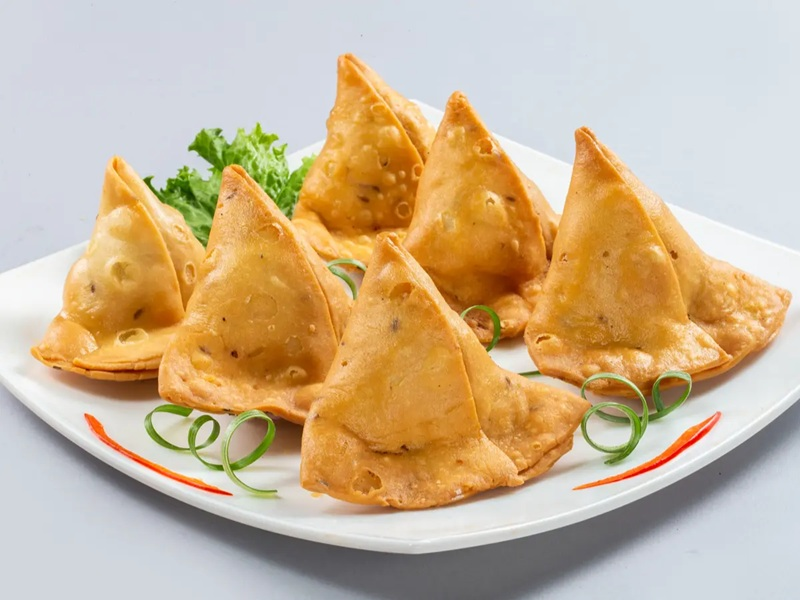

# Samosa Pakistani

*Pakistan's beef samosa: triangular fried pastries stuffed with spiced minced beef and peas. Served with tamarind and mint chutneys.*

**Serves:** 6 (makes 20 samosas)

**Prep Time:** 45 minutes (plus 30 min dough rest)

**Cook Time:** 15 minutes

## Overview
Pastry dough: plain flour, ghee, salt, ajwain seeds, and warm water are kneaded into a stiff oil-rich dough; rests for 30 min. Filling: ground beef (or lamb) sautées with onion, garlic, ginger, green chilli and a Pakistani spice blend (garam masala, cumin, coriander, chilli powder, turmeric). Frozen peas join; the mixture simmers dry; cooled fully. Dough divides into 10 balls; each rolls into a thin oval, cut in half to make 2 half-moons. Each half-moon forms a cone (one flat edge becomes the seam, sealed with flour paste). Cone fills with cooled filling. Top edge of cone seals with flour paste. Deep-fried 175°C 3-4 minutes per side until amber-crisp.

## Ingredients

### Dough
- 400 g plain flour
- 1 teaspoon salt
- 1 teaspoon ajwain seeds (carom - sold at South Asian shops; or substitute thyme)
- 100 g ghee (or sunflower oil, NOT melted; cool / room temperature)
- 180-200 ml warm water

### Filling
- 2 tablespoons sunflower oil (or ghee)
- 1 onion (medium, finely diced)
- 2 cm fresh ginger (grated)
- 4 garlic cloves (crushed)
- 2 green chillies (finely chopped)
- 500 g ground beef (or lamb)
- 1 teaspoon ground turmeric
- 1 ½ teaspoons [Garam Masala](../../indian/Spice-Mixes/garam-masala.md)
- 1 ½ teaspoons ground cumin
- 1 ½ teaspoons ground coriander
- 1 teaspoon Kashmiri red chilli powder
- 1 ½ teaspoons salt
- ½ teaspoon black pepper
- 150 g frozen peas
- 2 tablespoons fresh coriander (chopped)
- ½ lemon (juice)

### Flour paste (for sealing)
- 2 tablespoons plain flour mixed with 3 tablespoons cold water

### For frying
- 1 litre vegetable oil

### To serve
- [Tamarind Chutney](../../indian/sauces-pickles/tamarind-chutney.md) (sold ready-made)
- Green mint chutney (see [aushak.md](../../afghanistan/snacks/aushak.md) for a similar yogurt-based one, or blitz 1 bunch mint + 1 bunch coriander + 2 green chillies + 1 garlic + juice of 1 lime + 1 teaspoon salt)
- Lime wedges
- Sliced raw red onion

## Method

### Stage 1 - Dough
1. Whisk flour, salt and ajwain in a wide bowl.
1. Rub in ghee with fingertips until the mixture looks like coarse breadcrumbs.
1. Add warm water gradually; mix to a stiff dough (samosa dough should be much stiffer than bread dough - it shouldn't yield easily to a fingertip).
1. Knead 5 minutes on a lightly floured surface.
1. Cover; rest 30 minutes.

### Stage 2 - Filling
1. Heat oil or ghee in a wide pan over medium-high.
1. Sauté onion 6 minutes until golden.
1. Add ginger, garlic and green chilli; cook 1 minute.
1. Add mince; brown 6 minutes.
1. Stir in turmeric, garam masala, cumin, coriander, chilli powder, salt and pepper; cook 1 minute.
1. Add frozen peas; cook 4 minutes until the meat is dry but moist (no liquid pooling).
1. Off heat; stir in coriander and lemon juice.
1. Cool fully - warm filling makes the pastry soft.

### Stage 3 - Shape
1. Divide dough into 10 balls.
1. Roll each ball into a thin oval (12 cm × 18 cm, about 2 mm thick).
1. Cut each oval in half straight across the middle to make 2 half-moons.

### Stage 4 - Form cones and fill
1. Take a half-moon; brush the straight edge with flour paste.
1. Wrap the straight edge into a cone shape (overlapping by 1 cm); press the overlap firmly to seal.
1. Hold the cone with the open end up; spoon in 1 tablespoon of cooled filling.
1. Brush the open top edge with flour paste.
1. Pinch the top closed firmly; crimp with a fork.

### Stage 5 - Fry
1. Heat oil to 175°C.
1. Fry 4-5 samosas at a time, 3-4 minutes per side, turning, until amber-gold all over.
1. Lift onto kitchen paper.

### Stage 6 - Serve
1. Plate with bowls of tamarind chutney and mint chutney.
1. Lime wedges; sliced raw red onion.
1. Eat warm.

## Notes
- **Stiff dough is the technique:** Samosa dough is much firmer than bread dough. A wet, soft dough gives oily, soggy pastry. The stiffness gives the crisp, flaky-but-firm shell.
- **Cool the filling fully:** Warm filling melts the ghee in the dough and the pastry collapses.
- **Seal cones with flour paste:** The flour-water paste glues better than water alone. Leaky samosas burst in the oil; intact seals give crisp uniform pastries.

## Storage
- Best within 30 minutes of frying.
- Raw shaped samosas freeze 2 months on a tray; fry from frozen at 165°C 6-7 minutes per side.
- Cooked: refrigerate 2 days; re-crisp at 200°C oven 4 minutes.
