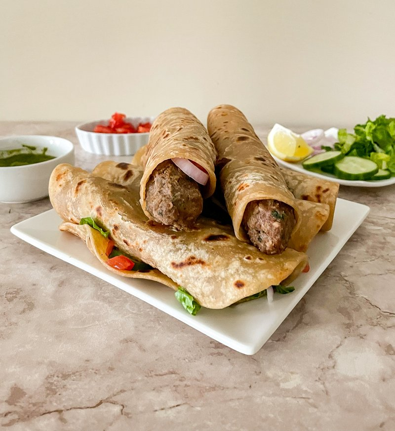

# Seekh Kebab Roll

*Pakistan's wrap snack: charcoal-grilled lamb seekh kebab pulled off the skewer, wrapped in a flaky paratha with onion, coriander and mint chutney.*

**Serves:** 4 (makes 8 rolls - 8 small seekh kebabs in 4 paratha wraps)

**Prep Time:** 30 minutes (plus 1 hour mince marinating)

**Cook Time:** 18 minutes

## Overview
Lamb mince (with enough fat for tenderness; 20%) combines with grated onion (squeezed dry), ginger, garlic, green chilli, fresh coriander, mint, garam masala, ground cumin, ground coriander, salt and a small spoon of besan (chickpea flour, helps the mince cling to the skewer). Mixed vigorously for 3 minutes to develop the proteins. Rested for 1 hour. Shaped into long sausages on metal skewers (or wooden skewers soaked for 30 min). Grilled hard over charcoal (or under a screaming-hot grill) 8-10 minutes turning often, until charred and just-cooked. Pulled off the skewers onto warm parathas; rolled with sliced onion, fresh coriander, mint chutney; eaten by hand.

## Ingredients

### Seekh kebab
- 500 g lamb mince (20% fat - fattier is better than leaner)
- 1 onion (small, grated, squeezed BONE-DRY in a tea towel)
- 3 cm fresh ginger (grated)
- 5 garlic cloves (crushed to a paste)
- 2 green chillies (very finely chopped)
- 3 tablespoons fresh coriander (chopped fine)
- 2 tablespoons fresh mint (chopped fine)
- 1 ½ teaspoons garam masala
- 1 teaspoon ground cumin
- 1 teaspoon ground coriander
- ½ teaspoon Kashmiri red chilli powder
- 1 teaspoon salt
- ½ teaspoon black pepper
- 1 tablespoon chickpea flour (besan; helps the mince hold its shape on the skewer)

### To assemble
- 4 large paratha or thin laffa-style flatbread (ready-made works; or use thin chapati / lavash)
- 1 red onion (small, sliced very thin and soaked in cold water 5 minutes, drained)
- 1 small bunch fresh coriander (leaves only)
- 6 tablespoons mint-coriander chutney (blitz 1 bunch coriander + 1 bunch mint + 2 green chillies + 1 garlic + juice of 1 lime + 1 teaspoon salt + 2 tablespoons yogurt)
- 2 lemons (cut into wedges)
- 1 teaspoon chaat masala (optional)

### Equipment
- 8 metal skewers (or wooden skewers soaked in water 30 minutes)
- A grill (charcoal best) or a screaming-hot oven broiler

## Method

### Stage 1 - Mince mixture
1. In a wide bowl, mix all the kebab ingredients with your hand.
1. Knead vigorously for 3 minutes - the mince becomes sticky and elastic (essential for clinging to the skewer).
1. Cover; refrigerate 1 hour minimum (lets the flavours integrate AND firms the mince).

### Stage 2 - Shape
1. Divide the mince into 8 portions.
1. With wet hands, form each portion into a long sausage 12 cm long, 2 cm thick, around a skewer - press the mince firmly around the skewer so it adheres.
1. Place on a tray; chill 15 minutes (helps the kebabs hold during grilling).

### Stage 3 - Cook
1. **Charcoal (best)**: build a hot fire; grill skewers directly on the grate 8-10 minutes, turning 4 times, until charred on all sides.
1. **Grill (broiler)**: heat to maximum; place skewers on a foil-lined tray 5 cm from the heat; grill 4 minutes; turn; 4 more minutes; turn 2 more times until charred.

### Stage 4 - Warm the paratha
1. Heat each paratha briefly in a dry hot pan 30 seconds per side until soft and warm.

### Stage 5 - Assemble
1. Slide 2 kebabs off the skewer onto each warm paratha.
1. Top with sliced red onion, fresh coriander leaves, 1 ½ tablespoons of mint chutney.
1. Squeeze of lemon; pinch of chaat masala.
1. Roll the paratha tightly around the kebabs; wrap the bottom in a small piece of foil or paper to hold.

### Stage 6 - Serve
1. Eat warm, by hand.
1. Lemon wedges and extra chutney on the side.

## Notes
- **Fatty mince is essential:** Lean mince gives a dry, crumbly kebab that falls off the skewer. 20% fat is right; if your butcher will grind lamb shoulder for you, that's ideal.
- **Squeeze the onion dry:** Grated onion holds a lot of water. If it goes into the mince wet, the mince won't cling to the skewer and the kebabs disintegrate over the heat.
- **Knead 3 minutes:** The meat needs to be worked until sticky-elastic. Insufficient kneading = crumbly kebabs.

## Storage
- Best within 30 minutes of grilling.
- Raw shaped kebabs on skewers freeze 1 month; grill from frozen, adding 5 minutes.
- Cooked: refrigerate 2 days; reheat in a covered pan with a splash of water 4 minutes.
