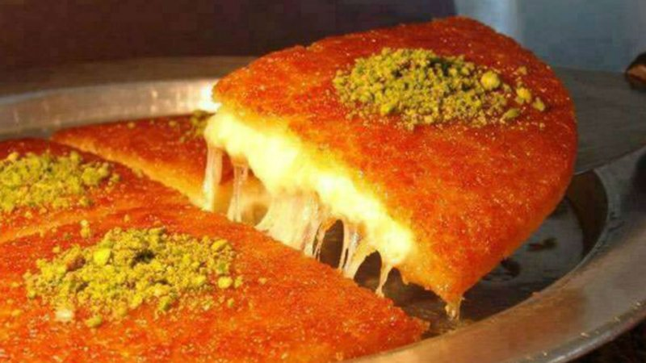

# Knafeh Nabulsiya

*The Nablus-style cheese knafeh: orange-tinted kataifi pastry baked over melted akkawi cheese, drenched in cold rosewater syrup, scattered with pistachio.*

**Serves:** 8

**Prep Time:** 30 minutes

**Cook Time:** 30 minutes

## Overview
Walk into a Nablus sweet shop late afternoon and this is what you smell: hot orange pastry, melted cheese, rosewater syrup hitting a tray that just came out of the oven. You blitz the kataifi to coarse rubble, toss it with melted ghee and a pinch of orange colouring, then press half of it firmly into a buttered tin. The desalted cheese goes in a soft layer, the rest of the pastry caps it, and you bake hot till the top is a deep orange-gold. The moment it leaves the oven, pour cold rosewater syrup over slowly: listen for the sizzle, that's the syrup soaking the pastry without softening the cheese underneath. Invert onto a wide platter so the bright orange shows, scatter chopped pistachios across the surface, cut while hot. Eat immediately and you'll get the cheese pull in long strings, with a glass of mint tea and another piece already cooling in front of you.

## Ingredients

### Pastry
- 500 g kataifi pastry (shredded phyllo, thawed if frozen)
- 250 g unsalted butter (or ghee), melted
- ¼ teaspoon orange food colouring paste (or 1 teaspoon liquid)

### Cheese
- 300 g mix of mozzarella 
- 200 g ricotta cheese

### Syrup
- 400 g caster sugar
- 250 ml water
- 1 tablespoon lemon juice
- 1 tablespoon rosewater
- 1 tablespoon orange blossom water

### Topping
- 80 g shelled pistachios (finely chopped)

## Method

### Stage 1 - Syrup
1. Combine the sugar, water and lemon juice in a small pan.
1. Bring to a boil; simmer 8-10 minutes until slightly thickened.
1. Off the heat, stir in the rosewater and orange blossom water.
1. Cool fully, must be cold when poured.

### Stage 2 - Soak the cheese
1. If using akkawi: rinse under cold running water 30 minutes (or soak in cold water with several changes) to remove excess salt; drain; chop into 1 cm pieces.
1. If using halloumi: rinse 30 minutes; grate.
1. The cheese must be unsalted-tasting, that's the difference between a great knafeh and a salty mess.

### Stage 3 - Prepare the pastry
1. Heat the oven to 200°C (180°C fan).
1. Pulse the kataifi in a food processor to a coarse rubble (or chop with a knife).
1. Whisk the orange colouring into the melted butter.
1. Pour over the pastry; toss thoroughly to coat every strand.

### Stage 4 - Layer
1. Butter a 28 x 22 cm round or rectangular baking tin.
1. Press half the pastry firmly into the bottom in an even layer (a glass works well as a press).
1. Spread the cheese evenly across.
1. Top with the remaining pastry; press firmly.

### Stage 5 - Bake
1. Bake 25-30 minutes until the top is deep orange-gold and the edges are crisp.

### Stage 6 - Drown and invert
1. Pull from the oven; immediately pour the cold syrup all over, slowly, evenly. Listen for the sizzle.
1. Rest 2 minutes (lets the syrup penetrate without softening too far).
1. Run a knife around the edges; invert onto a serving platter, the bright orange pastry should be on top.

### Stage 7 - Top and serve
1. Scatter the chopped pistachios across the surface.
1. Cut into squares while still hot; serve immediately so the cheese pulls in strings.

## Notes
- **Cheese desalting is essential:** Akkawi straight from the package is salty; eaten in knafeh untreated, the dish is inedible. Rinse hard.
- **Cold syrup, hot pastry:** Reverse and the kataifi goes mushy. Standard rule for Levantine sweets; doesn't change here.
- **Eat hot:** Knafeh's whole pleasure is the cheese pull. Cool knafeh is fine but sliced; warm it back up before serving (4 minutes at 180°C).

## Storage
- Best fresh; reheat at 180°C for 5-6 minutes covered to restore the cheese pull.
