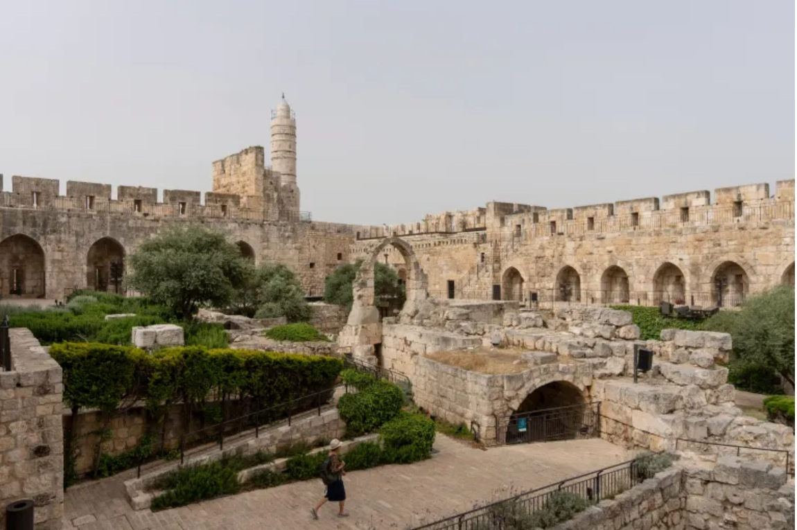

# Palestinian Cuisine

A cuisine that holds the Levantine table at its centre: olive oil, za'atar, sumac, tahini and lemon shape the seasoning. Musakhan (sumac chicken on flatbread) is the national dish; maqluba, mansaf, knafeh Nabulsiya and freshly-baked taboon bread are the table's other anchors. Slow-cooked stews, hand-rolled grape leaves, shared mezze and the closeness of olive groves to home cooking define the kitchen.
