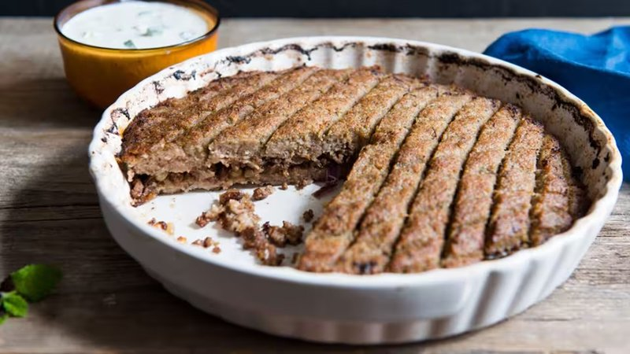

# Kibbeh Bil Saneeyeh

*Palestine's Friday-dinner kibbeh: two layers of bulgur-and-lamb dough sandwiching a spiced mince and pine-nut filling, scored and baked.*

**Serves:** 6

**Prep Time:** 45 minutes (plus 30 min bulgur soak)

**Cook Time:** 40 minutes

## Overview
The Friday-dinner kibbeh of Palestinian homes, a tray-baked celebration cousin of the fiddly handmade torpedoes you spend afternoons shaping. Start with the smallest grade of bulgur (the #1 fine), soak twenty minutes, squeeze dry. Blitz in the food processor with lean lamb, grated onion, baharat and allspice, ice water added till the paste is smooth and faintly tacky like stiff hummus. The filling is browned separately: onion soft and gold, fattier lamb spiced and broken up, toasted pine nuts and parsley off the heat. Press half the kibbeh paste firmly into a greased tin, spread the cooled filling across, flatten the rest between cling film and lay on top like a lid. Score the surface into diamonds, drizzle with olive oil, bake thirty-five to forty minutes till the top is deep golden and the edges crisp. Rest ten minutes, lift wedges out along the scored lines, serve with cold yogurt and a sharp cucumber-tomato salad alongside.

## Ingredients

### Kibbeh dough
- 200 g fine bulgur (#1 grade - labelled "fine" or "very fine")
- 250 ml cold water (for soaking)
- 400 g lean lamb (or beef, leg meat, twice-minced from the butcher OR processed at home)
- 1 onion (small, rough chunks, for the blender)
- 1 ½ teaspoons [Baharat](../../base-ingredients/spices/baharat.md) (Palestinian seven-spice)
- 1 teaspoon ground allspice
- ½ teaspoon ground cinnamon
- 1 ½ teaspoons salt
- ½ teaspoon black pepper
- 60 ml ice water (added during blitzing)

### Filling
- 3 tablespoons olive oil
- 1 onion (large, finely diced)
- 400 g fattier lamb mince (around 20% fat - keeps the filling juicy)
- 1 ½ teaspoons [Baharat](../../base-ingredients/spices/baharat.md)
- 1 teaspoon ground allspice
- ½ teaspoon ground cinnamon
- 1 teaspoon salt
- ½ teaspoon black pepper
- 60 g pine nuts (toasted in a dry pan 3 minutes until just gold)
- 2 tablespoons fresh flat-leaf parsley (chopped)

### To bake
- 2 tablespoons olive oil (for the tin and to drizzle)
- 30 g butter (small pieces dotted on top - optional)

### To serve
- Greek yogurt (or thick labneh) with a sprinkle of dried mint
- Cucumber-tomato-mint salad

## Method

### Stage 1 - Soak the bulgur
1. Cover the bulgur with cold water; soak 20 minutes.
1. Drain through a fine sieve; squeeze handfuls dry between your palms until no liquid drips.

### Stage 2 - Kibbeh dough
1. In a food processor, blitz the lean lamb, onion, baharat, allspice, cinnamon, salt and pepper to a smooth paste - 30 seconds.
1. Add the drained bulgur.
1. Pulse 8-10 times, adding ice water 1 tablespoon at a time, until you have a smooth slightly tacky dough that holds together. It should be like a stiff hummus consistency.
1. Tip into a bowl; cover; refrigerate while you make the filling.

### Stage 3 - Filling
1. Heat olive oil in a wide pan over medium heat.
1. Add onion; cook 8 minutes until soft and golden.
1. Add the fattier lamb mince; brown 6 minutes, breaking up.
1. Stir in baharat, allspice, cinnamon, salt and pepper; cook 1 minute.
1. Off heat; stir in the toasted pine nuts and chopped parsley.
1. Cool 10 minutes (lukewarm filling makes the dough sit better).

### Stage 4 - Assemble
1. Heat oven to 200°C (180°C fan).
1. Brush a 26 cm round tin (or 22 x 28 cm rectangular oven dish) with olive oil.
1. Take half the kibbeh dough; wet your hands and press it firmly into the base of the tin to make an even 1 cm-thick layer.
1. Spread the cooled filling evenly over.
1. Take the remaining kibbeh dough; flatten it into a disc between two sheets of cling film or baking paper to the same size as the tin.
1. Carefully transfer over the filling.
1. Wet your hands; smooth the top; seal the edges.

### Stage 5 - Score
1. With a sharp knife, score the top into diamonds (or squares) - cut about 5 mm deep, all the way through the top layer but not into the filling.
1. Drizzle 2 tablespoons of olive oil over the top.
1. Dot the butter (if using) at intersections.

### Stage 6 - Bake
1. Bake 35-40 minutes until the top is deep golden brown and the edges are crisp.

### Stage 7 - Rest and serve
1. Rest 10 minutes (this firms it up for cutting).
1. Cut along the scored lines.
1. Lift wedges with a wide spatula onto plates.
1. Serve with yogurt and a fresh cucumber-tomato salad.

## Notes
- **Fine bulgur, not coarse:** The kibbeh dough requires #1 fine bulgur. Coarse bulgur (the type used in tabbouleh) makes a gritty dough that doesn't hold together properly.
- **Cold meat, cold processor:** For a smooth kibbeh paste, work with cold meat and add ice water. Warm meat blitzes to a paste but the texture is sticky-wet rather than smooth-firm.
- **Score before baking:** Cutting after baking shatters the crisp top. Score before; bake; cut along the lines.

## Storage
- Refrigerate 4 days; reheat covered at 180°C 12 minutes.
- Freeze cooked 2 months; defrost overnight then reheat.
- Assembled-but-unbaked: refrigerate 24 hours then bake; or freeze 2 months and bake from frozen at 180°C 50 minutes.
