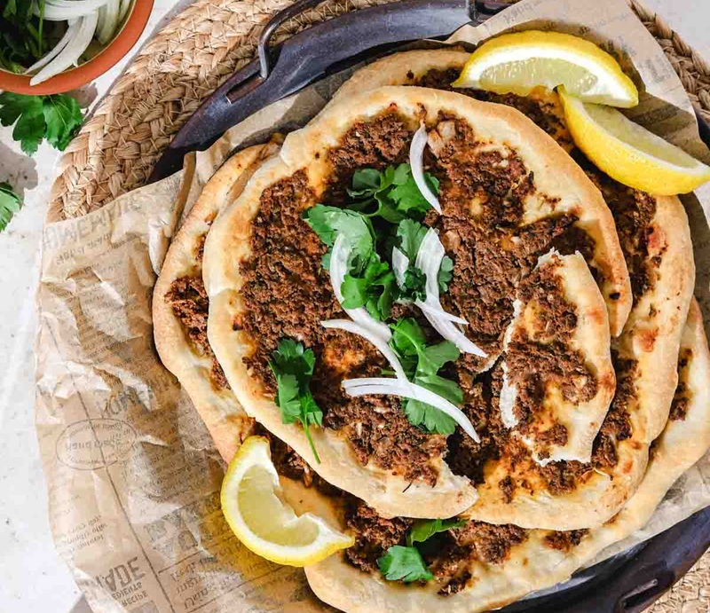

# Lahem Bi Ajeen

*Palestine's flat meat pies: spiced minced lamb with tomato, pomegranate molasses and baharat on thin yeasted dough, baked hot till glossy.*

**Serves:** 6 (makes 12 small pies)

**Prep Time:** 45 minutes (plus 1 hour rising)

**Cook Time:** 12 minutes

## Overview
A soft yeasted bread dough rises for 1 hour. While it rises, the lamb mince is mixed by hand with grated onion, chopped parsley, finely diced tomato, garlic, baharat, allspice, cinnamon, pomegranate molasses, lemon juice and salt, no cooking, the mince stays raw and cooks on the pies. The dough divides into 12 balls; each rolls into a thin 12 cm disc; a heaped tablespoon of the meat mix spreads to the edges. Bakes for 8-10 minutes at 230°C on a baking stone (or hot tray) until the dough is crisp and the meat is glossy and just cooked through.

## Ingredients

### Dough
- 500 g plain flour
- 1 sachet (7 g) fast-action yeast
- 1 ½ teaspoons salt
- 1 tablespoon olive oil
- 1 teaspoon caster sugar
- 320 ml warm water

### Topping
- 500 g lamb mince (20% fat, or a 70/30 lamb/beef mix)
- 1 onion (large, grated; squeeze excess water out)
- 2 tomatoes (medium, deseeded, very finely diced, about 200 g)
- 4 garlic cloves (crushed)
- 3 tablespoons fresh flat-leaf parsley (chopped fine)
- 1 ½ tablespoons pomegranate molasses
- 2 tablespoons tomato paste
- 1 ½ teaspoons baharat (Palestinian seven-spice)
- ½ teaspoon ground allspice
- ½ teaspoon ground cinnamon
- 1 teaspoon Aleppo pepper (or ½ teaspoon chilli flakes)
- 1 ½ teaspoons salt
- ½ teaspoon black pepper
- 2 tablespoons olive oil

### To finish
- Fresh mint and parsley leaves
- 2 lemons (cut into wedges)
- Greek yogurt
- A scatter of pine nuts (optional, toasted)

## Method

### Stage 1 - Dough
1. Whisk flour, yeast, salt and sugar in a wide bowl.
1. Add olive oil and warm water; mix to a soft dough.
1. Knead 8 minutes until smooth and elastic.
1. Cover; rise 1 hour until doubled.

### Stage 2 - Topping
1. In a wide bowl, combine the lamb mince, grated onion (squeezed dry - important), diced tomato, garlic, parsley, pomegranate molasses, tomato paste, baharat, allspice, cinnamon, Aleppo pepper, salt, pepper and olive oil.
1. Mix thoroughly with your hand for 2 minutes - the mixture should be evenly seasoned, smooth, and slightly wet but not soupy.

### Stage 3 - Heat the oven
1. Heat oven to 230°C (210°C fan).
1. Place a baking stone or heavy baking tray on the upper-middle rack to preheat for at least 20 minutes.

### Stage 4 - Shape the bases
1. Knock back the risen dough; divide into 12 equal balls.
1. Cover; rest 10 minutes.
1. Roll each ball into a thin disc 12-14 cm across, about 3 mm thick.

### Stage 5 - Top
1. Place 4 discs on a piece of baking paper.
1. Spoon 2 tablespoons of meat topping onto each disc; spread thinly to the edges with the back of a spoon - the layer should be 5 mm thick, not piled.

### Stage 6 - Bake
1. Slide the baking paper (with the topped discs) onto the hot stone or tray.
1. Bake 8-10 minutes - the dough should be golden at the edges; the meat should be glossy, slightly bubbling at the edges, just cooked through.
1. Repeat with the remaining discs in batches.

### Stage 7 - Serve
1. Eat warm.
1. Scatter fresh mint and parsley.
1. Squeeze a wedge of lemon over.
1. Optional: a spoon of yogurt on top, or a scatter of toasted pine nuts.

## Notes
- **Squeeze the onion:** Grated onion releases a lot of water. If you don't squeeze, the topping is wet and the dough underneath goes soggy.
- **Spread thin, not piled:** Lahem bi ajeen is meant to be a single thin layer of meat - about 5 mm. Piling it makes the meat dough's middle wet and the pies don't crisp.
- **Pomegranate molasses is the Palestinian signature:** The slight sweet-sour tang distinguishes the Palestinian pie from the Lebanese (which uses more lemon) and the Syrian (which leans heavier on tomato).

## Storage
- Best within 30 minutes of baking.
- Refrigerate cooked pies 2 days; reheat at 200°C 4 minutes.
- Freeze cooked pies 2 months; reheat from frozen at 200°C 7 minutes.
- Topping alone refrigerates 2 days; bake pies fresh.
