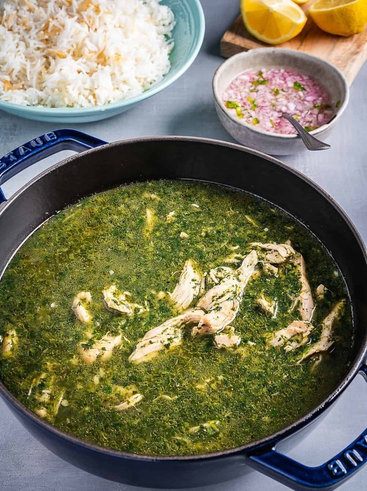

# Mlukhieh Palestinian

*Palestine's summer stew: finely chopped jute leaves simmered in chicken stock and finished with a fried-garlic-and-coriander tarka.*

**Serves:** 4

**Prep Time:** 20 minutes

**Cook Time:** 1 hour 20 minutes

## Overview
Mlukhieh is the dark green summer stew of Palestinian kitchens, jute leaves chopped to ribbons and simmered into a chicken broth till the whole pot smells of garlic and coriander. Poach bone-in chicken thighs with onion, bay, cardamom, cinnamon and peppercorns to build a clean, fragrant stock; the chicken comes out tender, the broth strains clear. Tip frozen finely chopped mlukhieh straight into the simmering stock (no need to defrost), cook gently for twenty-five minutes till the soup darkens and just thickens. Build the tarka, the Palestinian signature: lots of crushed garlic and ground coriander frying in olive oil till just gold, off the heat with fresh coriander and Aleppo pepper. Tip the tarka into the pot and listen for the hiss; that's the moment the dish becomes mlukhieh, not just a green soup. Don't boil hard at any stage or the leaves break and the texture goes lumpy. Ladle over fluffy basmati rice with a piece of poached chicken alongside, lemon, vinegared red onion, bread for mopping.

## Ingredients

### Chicken stock
- 4 bone-in skin-on chicken thighs (or 1 small whole chicken jointed)
- 1 onion (medium, halved)
- 2 bay leaves
- 4 green cardamom pods (bruised)
- 1 cinnamon stick
- 1 teaspoon black peppercorns
- 1 ½ teaspoons salt
- 1.6 litres water

### Mlukhieh
- 500 g frozen finely chopped mlukhieh (jute mallow / molokhia, sold at Middle Eastern shops)
- OR 200 g dried whole mlukhieh leaves, soaked 1 hour and chopped fine
- OR 1 kg fresh mlukhieh leaves (stripped from stems, chopped very fine, rarely available outside the region)

### Tarka
- 4 tablespoons olive oil (or 2 tablespoons olive oil + 2 tablespoons ghee)
- 10 garlic cloves (crushed)
- 1 tablespoon ground coriander
- 1 small bunch fresh coriander (chopped, both leaves and stems)
- ½ teaspoon chilli flakes

### To finish
- 1 teaspoon salt (to taste)
- ½ teaspoon black pepper

### To serve
- 400 g basmati rice (cooked, fluffy)
- 2 lemons (cut into wedges)
- 1 red onion (small, diced and soaked briefly in vinegar, optional Palestinian-style relish)
- Khobz (or pita)

## Method

### Stage 1 - Chicken and stock
1. Place chicken in a large pot with onion, bay, cardamom, cinnamon, peppercorns and salt.
1. Cover with the water.
1. Bring to a simmer; skim thoroughly.
1. Reduce heat; cover loosely; cook 35-40 minutes until the chicken is just tender.
1. Lift out the chicken onto a plate; keep warm under foil.
1. Strain the stock through a fine sieve into a clean pot. You should have about 1.4 litres of clear stock.

### Stage 2 - Mlukhieh
1. Bring the strained stock back to a simmer.
1. Add the frozen mlukhieh straight into the pot (no need to defrost, drop it in frozen).
1. Stir; bring back to a gentle simmer; cook 20-25 minutes. The mlukhieh thaws and integrates; the stock thickens slightly into a dark green soup.
1. Don't boil hard, the mlukhieh "breaks" with rough boiling.

### Stage 3 - Tarka (the Palestinian signature)
1. Heat olive oil (or oil-ghee mix) in a wide pan over medium heat.
1. Add crushed garlic; cook 1 minute, stir constantly, don't let it brown.
1. Add ground coriander; stir 30 seconds.
1. Off heat; stir in fresh coriander and Aleppo pepper.

### Stage 4 - Combine
1. Tip the tarka into the simmering mlukhieh.
1. The pot will hiss and bubble vigorously, this is what infuses the dish with garlic-and-coriander aroma.
1. Stir well.
1. Simmer 5 more minutes.
1. Season with extra salt and pepper to taste.

### Stage 5 - Serve
1. Place a mound of fluffy basmati rice on each plate.
1. Ladle a generous portion of mlukhieh over.
1. Set a piece of poached chicken to one side.
1. Squeeze of lemon (or scatter vinegared onion).
1. Bread for mopping.

## Notes
- **Frozen mlukhieh is the easy choice:** Sold at almost any Middle Eastern shop in 400-500g bags. Pre-chopped, ready to use. Dried whole leaves require more work (soaking, chopping); fresh is impossible to find outside the region.
- **Don't boil hard:** Vigorous boiling causes the mlukhieh to "break", the texture goes lumpy and the colour murky. Gentle simmer throughout.
- **Tarka in last:** Frying the garlic and coriander separately and stirring in at the end is the Palestinian touch. Egyptian molokhia adds the garlic differently; the Palestinian version is bolder and more garlic-forward.

## Storage
- Refrigerate 3 days; reheats well.
- Freezes 3 months.
