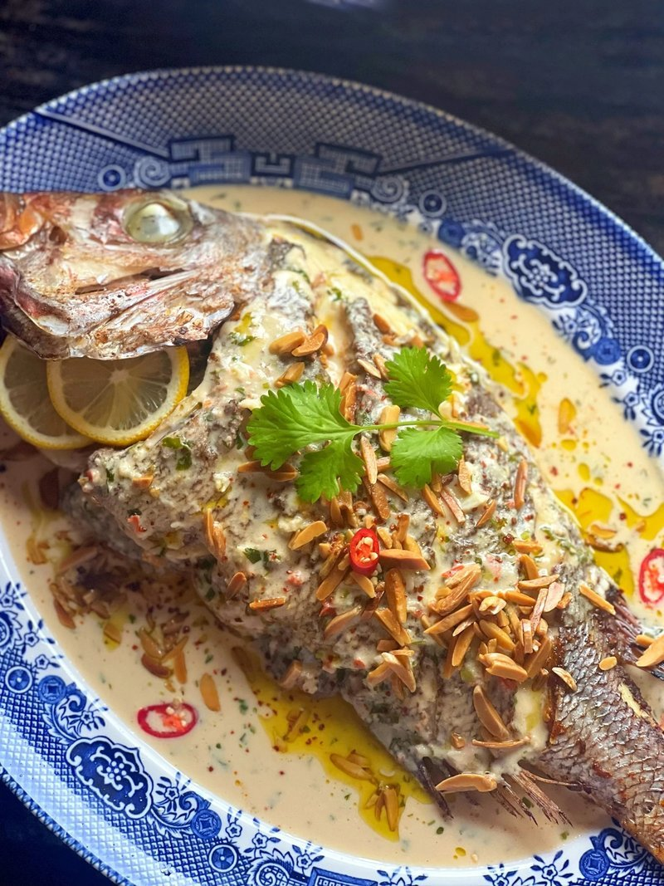

# Samkeh Harra

*Gaza's spicy fish: a whole sea bream baked on a bed of tahini-and-coriander sauce spiked with garlic, Aleppo pepper and lemon. Pomegranate on top.*

**Serves:** 4

**Prep Time:** 20 minutes

**Cook Time:** 30 minutes

## Overview
A whole fish is rubbed with salt, lemon, garlic and olive oil inside and out. While it rests, a sauce of tahini, lemon juice, water, garlic and chopped fresh coriander whisks together, adjusted with more water until the texture of pourable double cream. Diced red onion, Aleppo pepper, cumin and a pinch of cayenne fry briefly in olive oil. The tahini sauce stirs in; warms gently to a velvety consistency. The fish nestles on top in an oven dish; the sauce surrounds it; covered with foil; baked for 20 minutes; uncovered another 5-10 minutes. Topped with toasted pine nuts, pomegranate seeds and extra coriander at the table.

## Ingredients

### Fish
- 1 whole sea bass or sea bream (about 1.2 kg, scaled and gutted, head on) - OR 4 fillets if you prefer
- 2 garlic cloves (crushed to a paste)
- 1 ½ teaspoons salt
- Juice of ½ lemon
- 2 tablespoons olive oil

### Sauce
- 4 tablespoons olive oil
- 1 large red onion (finely diced)
- 6 garlic cloves (sliced thin)
- 2 teaspoons Aleppo pepper (or 1 teaspoon mild chilli powder)
- 1 ½ teaspoons ground cumin
- ½ teaspoon ground coriander
- ¼ teaspoon cayenne pepper (optional, for heat)
- 200 g tahini (well-stirred)
- 200 ml warm water (more as needed)
- Juice of 2 lemons (about 4 tablespoons)
- 1 large bunch fresh coriander (chopped - leaves and fine stems, about 80 g)
- 1 teaspoon salt (to taste)

### Garnish
- 3 tablespoons pine nuts (toasted in a dry pan 3 minutes until just gold)
- 3 tablespoons pomegranate seeds (optional, for colour)
- 2 tablespoons fresh coriander (chopped)
- 1 lemon (cut into wedges)

### To serve
- Plain basmati rice
- Khobz or pita

## Method

### Stage 1 - Prepare the fish
1. Score the fish 3 times on each side with diagonal slashes.
1. Whisk crushed garlic, salt, lemon juice and olive oil; rub all over the fish (inside the cavity too).
1. Let rest 20 minutes at room temperature.

### Stage 2 - Soften the onion
1. Heat olive oil in a wide deep oven-safe pan over medium heat.
1. Add diced onion; cook 8 minutes until soft and just gold.
1. Add sliced garlic; cook 2 minutes (don't brown - golden is right).

### Stage 3 - Spice
1. Stir in Aleppo pepper, cumin, ground coriander and cayenne (if using); cook 30 seconds.

### Stage 4 - Tahini sauce
1. Off heat (or very low heat - tahini scorches).
1. Stir in the tahini, warm water and lemon juice - the tahini will look like it's seizing; keep whisking and it'll smooth out into a velvety sauce.
1. Add more warm water 1 tablespoon at a time if too thick - the sauce should be like pourable double cream.
1. Stir in the chopped coriander.
1. Add salt; taste; adjust.

### Stage 5 - Bake
1. Heat oven to 190°C (170°C fan).
1. Tip the sauce into a wide ovenproof dish (or use the pan it was made in if oven-safe).
1. Lay the fish on top, scored side up.
1. Spoon some of the sauce up over the fish; the rest should pool around.
1. Cover with foil; bake 18-20 minutes.
1. Uncover; bake 5-8 minutes more until the fish is cooked through (flesh flakes easily at the thickest point) and the sauce is slightly bubbling at the edges.

### Stage 6 - Garnish and serve
1. Scatter toasted pine nuts, pomegranate seeds and fresh coriander.
1. Bring the dish to the table.
1. Serve with rice and bread; spoon the sauce generously over.
1. Squeeze of lemon at the table.

## Notes
- **Don't boil the tahini sauce:** Tahini splits and goes oily over too much heat. The sauce warms gently in the oven inside the foil - that's the right amount.
- **Whole fish vs fillets:** Whole fish gives the most flavour and traditional presentation. Fillets work for a quicker dinner; reduce baking time to 15 minutes total.
- **Sea bass, sea bream, or red mullet:** Any firm white fish with skin and bones in. White flat-fish are too delicate; tuna or salmon are too oily and overwhelm the tahini.

## Storage
- Best within an hour of cooking.
- Refrigerate 2 days; reheat gently covered at 160°C 12 minutes (microwave makes the fish rubbery).
- Doesn't freeze well.
