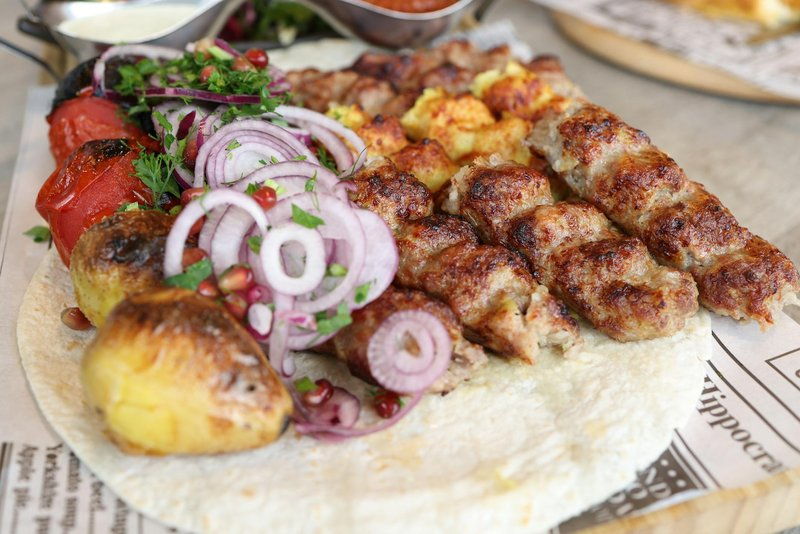

# Shish Barak

*Palestine's celebration dumplings: tiny lamb-stuffed parcels baked till firm, then warmed in a yogurt-and-mint sauce with garlicky butter.*

**Serves:** 4

**Prep Time:** 1 hour

**Cook Time:** 30 minutes

## Overview
A simple wheat-flour-and-water dough rests for 30 minutes. The filling: onion fries; lamb mince browns with baharat, allspice, cinnamon, salt and pepper; cooled. The dough rolls thin, cuts into 5 cm rounds; a small spoon of filling sits on each; folded in half to make a half-moon; the corners pinched together over the back to form a tiny tortellini. Lined up on a tray; baked for 12 minutes at 200°C to firm and lightly colour. A warm yogurt sauce simmers gently, thickened with cornstarch (or whisked egg white) so it doesn't split. The baked dumplings drop in and warm 5 minutes. Garlic-and-mint butter sizzles on top.

## Ingredients

### Dough
- 300 g plain flour
- 1 teaspoon salt
- 1 tablespoon olive oil
- 170 ml warm water

### Filling
- 2 tablespoons olive oil
- 1 onion (medium, very finely diced)
- 300 g lamb mince (20% fat)
- 1 teaspoon [Baharat](../../base-ingredients/spices/baharat.md)
- ½ teaspoon ground allspice
- ½ teaspoon ground cinnamon
- 1 teaspoon salt
- ½ teaspoon black pepper
- 1 tablespoon pine nuts (toasted, finely chopped - optional)

### Yogurt sauce
- 800 g full-fat plain yogurt
- 1 egg white (lightly whisked, OR 1 tablespoon cornstarch mixed with 2 tablespoons cold water)
- 200 ml warm water (more if too thick)
- 1 ½ teaspoons salt (to taste)
- ½ teaspoon white pepper

### Garlic-mint finish
- 3 tablespoons unsalted butter
- 6 garlic cloves (sliced thin)
- 2 tablespoons fresh mint (chopped - or 1 tablespoon dried mint)
- 1 teaspoon Aleppo pepper

### To serve
- Fluffy basmati rice (often served alongside)

## Method

### Stage 1 - Dough
1. Whisk flour and salt in a bowl.
1. Mix in olive oil and warm water until a soft dough forms.
1. Knead 5 minutes on a lightly floured surface until smooth.
1. Cover; rest 30 minutes.

### Stage 2 - Filling
1. Heat olive oil in a pan over medium.
1. Add diced onion; cook 6 minutes until soft.
1. Add lamb mince; break up; brown 6 minutes.
1. Stir in baharat, allspice, cinnamon, salt and pepper; cook 1 minute.
1. Off heat; stir in toasted pine nuts (if using).
1. Cool completely.

### Stage 3 - Shape the dumplings
1. Heat oven to 200°C (180°C fan).
1. Roll the dough out on a floured surface to 2 mm thick.
1. Cut out 5 cm rounds (a small glass or biscuit cutter).
1. Place a small teaspoon of filling in the middle of each round.
1. Fold the round in half over the filling; pinch the half-moon closed with floured fingers.
1. Bring the two corners of the half-moon together and pinch firmly into a small tortellini-like shape.
1. Place on a lined baking tray.
1. Re-roll scraps once.

### Stage 4 - Bake the dumplings
1. Bake 10-12 minutes - just until set and very pale gold (not deeply browned).
1. This step is what gives shish barak its slightly chewy, distinct character. Don't skip it.

### Stage 5 - Yogurt sauce
1. While the dumplings bake, set up the yogurt sauce.
1. In a wide heavy pot, whisk the yogurt smooth.
1. Whisk in the egg white (or cornstarch slurry).
1. Add 200 ml warm water; whisk to a pourable consistency (like single cream).
1. Place over medium-low heat.
1. Whisk CONSTANTLY in one direction (don't stop until it boils - yogurt splits when you stop stirring).
1. Bring just to a low simmer; cook 5 minutes whisking, until very slightly thickened.
1. Reduce to the lowest heat.
1. Add salt and white pepper.

### Stage 6 - Combine
1. Add the baked dumplings to the warm yogurt sauce.
1. Heat through 5 minutes - DON'T boil; just keep it warm enough to soak through the dumplings.
1. They will absorb some sauce and soften slightly.

### Stage 7 - Garlic-mint butter
1. In a small pan, melt the butter over medium heat.
1. Add sliced garlic; cook 1 minute until just gold (don't brown).
1. Off heat; stir in mint and Aleppo pepper.

### Stage 8 - Serve
1. Ladle shish barak into deep bowls.
1. Drizzle the hot garlic-mint butter over each.
1. Eat with rice on the side.

## Notes
- **Stabilise the yogurt:** Without the egg white or cornstarch, the yogurt will curdle when heated. Either works; cornstarch gives a slightly glossier sauce, egg white a fresher taste. Whisk constantly while heating - non-negotiable.
- **Bake before boiling:** Pre-baking the dumplings is what makes shish barak distinct from generic boiled dumplings. The dough sets slightly, the bottom faintly toasts; when they go into the yogurt they soften but keep their structure.
- **Garlic-mint sizzle is the final flourish:** Pour it over hot - the sizzle of butter on warm yogurt is part of the dish's presentation.

## Storage
- Best the day they're made.
- The baked dumplings (without sauce) refrigerate 3 days or freeze 2 months; warm in the yogurt fresh.
- Yogurt sauce with dumplings doesn't reheat well - the yogurt thickens unappealingly. Eat what you ladle.
