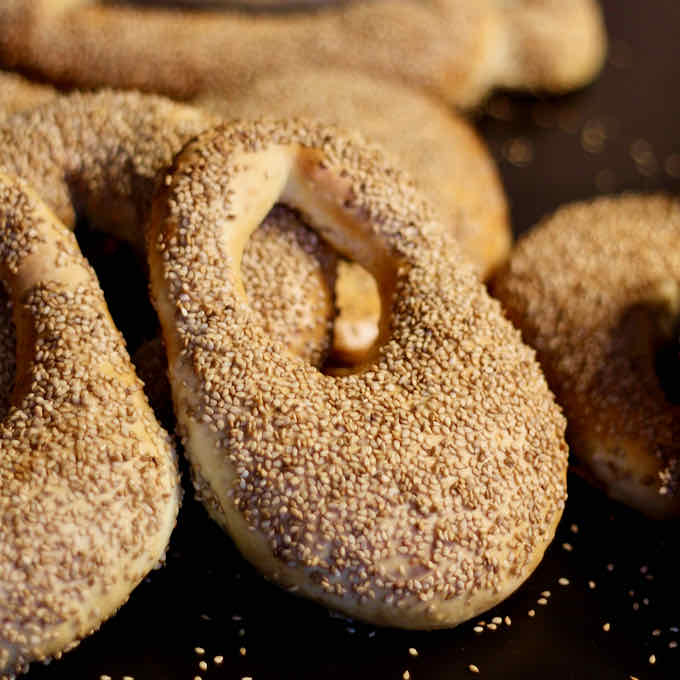

# Ka'ak Bi Simsim

*Jerusalem's sesame bread ring: a soft yeasted oblong crusted with toasted sesame. Torn at the table and stuffed with za'atar oil and hard-boiled egg.*

**Serves:** 4 (makes 4 large rings or 8 small)

**Prep Time:** 30 minutes (plus 1 hour rising)

**Cook Time:** 18 minutes

## Overview
Walk Jerusalem's Old City at any hour and you'll find bread sellers pushing wooden carts piled with stretched horseshoe-shaped rings crusted in sesame, sold with a paper sachet of za'atar. Raise a soft yeasted dough scented with mahleb (the ground cherry kernel that gives Levantine bakeries their distinctive almond-cherry perfume) for an hour till doubled. While it rises, toast a generous bowl of sesame seeds till pale gold, and whisk date molasses with warm water in a wide shallow dish for the glaze. Divide the dough into ropes, bring the ends together to form a stretched-oblong ring more horseshoe than circle, dip the whole ring in the molasses glaze and press it firmly into the sesame so every surface is coated. Final rise thirty minutes, bake at 220 °C for fifteen to eighteen minutes till deep golden-brown and the sesame is fully toasted into the crust. Eat warm, torn and stuffed with sliced hard-boiled egg, or dipped into za'atar mixed with olive oil for the simplest Jerusalem breakfast.

## Ingredients

### Dough
- 600 g plain flour
- 1 sachet (7 g) fast-action yeast
- 1 ½ teaspoons salt
- 1 tablespoon caster sugar
- 1 teaspoon ground mahleb (optional but very traditional - sold at Middle Eastern shops)
- 60 ml olive oil
- 100 ml warm milk
- 220 ml warm water (more as needed)

### Glaze
- 2 tablespoons date (or pomegranate molasses, or treacle)
- 100 ml warm water

### Coating
- 250 g sesame seeds (raw, white)
- 1 tablespoon nigella seeds (optional, scatter)

## Method

### Stage 1 - Toast the sesame
1. Tip the sesame seeds onto a dry baking tray.
1. Toast in a 180°C oven 5-6 minutes, stirring halfway, until pale gold and very fragrant. (Or toast in a dry pan over medium heat 4-5 minutes - watch carefully, they go from gold to burnt fast.)
1. Cool.
1. Tip into a wide shallow bowl.

### Stage 2 - Dough
1. Whisk flour, yeast, salt, sugar and mahleb (if using) in a wide bowl.
1. Pour in olive oil, warm milk and warm water; mix to a soft dough. Add more water 1 tablespoon at a time if needed.
1. Knead 10 minutes by hand (or 7 minutes in a stand mixer) until smooth and elastic.
1. Cover; rise 1 hour until doubled.

### Stage 3 - Glaze
1. Whisk the molasses with the warm water in a wide shallow bowl. The glaze should be the consistency of weak tea.

### Stage 4 - Shape
1. Knock back the risen dough.
1. Divide into 4 (for large rings) or 8 (for snack-size rings) pieces.
1. Roll each piece into a rope about 30 cm long, slightly thicker at one end.
1. Bring the ends together and pinch to seal - the ring should be more oblong than perfectly round, mimicking the traditional Jerusalem shape.

### Stage 5 - Glaze and coat
1. Working one ring at a time:
   - Dip the entire ring in the molasses glaze, making sure all surfaces are coated.
   - Lift; allow excess to drip off.
   - Press into the sesame bowl; turn to coat the entire ring thoroughly in sesame seeds.
   - Transfer to a paper-lined baking tray.
1. Scatter a few nigella seeds across the top of each (if using).

### Stage 6 - Final rise
1. Cover loosely with a tea towel; rise 30 minutes.

### Stage 7 - Bake
1. Heat oven to 220°C (200°C fan).
1. Bake 15-18 minutes until deep golden brown and the sesame is fully toasted.

### Stage 8 - Cool and serve
1. Cool 10 minutes on a rack.
1. Eat warm or at room temperature.
1. Traditional accompaniment: a sachet of za'atar mixed with olive oil to dip the bread in; or hard-boiled egg sliced and stuffed inside the torn ring.

## Notes
- **Mahleb is the bakery-aroma:** Ground from the kernel of a particular cherry pit, mahleb gives Levantine breads their distinctive faint almond-cherry perfume. Optional, but the bread tastes much more Palestinian with it.
- **Toast the sesame first:** Untoasted sesame on the outside of the bread doesn't toast enough during baking to develop the deep nutty flavour. Pre-toasted is what gives ka'ak its character.
- **Heavy sesame coat:** These breads are about the sesame as much as the bread. Press firmly into the seeds; the glaze should hold them on.

## Storage
- Best the day they're made.
- Refrigerate 3 days; freshen in a 180°C oven 4 minutes.
- Freeze cooked 2 months; reheat from frozen at 180°C 8 minutes.
