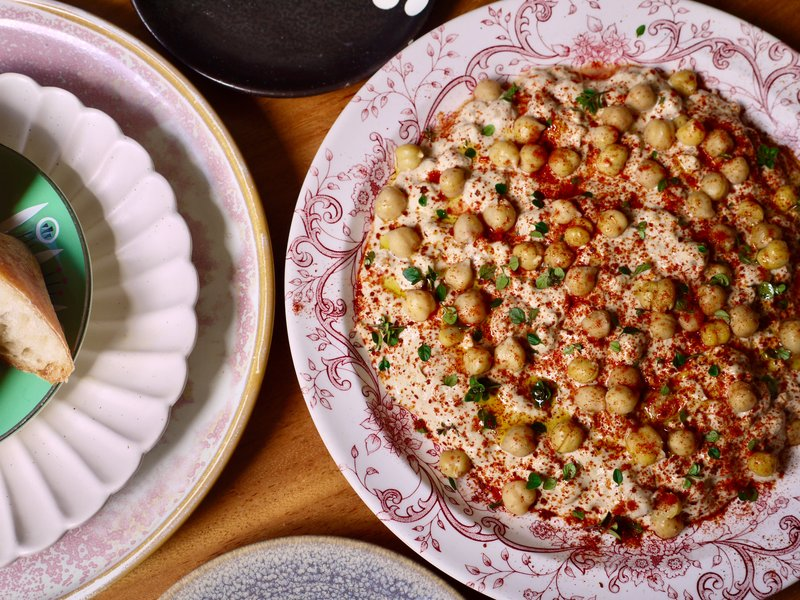

# Msabaha

*Palestine's breakfast hummus: warm whole chickpeas piled into a bowl of tahini-and-lemon, drizzled with olive oil and cumin.*

**Serves:** 4

**Prep Time:** 15 minutes (plus overnight soaking)

**Cook Time:** 1 hour 30 minutes

## Overview
Msabaha is the warm breakfast hummus you eat sitting on a low stool at a Palestinian street stand, hot bread torn straight from the basket and dipped while the chickpeas are still steaming. Soak dried chickpeas overnight with a pinch of bicarbonate (this softens the skins so they cook tender, not gritty), then simmer the next morning with whole garlic, bay and cumin till they crush easily between your fingers. Scoop out a third of them and blitz with tahini, lemon, more garlic and ice water into a smooth pourable purée. Keep the rest warm in their cooking liquid while you whisk a second tahini-lemon-garlic sauce, looser, like single cream, for drizzling. Spread the smooth purée at the bottom of a wide shallow bowl, pile hot whole chickpeas in the centre, pour the loose tahini sauce over, finish with extra-virgin olive oil, cumin and paprika, parsley and chopped green chilli. Eat warm with hot khobz, raw onion and pickled turnips; tear bread, scoop chickpeas with tahini together, eat.

## Ingredients

### Chickpeas
- 250 g dried chickpeas
- 1 teaspoon bicarbonate of soda (for soaking)
- 2 garlic cloves (whole, peeled)
- 1 bay leaf
- 1 teaspoon ground cumin
- 1 ½ teaspoons salt
- 2 litres water (for cooking)

### Smooth purée (about a third of the chickpeas)
- 80 g tahini
- 60 ml fresh lemon juice (about 2 lemons)
- 2 garlic cloves (crushed to a paste with ½ teaspoon salt)
- 3-4 tablespoons ice water
- ¼ teaspoon ground cumin
- Salt to taste

### Drizzle sauce (for the top)
- 100 g tahini
- 50 ml fresh lemon juice
- 2 garlic cloves (crushed to a paste)
- 3-4 tablespoons warm water (more as needed)
- ½ teaspoon salt

### To finish
- 3 tablespoons extra-virgin olive oil
- 1 teaspoon ground cumin
- ½ teaspoon paprika
- 2 tablespoons fresh flat-leaf parsley (chopped)
- 1 green chilli (small, finely chopped - optional)
- 1 lemon (cut into wedges)

### To serve
- Hot khobz, pita (or flatbread)
- Mixed pickles (turnip, cucumber)
- Sliced raw onion (optional, traditional)

## Method

### Stage 1 - Soak
1. Place dried chickpeas in a large bowl with the bicarbonate of soda.
1. Cover with 2 litres of cold water.
1. Soak overnight (12 hours).

### Stage 2 - Cook
1. Drain the soaked chickpeas; rinse.
1. Place in a deep pot with 2 litres of fresh water, the garlic cloves, bay leaf and 1 teaspoon ground cumin.
1. Bring to a boil; skim foam thoroughly.
1. Reduce heat; simmer gently 1 hour to 1 hour 30 minutes, partially covered, until the chickpeas are very tender (you should be able to crush one easily between your fingers).
1. In the last 10 minutes, add the salt.

### Stage 3 - Smooth purée
1. Lift out about a third of the cooked chickpeas (around 250 g) with a slotted spoon into a blender or food processor.
1. Add tahini, lemon juice, garlic-salt paste, ice water and cumin.
1. Blitz on high until very smooth - 1-2 minutes. Add more ice water 1 tablespoon at a time to loosen if needed.
1. Taste; adjust salt and lemon.

### Stage 4 - Drizzle sauce
1. In a small bowl, whisk tahini, lemon juice, garlic-salt paste and warm water until smooth and pourable (like double cream). Add more water if needed.
1. Salt to taste.

### Stage 5 - Keep the whole chickpeas warm
1. Keep the remaining whole chickpeas in their cooking liquid over very low heat until ready to plate.

### Stage 6 - Plate
1. Spread a generous spoon of smooth purée at the bottom of each shallow bowl, swooshing it up the sides.
1. Drain a ladle of warm whole chickpeas (reserving a little cooking liquid).
1. Pile the warm chickpeas in the centre of each bowl.
1. Drizzle the tahini-lemon sauce generously over the chickpeas.
1. Drizzle a tablespoon of extra-virgin olive oil over.
1. Sprinkle ground cumin and paprika.
1. Scatter chopped parsley and (if using) green chilli.
1. Optional: spoon a little of the warm chickpea cooking liquid around the edges to keep it soup-like.

### Stage 7 - Serve
1. Eat immediately with hot bread, pickles and (if you like) raw onion slices.
1. The technique: tear a piece of bread, scoop the chickpeas + tahini together, eat.

## Notes
- **Bicarbonate of soda in the soak:** Adds alkali to the soaking water; softens the skins so the chickpeas cook more tenderly. Don't skip - old chickpeas in particular need this help.
- **Cook the chickpeas until very soft:** Underdone chickpeas make a gritty msabaha. They should crush easily between your fingers. Soft is the goal.
- **Warm, not hot:** Msabaha is served warm-but-not-scalding. The tahini sauce should not be heated; it's poured cold-to-warm over the warm chickpeas, where it slightly slackens and emulsifies with the chickpea juices.

## Storage
- Cooked chickpeas in their liquid: refrigerate 4 days; freeze 3 months.
- Smooth purée: refrigerate 4 days.
- Drizzle sauce: refrigerate 3 days.
- Assemble fresh each time.
