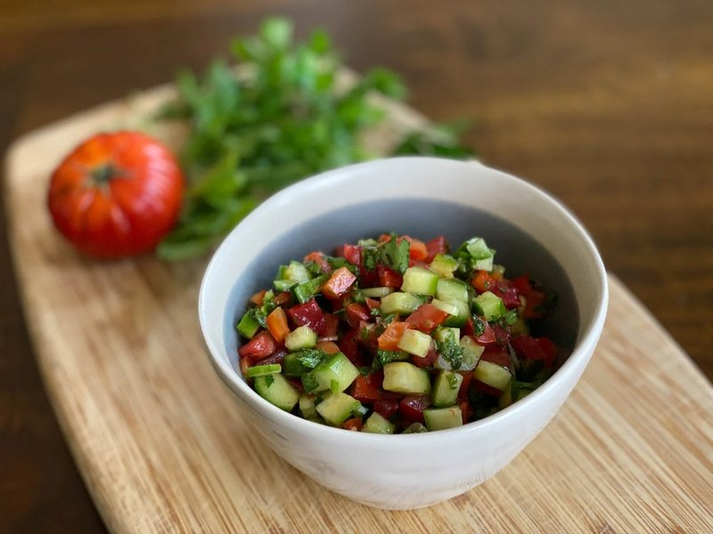

# Salata Arabieh

*Palestine's everyday salad: tomato, cucumber and onion diced fine, dressed with lemon, olive oil, sumac, parsley and mint.*

**Serves:** 4

**Prep Time:** 15 minutes

**Cook Time:** 0 minutes

## Overview
Salata arabieh is the everyday chopped salad that turns up alongside musakhan, mansaf, kibbeh and lahem bi ajeen on Palestinian tables, a bowl of finely diced tomato and cucumber sharpened with sumac and a generous bunch of herbs. The whole dish lives or dies on two technical moves: deseed the tomatoes and cucumbers properly, and chop everything very small (5 mm pieces, not chunky). Halve the tomatoes and scoop the seeds out with a spoon (otherwise they weep and the dressing dilutes within minutes), peel half the cucumber for stripes and scoop those seeds too, and dice both as fine as you can. Add finely diced red onion, a small chilli if you like the heat, then a serious quantity of chopped flat-leaf parsley and mint, the herbs are 30% of this salad and they belong in the bowl, not as garnish. Whisk olive oil with lemon juice, sumac (the lemony purple-red Levantine spice without which the salad is just chopped vegetables), salt, pepper and a touch of pomegranate molasses for sweetness, then toss through and rest just five minutes for the flavours to meet. Tip onto a wide shallow plate and eat right away with anything Palestinian coming off the grill or out of a tagine: it's the cold, sharp, herby foil to almost everything heavier on the table.

## Ingredients

- 4 ripe medium tomatoes (deseeded, diced 5 mm, about 400 g)
- 1 cucumber (large, deseeded, diced 5 mm, about 250 g)
- ½ small red onion (very finely diced, about 60 g)
- 1 green chilli (small, or red chilli, deseeded, finely chopped, optional)
- 1 large bunch fresh flat-leaf parsley (chopped fine - about 30 g)
- 3 tablespoons fresh mint (chopped fine, about 10 g)
- 2 spring onions (sliced very thin, optional)

### Dressing
- 4 tablespoons extra-virgin olive oil
- 3 tablespoons fresh lemon juice (about 1 ½ lemons)
- 1 ½ teaspoons sumac (sold at Middle Eastern shops)
- 1 teaspoon salt
- ½ teaspoon black pepper
- 1 teaspoon pomegranate molasses (optional, for a touch of Palestinian sweetness)
- A pinch of cumin (optional)

## Method

### Stage 1 - Prep
1. Tomatoes: halve, scoop seeds with a spoon (this prevents the salad from going watery), dice 5 mm.
1. Cucumber: peel half the skin (for stripes), halve lengthwise, scoop seeds with a teaspoon, dice 5 mm.
1. Red onion: dice as finely as you can manage (the smaller, the less aggressive its bite).
1. Chop the parsley and mint very fine - the herbs are 30% of this salad and they should be cut, not stems.

### Stage 2 - Combine
1. In a wide bowl, combine all the vegetables and herbs.

### Stage 3 - Dress
1. Whisk olive oil, lemon juice, sumac, salt, pepper and (if using) pomegranate molasses and cumin in a small bowl.
1. Pour over the salad; toss thoroughly.

### Stage 4 - Rest
1. Let stand 5 minutes for flavours to integrate. Don't rest longer than 15 minutes - beyond that the tomato weeps and the salad gets soupy.

### Stage 5 - Final taste
1. Taste; adjust lemon, salt, sumac.

### Stage 6 - Serve
1. Tip onto a wide shallow plate.
1. Eat alongside any Palestinian main: musakhan, mansaf, lahem bi ajeen, kibbeh, fatteh.

## Notes
- **Deseed the tomatoes and cucumbers:** This is the single trick that separates a great salata arabieh from a watery one. The seeds weep and dilute the dressing. Scoop them out with a spoon before dicing.
- **Sumac is essential:** Without sumac the salad is just a Mediterranean chopped salad. With sumac, it's Palestinian. The tart purple-red spice from dried sumac berries.
- **Herbs in abundance:** Don't be timid with the parsley and mint. They're not garnish - they're a structural part of the salad. A whole bunch of parsley per 4 people is not too much.

## Storage
- Best within 30 minutes of dressing.
- The undressed vegetables and herbs can be prepped a few hours ahead and refrigerated; toss with dressing only when ready to eat.
