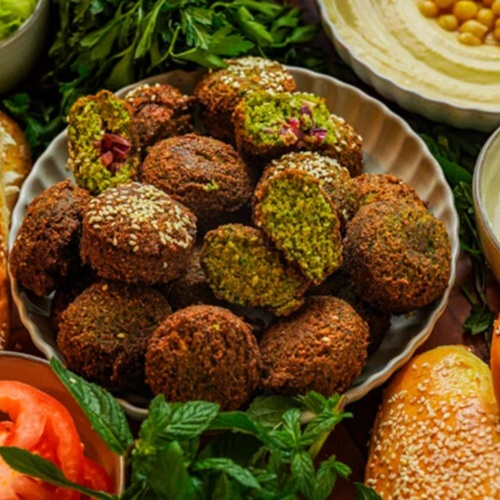

# Falafel Palestinian

*Palestine's herb-green falafel: soaked chickpeas blitzed with parsley, coriander and leek, deep-fried amber and tucked into thick khobz with tahini.*

**Serves:** 4 (makes 20 patties)

**Prep Time:** 25 minutes (plus overnight bean soak)

**Cook Time:** 12 minutes

## Overview
Dried chickpeas (or a chickpea-fava blend) soak overnight. Drained, blitzed with onion, leek, a heaped pile of fresh parsley AND coriander (the Palestinian style is herb-heavy and notably green), garlic, ground cumin, ground coriander, salt and Aleppo pepper. Left to rest. Baking soda mixed in right before frying. Shaped into small patties or balls; pressed into sesame seeds; deep-fried until amber. Stuffed into khobz with tahini sauce, salad and pickled vegetables.

## Ingredients

### Beans
- 250 g dried chickpeas (or 200 g dried chickpeas + 50 g dried split fava beans)
- 1 teaspoon bicarbonate of soda (for the soak)
- Cold water (for the soak)

### Blender (the herb load is the Palestinian signature)
- 1 onion (medium, rough chunks)
- 1 leek (small, white and pale green only, chopped) OR 4 spring onions
- 5 garlic cloves
- 1 large bunch fresh parsley (~50 g, leaves and fine stems)
- 1 large bunch fresh coriander (~30 g)
- 1 small bunch fresh dill (~15 g, optional, traditional)
- 1 ½ teaspoons salt
- 2 teaspoons ground cumin
- 1 teaspoon ground coriander
- 1 teaspoon Aleppo pepper
- ½ teaspoon black pepper

### Just before frying
- 1 teaspoon baking soda

### Coating (optional)
- 4 tablespoons sesame seeds

### For frying
- 1 litre vegetable oil

### To serve
- 4 khobz (large, or pita)
- Tahini sauce (4 tablespoons tahini + 4 tablespoons water + juice of 1 lemon + 2 crushed garlic + ½ teaspoon salt)
- Sliced tomato, cucumber, romaine
- Pickled turnips (the Palestinian pink ones)
- A pinch of sumac
- Hot sauce

## Method

### Stage 1 - Soak
1. Place chickpeas (and fava if using) in a bowl with 1 ½ litres cold water and the soda.
1. Soak 12-18 hours.
1. Drain; rinse.

### Stage 2 - Blitz
1. In a food processor, combine drained beans, onion, leek, garlic, parsley, coriander, dill (if using), salt, cumin, ground coriander, Aleppo pepper and pepper.
1. Pulse to a coarse green paste - vivid green colour, fine grainy texture.
1. Tip into a bowl; rest 30 minutes.

### Stage 3 - Tahini
1. Whisk tahini, water, lemon, garlic and salt to a thick pourable sauce.

### Stage 4 - Shape
1. Just before frying, mix baking soda thoroughly into the bean paste.
1. Shape into 1-tablespoon patties (3 cm × 1 ½ cm) or balls.
1. Optional: press one side into sesame seeds.

### Stage 5 - Fry
1. Heat oil to 175°C.
1. Fry 6-8 at a time, 2-3 minutes per side until amber-gold.
1. Drain on paper.

### Stage 6 - Stuff
1. Cut khobz in half; warm.
1. Spread tahini inside.
1. Add 4-5 falafel per pocket.
1. Stuff with tomato, cucumber, lettuce, pickled turnip.
1. Drizzle more tahini; sumac sprinkle; hot sauce if you like.

## Notes
- **Herb-heavy is the Palestinian signature:** Big bunch of parsley + big bunch of coriander + dill is the herb load. The interior should be GREEN. Compare to a Lebanese falafel which is also green but less so; an Egyptian tameya which uses different beans; an Israeli falafel which is often denser and less herby.
- **Soak, never cook:** Same rule as all falafel - raw soaked beans.
- **Baking soda last:** Activates with moisture.

## Storage
- Best within 30 minutes of frying.
- Cooked: refrigerate 2 days; re-crisp at 200°C 4 minutes.
- Raw mixture (without soda) refrigerates 24 hours or freezes 2 months.
