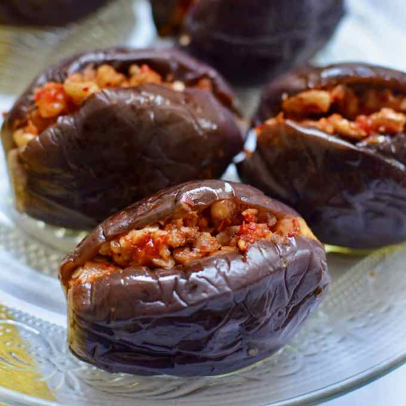

# Makdous

*Palestine's winter pantry preserve: tiny aubergines stuffed with walnuts, garlic and red pepper paste, submerged in olive oil for weeks.*

**Serves:** 8 (makes about 18 stuffed mini aubergines in a 1-litre jar)

**Prep Time:** 30 minutes active

**Curing Time:** 1-3 weeks

## Overview
Tiny aubergines (the small Middle-Eastern variety) blanched in salted water 6 minutes until just tender. Drain. Salt and pressed under weight 4-6 hours to drain bitter water. Each aubergine slits lengthwise (don't cut all the way through). A walnut-garlic-red-pepper-paste mixture stuffs into each slit. The stuffed aubergines pack tightly into a sterilised glass jar; covered in olive oil to fully submerge. Sealed and left at room temperature for 7-21 days. The oil takes on the spice; the aubergines mellow.

## Ingredients

### Aubergines
- 600 g baby aubergines
- 2 tablespoons salt (for boiling)

### Stuffing
- 200 g walnut halves (chopped to a coarse rubble, not paste)
- 8 garlic cloves (crushed to a paste with ¾ teaspoon salt)
- 2 tablespoons hot red pepper paste (Syrian / Aleppo-style red pepper paste, sold in jars; or substitute a mix of 1 tablespoon tomato paste + 1 teaspoon Aleppo pepper + ½ teaspoon paprika)
- 1 teaspoon dried red chilli flakes
- 1 teaspoon ground cumin
- 1 teaspoon salt
- ½ teaspoon black pepper
- 1 tablespoon olive oil (to bind)

### Salting
- 2 tablespoons salt (for the drain)

### To preserve
- 350-500 ml extra-virgin olive oil (enough to fully cover the aubergines in the jar)

### Equipment
- 1 (1-litre) glass jar, sterilised (washed in hot soapy water, dried in a 130°C oven 15 minutes)
- A small heatproof plate / weight that fits inside the jar mouth

## Method

### Stage 1 - Blanch
1. Snip the stem ends off the aubergines but don't peel.
1. Bring a wide pot of water with 2 tablespoons salt to a boil.
1. Add the aubergines; cook 5-6 minutes until just tender (a knife should slip in but not collapse the flesh).
1. Drain.

### Stage 2 - Drain and press
1. Cut a lengthwise slit along the side of each aubergine, about ¾ of the length, not cutting all the way through.
1. Open each slit gently with a fingertip.
1. Sprinkle the inside of each with a pinch of salt.
1. Place the slit aubergines on a clean tea towel; cover with another tea towel; press with a weight (a heavy chopping board with a few cans) for 4-6 hours. This draws out the bitter water.

### Stage 3 - Stuffing
1. Mix walnut rubble, garlic-salt paste, red pepper paste, chilli flakes, cumin, salt, black pepper and olive oil into a thick paste.

### Stage 4 - Stuff
1. Open each pressed aubergine; spoon in 1-2 teaspoons of stuffing, packing it into the slit firmly.

### Stage 5 - Pack the jar
1. Place stuffed aubergines tightly into the sterilised jar (slit-side up if possible), packing tightly to maximise count.
1. Pour olive oil to fully submerge - every aubergine must be under the oil line; expose-to-air = mould.
1. Press the small plate / weight on top to keep aubergines submerged.

### Stage 6 - Cure
1. Seal the jar.
1. Keep at cool room temperature (16-20°C) for 1-3 weeks.
1. Check every few days: if any aubergine pokes above the oil line, press it back down or top up oil. Discard if mould forms.

### Stage 7 - Serve
1. After 7 days minimum, lift out one aubergine.
1. Place on a small plate, drizzled with a little of the jar oil.
1. Eat as part of breakfast (with labneh, olives, and bread), on a mezze platter, or sliced onto toast.

## Notes
- **Tiny aubergines are the dish:** Big eggplant doesn't work - the cure takes too long, the stuffing-to-aubergine ratio is wrong. Look for the 5-7 cm aubergines sold at Middle Eastern shops; if unavailable, the closest substitute is baby aubergines from supermarkets (somewhat larger but workable).
- **Fully submerged in oil:** Anything above the oil line moulds. The weight on top keeps everything submerged. Check every few days.
- **Salt-and-press is essential:** Skipping this stage gives bitter, soggy makdous. The 4-6 hour weighted press is the technique.

## Storage
- After 7 days curing, refrigerate for safety (the oil-and-salt cure is preservation, but home conditions vary). Refrigerated keeps 3-6 months.
- Once a jar is opened, eat within 1 month, keeping the remaining aubergines under oil.
- The flavoured oil at the end of the jar is exceptional - use as a finishing oil on hummus, labneh, salads, or grilled fish.
